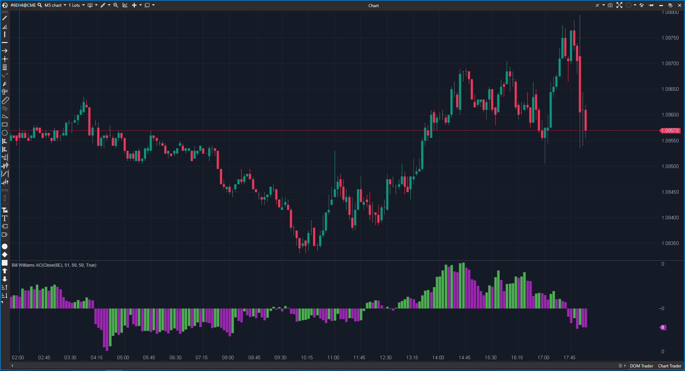

## 🟦 Bill Williams AC (4/10)

**Nombre del archivo:** `ACBW.cs`  
**Nombre del indicador:** Bill Williams AC  
**Web oficial:** [ATAS — Bill Williams AC](https://help.atas.net/support/solutions/articles/72000602333)
**Compatibilidad:** ATAS versión estable y superiores.

----------

### ⚙️ Parámetros configurables

-   **ShortPeriod**: Periodo de la SMA corta (por defecto: `50`)
    
-   **LongPeriod**: Periodo de la SMA larga (por defecto: `51`)
    
-   **SignalPeriod**: Periodo de la SMA del AC (por defecto: `50`)
    
-   **PosColor / NegColor / NeutralColor**: Colores para barras.
    

----------

### 🧭 Clasificación

📂 Momentum — Oscilador de aceleración (derivada del momentum).

----------

### 🧠 Uso más frecuente

-   (Intento de) medir la **aceleración y deceleración** del "Awesome Oscillator" (AO).
    
-   Es la "tercera derivada" del precio (Precio -> Momentum (AO) -> Aceleración (AC)).
    
-   Bill Williams lo usa como señal de entrada adelantada (antes de que el AO cruce el cero).
    

----------

### 📊 Nivel de relevancia

🔟 **3 / 10**

⛔ ¡IMPLEMENTACIÓN COMPLETAMENTE ROTA! Este indicador es un ejemplo de "copiar sin entender".

⛔ ¡DEFAULTS ABSURDOS! Los valores por defecto (50, 51, 50) no tienen absolutamente nada que ver con el indicador real de Bill Williams, cuyos valores canónicos son (5, 34, 5). Es inutilizable "de fábrica".

⛔ ¡CÁLCULO INCORRECTO! El sistema de Bill Williams siempre se calcula sobre el Precio Medio (High + Low) / 2. Esta implementación usa value (el Close por defecto), lo cual rompe la fidelidad al sistema.

⛔ ¡BUG DE COLOR! La lógica de color es errónea: pinta los valores iguales como positivos.

----------

### 🎯 Estrategias de scalping donde se aplica

-   **Ninguna.** No con esta implementación.
    
-   (Teóricamente, con el indicador real): Comprar cuando el AC (real) imprime dos barras verdes por encima de cero; Vender con dos barras rojas por debajo de cero. Pero esta versión no sirve para eso.
    

----------

### ⚙️ Parametrización óptima para scalping (1M, S&P 500)

-   La parametrización es irrelevante porque el indicador está fundamentalmente mal implementado.
    
-   **Si se arreglara el código**, los únicos parámetros aceptables son los canónicos:
    
    -   **ShortPeriod**: `5`
        
    -   **LongPeriod**: `34`
        
    -   **SignalPeriod**: `5`
        
    -   Y cambiar el código para usar `(High + Low) / 2`.
        

----------

### 🧪 Notas de desarrollo

-   El indicador intenta calcular el **Accelerator Oscillator (AC)**.
    
-   La fórmula canónica es:
    
    1.  `MedianPrice = (High + Low) / 2`
        
    2.  `AO = SMA(MedianPrice, 5) - SMA(MedianPrice, 34)`
        
    3.  `AC = AO - SMA(AO, 5)`
        
-   **Lo que este código hace:**
    
    1.  `diff = SMA(Close, 50) - SMA(Close, 51)` (Esto no es el AO)
        
    2.  `ac = diff - SMA(diff, 50)` (Esto no es el AC)
        
    3.  Colorea `ac > prevValue` como `PosColor` y `ac == prevValue` también como `PosColor`.
        

----------

### ❗ Incoherencias o aspectos mejorables detectados

1.  **Falla en los Defaults (50, 51, 50):** El error más grave. Invalida el indicador.
    
2.  **Falla en la Fuente de Datos:** Usa `Close` en lugar de `Median Price`. Invalida el sistema de Bill Williams.
    
3.  **Falla en la Lógica de Color:** El bug de `(ac == prevValue)` es un error de programación básico que oculta información (un "stall" o freno en la aceleración).
    

----------

### 🛠️ Propuestas de mejora

-   **Reescribir el indicador desde cero.**
    
-   Fijar los valores por defecto a `5`, `34`, `5`.
    
-   Cambiar la fuente de datos de `OnCalculate` para que use `(GetCandle(bar).High + GetCandle(bar).Low) / 2`.
    
-   Arreglar la lógica de color para usar `_neutralColor` cuando `ac == prevValue`.
    
----------

> La Pregunta Clave: "¿El momentum (AO) está acelerando o frenando?"
> 
> (Is the momentum (AO) accelerating or braking?)

----------

### ✍️ Mi Opinión sobre el Indicador (El Análisis Correcto)

Este indicador es un **fraude**. Es un "cargo cult" de libro: copia el nombre, pero no entiende nada del ritual.

El sistema de Bill Williams es un ecosistema cerrado y muy específico. Sus herramientas (Alligator, AO, AC, Fractals) están diseñadas para funcionar _juntas_, con _parámetros específicos_ (números de Fibonacci) y sobre una _fuente de datos específica_ (el Precio Medio `(H+L)/2`).

Esta implementación de ATAS falla en los tres pilares:

1.  **Parámetros Rotos:** Los defaults (50, 51, 50) son una broma pesada. Demuestran que el programador no tenía ni la más remota idea de lo que estaba implementando.
    
2.  **Datos Rotos:** Usar el `Close` en lugar del `Median Price` rompe la lógica del "consenso de la barra" de Williams.
    
3.  **Visualización Rota:** El bug de color es la guinda del pastel.
    

Un scalper que intente usar esto se estará guiando por un instrumento roto que da lecturas falsas. Es peor que inútil, es **engañoso**.

### 📈 Veredicto: ¿Es útil para Scalping?

**No. Esta implementación es basura.**

Es un indicador que debe ser **descartado y reescrito desde cero** para ser fiel al sistema que dice representar. En su estado actual, es activamente perjudicial para cualquier análisis.

**Acción:** **Descartar (Implementación Rota / Falsa).**
<!--stackedit_data:
eyJoaXN0b3J5IjpbMTM0MTMwMDk3NF19
-->