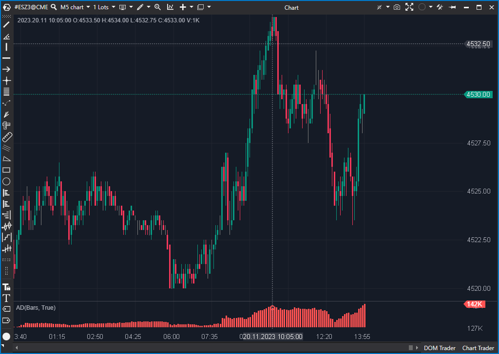

# 🟦 AD (2/10)

**Nombre del archivo:** `AD.cs`  
**Nombre del indicador:** Accumulation/Distribution (A/D)  
**Web oficial:** [ATAS - Accumulation/Distribution (A/D)](https://help.atas.net/support/solutions/articles/72000606733)



---

### ⚙️ Parámetros configurables

Este indicador **no tiene parámetros configurables** desde la interfaz. La lógica se aplica automáticamente a cada vela con los datos OHLCV.

---

### 🧭 Clasificación  
📂 **VolumeClassic** — Indicadores clásicos basados en volumen acumulado y relación precio-volumen

---

### 🧠 Uso más frecuente

- Medir el **flujo acumulado de dinero** basado en el precio de cierre relativo al rango de la vela.
- Confirmar la dirección de una tendencia: si el AD sube mientras el precio sube, se considera confirmación de acumulación.
- Detectar posibles **divergencias** entre el precio y la línea AD.

---

### 📊 Nivel de relevancia  
🔟 **2 / 10**

✅ Indicador clásico y fácil de interpretar  
✅ Útil para confirmar tendencias y detectar divergencias  
⛔ No muestra desequilibrios agresivos ni absorciones  
⛔ Puede generar señales erróneas en mercados laterales o con velas de rango estrecho

---

### 🎯 Estrategias de scalping donde se aplica

- **Confirmación de tendencia**: si el precio rompe resistencia y el AD también sube, puede indicar movimiento genuino.
- **Divergencias bajistas**: precio hace nuevo máximo, pero AD no lo acompaña → posible retroceso.
- **Divergencias alcistas**: precio hace nuevo mínimo, pero AD no lo acompaña → posible rebote.

⚠️ *No es un indicador primario para scalping, pero puede utilizarse como filtro de contexto en timeframes mayores (H1, H4).*

---

### ⚙️ Parametrización óptima para scalping (1M, S&P 500)

- Este indicador **no requiere configuración específica**.
- **Uso sugerido**: como confirmación secundaria en gráficos de contexto (mínimo H1), no en M1.
- **Interpretación visual**: se usa como histograma acumulativo, sin ajustes.

✅ Puede ser útil para validar contexto direccional antes de entrar en M1  
⛔ No aporta señales tácticas directas en gráficos rápidos

---

### 🧪 Notas de desarrollo

- Calcula la línea de acumulación/distribución según la fórmula clásica de Chaikin:  

$$
  AD_t = AD_{t-1} + \left( \frac{(C - L) - (H - C)}{H - L} \right) \times V
  $$
  
- Si el rango de la vela es cero (High = Low), se mantiene el valor anterior (`prev`).
- El resultado se almacena en un `ValueDataSeries` con representación tipo `Histogram`.
- Utiliza `OnCalculate` para evaluar cada barra y `GetCandle(bar)` para obtener OHLCV.

---

### 🛠️ Propuestas de mejora

- Permitir activar/desactivar el uso como **línea en lugar de histograma**.
- Añadir opción de **suavizado con media móvil**.
- Incluir un filtro de rango mínimo para evitar sumar velas irrelevantes (Low = High).
- Mostrar divergencias automáticamente con etiquetas visuales.

---

### Comentario de Gemini

Aquí tienes la "pregunta clave" de este indicador:

**¿El flujo de volumen acumulado está confirmando la tendencia del precio, o está mostrando una divergencia?**

El indicador A/D es una **línea acumulativa**. Su único propósito real es trazar **divergencias** (ej. el precio hace un nuevo máximo, pero la línea A/D no).

Tal como está codificado (y como se ve en tu imagen), usa `VisualType = VisualMode.Histogram`. Esto es un **error de visualización catastrófico**.

Como puedes ver en tu propia imagen, el histograma hace imposible comparar un pico con el anterior. No puedes trazar una línea de tendencia sobre él. Este indicador, visualizado como un histograma, es **completamente inútil**.

Tu propuesta de "Permitir activar/desactivar el uso como **línea en lugar de histograma**" no es solo una mejora, es la **solución fundamental** que necesita este indicador. Debería ser una línea por defecto.

-----

### 🛠️ ¿Merece la pena arreglarlo?

  * **Para el repositorio de ATAS:** Sí. El arreglo es trivial y lo convierte en un indicador funcional.
    ```csharp
    DataSeries[0] = new ValueDataSeries("Ad", "AD")
    {
        VisualType = VisualMode.Line, // <-- ARREGLADO
        UseMinimizedModeIfEnabled = true
    };
    ```
  * **Para *tu* sistema de scalping:** **No.**
    Descartaría este indicador. No te aporta ninguna información que no puedas obtener de forma más rápida, limpia y precisa de un gráfico de Delta o Volumen.