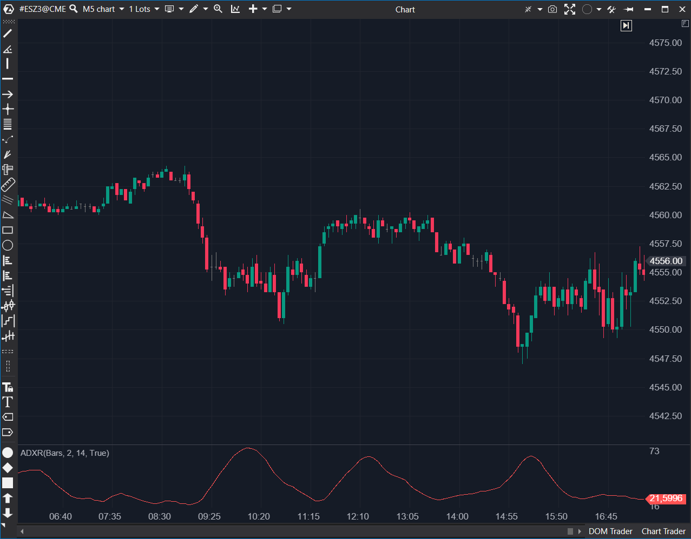

## 🟦 ADXR (6/10)

**Nombre del archivo:** `ADXR.cs`  
**Nombre del indicador:** ADXR  
**Web oficial:** [ATAS - ADXR](https://help.atas.net/support/solutions/articles/72000602314)



---

### ⚙️ Parámetros configurables

- **Period**: Número de barras de retraso entre los valores de ADX usados para calcular ADXR (por defecto: 2)
- **AdxPeriod**: Periodo utilizado por el indicador ADX interno (por defecto: 14)

---

### 🧭 Clasificación  
📂 Trend — Indicadores de fuerza de tendencia derivados del ADX

---

### 🧠 Uso más frecuente

- Confirmar fuerza de tendencia suavizada y reducir ruido de ADX puro  
- Evitar entradas en consolidaciones  
- Estimar estabilidad de una tendencia en curso con menor variabilidad

---

### 📊 Nivel de relevancia  
🔟 **6 / 10**

✅ Suaviza señales del ADX, útil en sistemas de seguimiento de tendencia  
✅ Reduce sensibilidad a cambios bruscos en el ADX  
⛔ No ofrece información adicional sobre dirección (como +DI / -DI)  
⛔ Retraso inherente por cálculo medio

---

### 🎯 Estrategias de scalping donde se aplica

- Confirmación de tendencia antes de entrar tras pullbacks  
- Filtro de consolidación: evitar operar si ADXR está por debajo de cierto umbral (ej: 20)  
- Combinación con volumen o delta para confirmar entradas tendenciales

---

### ⚙️ Parametrización óptima para scalping (1M, S&P 500)

- **Period**: 2  
- **AdxPeriod**: 7  
✅ Aumenta la reactividad sin perder suavizado  
✅ Compatible con sistemas basados en momentum o ruptura  
⛔ Si el periodo es muy largo, puede ocultar cambios rápidos en la fuerza de la tendencia

---

### 🧪 Notas de desarrollo

- El indicador usa un ADX interno (_adx) y calcula el ADXR como el promedio del valor actual y el valor de "Period" barras atrás.
- La fórmula exacta es:

```
ADXR[bar] = Max(0.01, (ADX[bar] + ADX[bar - Period]) / 2)
```


- Se fuerza un valor mínimo de 0.01 para evitar valores cero que podrían invalidar cálculos posteriores.
- RecalculateValues() se llama al modificar los parámetros Period o AdxPeriod.

---

### 🛠️ Posibles fallos o mejoras detectadas

✅ Cálculo correcto y eficiente del ADXR con lógica estándar  
✅ Buena encapsulación del ADX como subindicador interno

⚠️ No se controla que (bar - Period) sea válido
Actualmente solo se usa (if (bar < _period) return;), pero si _period > bar, se accede a una posición inválida en el ADX  

➡️ Sugerencia:

```
if (bar < _period || bar - _period < 0) return;
```  
⚠️ No se aplica un valor mínimo al ADX interno, solo al resultado promedio. Si se desea consistencia, puede considerarse:
```
var adxNow = Max(0.01, _adx[bar])  
var adxPast = Max(0.01, _adx[bar - _period])  
_renderSeries[bar] = (adxNow + adxPast) / 2
```    

⚠️ No hay comprobación de cambios en tiempo real del ADX al modificar el periodo del ADXR. Aunque se llama a RecalculateValues(), si el ADX ya se recalculó antes, puede que no refleje los nuevos valores correctamente.

---

### Comentario de Gemini
Aquí tienes la "pregunta clave" de este indicador:

**¿Cuál es la fuerza *estable y suavizada* de la tendencia, ignorando el ruido a corto plazo del propio ADX?**

---

### 📈 ¿Es útil para Scalping en S&P 500?

Ya habíamos establecido que el **ADX (6/10)** era un "filtro de régimen" con un **lag extremo**. Era una herramienta lenta que nos decía qué *había pasado* en los últimos 30-60 minutos.

El **ADXR** coge ese indicador lento y con lag... y **le añade más lag** al aplicarle una media móvil encima.

* El ADX te dice (tarde) que hay una tendencia.
* El ADXR te lo dice *aún más tarde*.

Para un scalper que opera en gráficos de 1M o 5M, el lag es el enemigo. Necesitas información *ahora*. El ADXR es conceptualmente lo **opuesto** a lo que un scalper necesita.

Mira tu propia captura de pantalla: la línea del ADXR es una curva lenta y suave que ignora por completo la acción del precio. A las 09:25, cuando el precio se desploma, el ADXR sigue subiendo perezosamente. Es una herramienta diseñada para traders de gráficos diarios o semanales, para que no se asusten por las correcciones de 2-3 días.