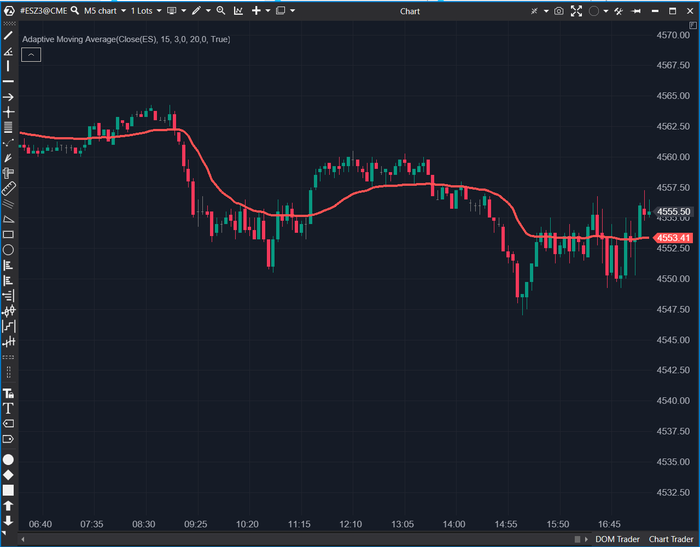

## 🟦 Adaptive Moving Average (AMA) (7/10)

**Nombre del archivo:** `AMA.cs`  
**Nombre del indicador:** Adaptive Moving Average  
**Web oficial:** [ATAS - Adaptive Moving Average](https://help.atas.net/support/solutions/articles/72000602310)  
**Compatibilidad:** ATAS versión stable y superiores.
**La Pregunta Clave:** ¿Cómo puedo obtener una media móvil suave que _no_ tenga retardo (lag) durante una ruptura fuerte, pero _sí_ filtre el 'ruido' en un mercado lateral?

----------

### ⚙️ Parámetros configurables

-   **Period**: Periodo de cálculo para la eficiencia adaptativa (por defecto: `15`)
    
-   **FastConstant**: Constante para el extremo rápido de la media móvil (por defecto: `3`)
    
-   **SlowConstant**: Constante para el extremo lento de la media móvil (por defecto: `20`)
    

----------

### 🧭 Clasificación

📂 Trend — Indicador de filtro de régimen (Tendencia vs. Rango) adaptativo.

----------

### 🧠 Uso más frecuente

-   Obtener una media móvil que **se adapta dinámicamente a la eficiencia del mercado**.
    
-   Identificar visualmente el régimen del mercado:
    
    -   **Línea plana:** Mercado en rango ("chop").
        
    -   **Línea con pendiente:** Mercado en tendencia.
        
-   Actuar como un soporte/resistencia dinámico que se acelera en tendencias y se frena en rangos.
    

----------

### 📊 Nivel de relevancia

🔟 **7 / 10**

✅ Excelente filtro de régimen: El mejor que hemos visto para diferenciar "tendencia" de "rango" de forma visual.

✅ Adaptativo: Se acelera para pegarse al precio en breakouts (reduciendo el lag) y se frena para cortar el ruido (aumentando el lag) en rangos.

✅ Muy superior a indicadores clásicos como Alligator o ADX para el mismo propósito.

⛔ No es una señal de entrada por sí misma, sino un filtro de contexto.

----------

### 🎯 Estrategias de scalping donde se aplica

-   **Filtro de Contexto / Régimen:**
    
    -   **Si AMA está plano:** Activar estrategias de reversión a la media. Prohibido operar breakouts.
        
    -   **Si AMA tiene pendiente:** Activar estrategias de continuación/pullback. Prohibido operar contra-tendencia.
        
-   **Soporte/Resistencia Dinámico:** En una tendencia fuerte (AMA con pendiente), comprar en los pullbacks al AMA.
    

----------

### ⚙️ Parametrización óptima para scalping (1M, S&P 500)

-   **Period**: `10`
    
-   **FastConstant**: `2`
    
-   **SlowConstant**: `30`
    
-   _Nota: Esta es la configuración canónica de Kaufman (creador del KAMA), que es ligeramente más reactiva que la de por defecto, siendo ideal para 1M._
    

----------

### 🧪 Notas de desarrollo

-   El indicador implementa el **Kaufman’s Adaptive Moving Average (KAMA)**.
    
-   Calcula un "Ratio de Eficiencia" (ER): `ER = |Movimiento Neto (Period)| / Suma(Movimientos Absolutos(Period))`.
    
-   Este ER (de 0 a 1) ajusta la constante de suavizado de una EMA.
    
-   **Si el ER es alto** (movimiento eficiente/tendencia), la media se acelera (usa `FastConstant`).
    
-   **Si el ER es bajo** (movimiento ineficiente/rango), la media se frena (usa `SlowConstant`).
    
-   La fórmula (`c = c * c;`) aplica un "cuadrado" a la constante de suavizado, lo que hace que la media se vuelva _extremadamente_ lenta en los rangos.
    

----------

### ❗ Incoherencias o aspectos mejorables detectados

-   El indicador es funcional y fiel a la fórmula original. No se detectan incoherencias.
    

----------

### 🛠️ Propuestas de mejora

-   Añadir opción para **visualizar el "Ratio de Eficiencia"** en un panel separado para ver _por qué_ la media se está acelerando o frenando.
    
-   Incluir alertas visuales o sonoras al cambio de pendiente (ej. cuando el AMA pasa de "plano" a "tendencia").
    

----------

----------

### ✍️ La opinión de Gemini sobre el Indicador (El Análisis Correcto)

**Sí, absolutamente. Este es un indicador para "Conservar".**

Es una herramienta de contexto fantástica que funciona como un **filtro de régimen** (Tendencia vs. Rango) de una forma mucho más rápida y visual que el ADX.

La imagen de la ficha es el ejemplo perfecto de por qué este indicador es tan bueno:

1.  **Modo Rango (08:30 - 09:25):** El precio se mueve lateral. El AMA detecta este "ruido" (baja eficiencia) y se **aplana como una tabla**. Te está diciendo visualmente: "No operes rupturas, estamos en un rango".
    
2.  **Modo Tendencia (09:25):** El precio rompe el AMA plano con fuerza. El indicador detecta un movimiento "eficiente" y **acelera bruscamente**, pegándose al precio y actuando como una resistencia dinámica.
    
3.  **Modo Rango (10:20 - 14:30):** El precio vuelve al "chop". El AMA se **aplana de nuevo**, definiendo perfectamente el nuevo rango de consolidación.
    

Para un scalper, esto es oro. Te da un "interruptor" visual inmediato para cambiar tu mentalidad de "operar rangos" a "operar tendencias".

----------

### 📈 Veredicto: ¿Es útil para Scalping?

**Sí. Es una herramienta de contexto (filtro de régimen) de primera categoría.**

Es muy superior al `Alligator` y al `ADX` porque hace el mismo trabajo (diferenciar tendencia de rango) pero de forma más rápida, adaptativa y visualmente limpia.

**Acción:** **Conservar.** (Recomendado como filtro de tendencia/régimen principal).

**¿Merece la pena arreglarlo?** El indicador funciona perfectamente. Las "Propuestas de mejora" (como ver el Ratio de Eficiencia) son añadidos "nice-to-have" (bueno tenerlos), no correcciones necesarias.
<!--stackedit_data:
eyJoaXN0b3J5IjpbLTQ1MzczNjE1OF19
-->