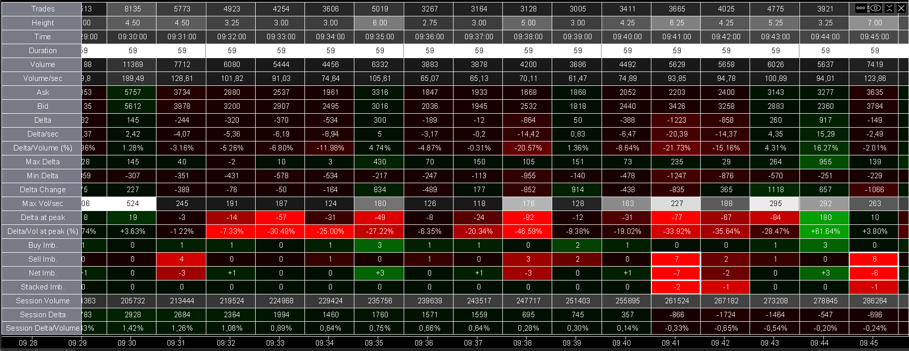
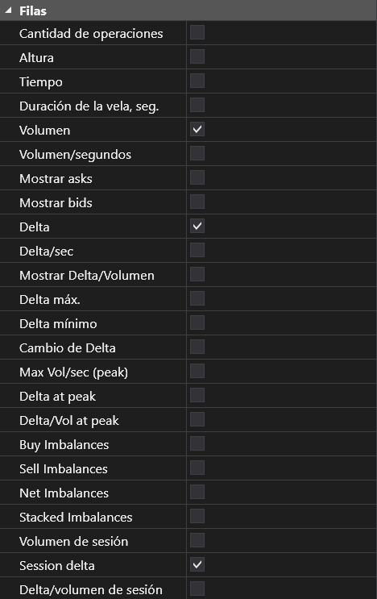
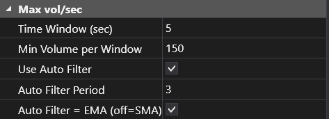
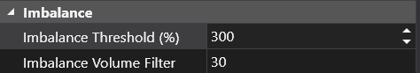
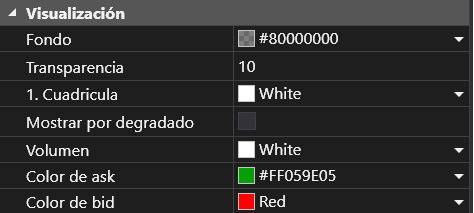
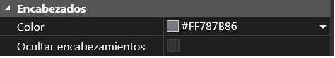
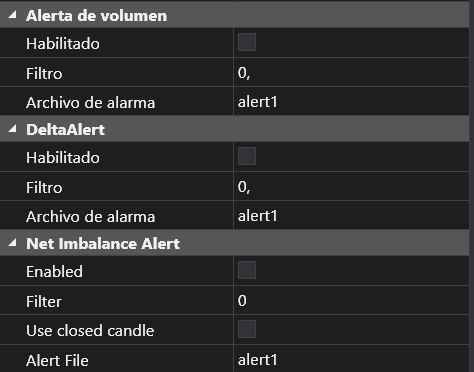

## 🟦 Cluster Statistic

- **Nombre del archivo:** [ClusterStatisticModif.cs](https://github.com/AlbertoAmadorBelchistim/Indicators/blob/compile/myindicators/MyIndicators/ClusterStatisticModif.cs) 
- **Nombre del indicador:** Cluster Statistic Modif 
- **Web oficial:** [ATAS — Cluster Statistic](https://help.atas.net/en/support/solutions/articles/72000602624-cluster-statistics)  
- **Compatibilidad:** ATAS versión estable y superiores.
- **Versión actual:** 1.1.0 (1/10/2025)
*(Versión extendida y optimizada por Alberto Amador Belchistim)*

---

### ⚙️ Parámetros configurables

#### 🧱 Filas
Selección de las filas de datos que se muestran en la tabla de estadísticas del clúster.

- **Cantidad de operaciones** – número total de trades por vela.  
- **Altura** – altura vertical de la vela (en ticks).  
- **Tiempo** – instante inicial de la vela.  
- **Duración de la vela (seg.)** – duración total en segundos.  
- **Volumen** – volumen total negociado en la vela.  
- **Volumen/segundo** – velocidad de ejecución media (volumen por segundo).  
- **Mostrar asks / bids** – muestra los volúmenes de ask y bid por separado.  
- **Delta** – diferencia entre volumen agresivo de compra y venta.  
- **Delta/seg.** – delta por segundo medio (velocidad del flujo).  
- **Mostrar Delta/Volumen** – ratio de delta normalizado respecto al volumen total.  
- **Delta máximo / mínimo** – valores extremos de delta entre los clusters de la vela.  
- **Cambio de Delta** – variación de delta respecto a la vela anterior.  
- **Max Vol/seg (peak)** – pico máximo de volumen por segundo dentro de la vela.  
- **Delta at peak** – delta en el momento del pico de volumen.  
- **Delta/Vol at peak** – relación delta/volumen en el pico de actividad.  
- **Buy / Sell / Net Imbalances** – desequilibrios por lado (compra, venta y diferencia). 
- **Stacked Imbalances** – Desequilibrios en clústeres consecutivos. 
- **Volumen / Delta / Delta/volumen de sesión** – valores acumulados desde el inicio de la sesión.

---

#### ⚡ Max vol/seg
Parámetros del cálculo de velocidad pico (volumen por segundo).

- **Ventana temporal (seg.)** – tamaño de la ventana móvil usada para el cálculo.  
En el ejemplo compararía el volumen acumulado en cada intervalo de 5 segundos dentro de la vela.
- **Volumen mínimo por ventana** – volumen mínimo durante la ventana para tenerla en cuenta en el cálculo.  
- **Usar filtro automático** – los colores de la tabla se ajustan dinámicamente según un filtro basado en la media de los últimos valores. 
- **Periodo del filtro automático** – número de velas usadas para el filtro.  
- **Filtro automático = EMA (off = SMA)** – tipo de media móvil empleada (EMA o SMA).

---

#### ⚖️ Imbalance
Control de los umbrales de desequilibrio y filtrado.

- **Umbral de desequilibrio (%)** – porcentaje de diferencia mínima entre el ask de un nivel y el bid del inferior para resaltar un desequilibrio.  
- **Filtro de volumen de desequilibrio** – volumen mínimo necesario para tener en cuenta el desequilibrio.

---

#### 🎨 Visualización
Ajustes generales de apariencia del panel.

- **Fondo** – color de fondo del panel.  
- **Transparencia** – opacidad del fondo (0–255).  
- **1. Cuadrícula** – color de las líneas de cuadrícula.  
- **Mostrar por degradado** – activa el sombreado por degradado de color en las distintas celdas.  
- **Color de volumen / Ask / Bid** – colores base para cada tipo de dato.

---

#### ✏️ Texto

- **Color** – color del texto.  
- **Tipo de letra** – fuente y tamaño (por ejemplo, Arial 9 px).  
- **Alineación centrada** – centra el texto dentro de cada celda.  
- **Ratios como porcentaje** – muestra los ratios en formato de porcentaje.

---

#### 🧩 Encabezados

- **Color** – color de fondo del encabezado.  
- **Ocultar encabezamientos** – oculta la columna de títulos de la tabla.

---

#### 🔔 Alertas de volumen / Delta / Net Imbalance

- **Habilitado** – activa la alerta.  
- **Filtro** – valor de umbral para activar la alerta.  
- **Archivo de alarma** – nombre del archivo de sonido (por ejemplo, `alert1`).
- **Usar vela cerrada** (sólo en Net Imbalance)– evalúa la condición únicamente al cierre de la vela.  

---

#### ⚙️ Misc.
- **Mostrar descripción** – muestra un texto descriptivo interno debajo del panel.

---

### 🧭 Clasificación  
📂 **VolumeOrderFlow** — Indicadores basados en estadísticas agrupadas por vela (volumen, delta, número de ejecuciones, etc.).

---

### 🧠 Uso más frecuente (versión original)

- Mostrar un **resumen por vela** de variables clave como Volumen, Delta, Trades.  
- Detectar velas con **delta extremo** (agresión de compra o venta).  
- Confirmar **impulso** cuando volumen y delta acompañan una ruptura.  

---

### ✨ Mejoras introducidas en la versión por Alberto Amador Belchistim

Esta versión modificada conserva la base del indicador original pero añade métricas avanzadas orientadas al scalping profesional.

Se han incorporado las siguientes mejoras respecto a la versión oficial:

**Visuales / UI**

- Reordenación de campos de la interfaz para mejorar legibilidad de métricas y facilitar interpretación rápida.  
- Mejora del contraste y diferenciación de color para métricas clave para facilitar identificación de señales relevantes.

**Funcionales / métricas adicionales**

- Añadido cálculo de **Delta por segundo (Delta/sec)** para medir agresión neta en función del tiempo de vela. 
- Introducción de series “PeakVolPerSec” y “PeakDeltaPerSec” para identificar picos de velocidad máxima dentro de la vela.
- Añadido “PeakDeltaPerVol” (Delta/Vol en el momento del máximo volumen/segundo) para evaluar eficiencia de impulso frente a volumen. 
- Integración de filtros por umbral basado en media (media móvil/exponencial) para métricas de pico de velocidad, permitiendo destacar eventos excepcionales en función del contexto histórico reciente.  
- Implementación de imbalances de huella (buy/sell/net) con filtro de volumen y opción de alerta cuando el desequilibrio supera umbral configurado.
- Corrección de cálculo de acumulación máxima de Bid (`maxBid`) y de `_maxDeltaPerVol` en actualizaciones de vela para mejorar precisión del resumen.

**Valor añadido práctico**

- Permite al trader ver **no solo qué se acumuló**, sino **cómo de rápido** (volumen/delta por segundo), lo cual mejora la detección de impulsos reales frente a ruido.  
- Las métricas pico (Vol/sec, Delta/sec) permiten **anticipar rupturas** o confirmarlas antes que el volumen total sea evidente.  
- Los imbalances ayudan a detectar **actividad institucional o desequilibrio significativo** en tiempo real.  
- La mejora visual hace que el panel sea **más legible** en marcos rápidos (scalping) y en sesiones donde el espacio gráfico es limitado.

---

### 📊 Nivel de relevancia  
🔟 **8 / 10**

✅ Extiende una herramienta ya relevante en el ecosistema de flujo de órdenes.  
✅ Introduce métricas nuevas que mejoran detección y velocidad de respuesta.  
⛔ Requiere buen dominio del contexto de volumen/delta y cierto espacio visual en el gráfico.

---

### 🎯 Estrategias de scalping donde se aplica

- **Ruptura con convicción**: vela que muestra Volumen alto + Delta/sec elevado + PeakVol/sec > umbral = señal de continuación.  
- **Absorción de mercado**: Volumen elevado + Delta/segs bajo o negativo + desequilibrio de huella importante cerca de soporte/resistencia = posible rechazo.  
- **Falsas rupturas**: Volumen total alto pero Delta/sec bajo + PeakDeltaPerVol bajo = falta de impulso, posible retroceso.  
- **Secuencia de impulso sostenido**: varias velas consecutivas con incremento de Trades, Vol/sec, Delta/sec → confirmar continuidad.

---

### ⚙️ Parametrización óptima para scalping (1M, S&P 500)

- **Filas activas:**  
  - ✅ Delta  
  - ✅ Delta/seg.  
  - ✅ Delta/Volumen  
  - ✅ Cambio de Delta  
  - ✅ Delta/Volumen en el pico (Delta/Vol at peak)  
  - ✅ Net Imbalances  
  - ✅ Stacked Imbalances  

- **Ventana de velocidad (Max vol/sec):**  
  - **Time Window (sec):** `5`  
  - **Min Volume per Window:** `150`  
  - **Use Auto Filter:** ✅  
  - **Auto Filter Period:** `3`  
  - **Auto Filter = EMA (off = SMA):** ✅

- **Umbrales de desequilibrio:**  
  - **Imbalance Threshold (%):** `300`  
  - **Imbalance Volume Filter:** `30`

- **Visualización:**  
  - **Fondo:** `#80000000` (gris translúcido)  
  - **Transparencia:** `10`  
  - **Cuadrícula:** `White`  
  - **Mostrar por degradado:** ❌  
  - **Color de Ask / Bid:** `#FF059E05` (verde) / `Red`  
  - **Color de volumen / texto:** `White`

- **Texto:**  
  - **Tipo de letra:** `Arial; 9px`  
  - **Ratios como porcentaje:** ✅  
  - **Alineación centrada:** ✅

- **Encabezados:**  
  - **Color:** `#FF787B86`  
  - **Ocultar encabezados:** ❌  

✅ Esta configuración ofrece una lectura equilibrada entre **intensidad del flujo** y **desequilibrio neto**, permitiendo detectar fácilmente:
- Cambios bruscos de delta intrabarra (fatiga o absorción).  
- Zonas con *stacked imbalance* o *net imbalance* dominante.  
- Momentos de aceleración del flujo (Delta/sec o Delta/Vol at peak).  

⛔ Evita sobrecargar la tabla con métricas redundantes (por ejemplo, Volume o Max/Min Delta) para mantener claridad visual en escalas de 1M.  

---

### 🧪 Notas de desarrollo

- Basado en la implementación estándar del indicador de ATAS, pero ampliado con nuevas métricas que permiten una lectura más rica del flujo de órdenes.  
- La lógica original de acumulación por vela se mantiene, pero se añade una ventana de tiempo interno para calcular Vol/sec, Delta/sec, picos por segundo y umbrales dinámicos.  
- La interfaz ha sido ajustada para scalping, con mejor alineación, más métricas y mayor claridad visual.  

---

### 🛠️ Propuestas de mejora futura

- Permitir **alertas automáticas** cuando Delta/sec o PeakDeltaPerVol superen umbral dinámico calculado por sesión.  

---