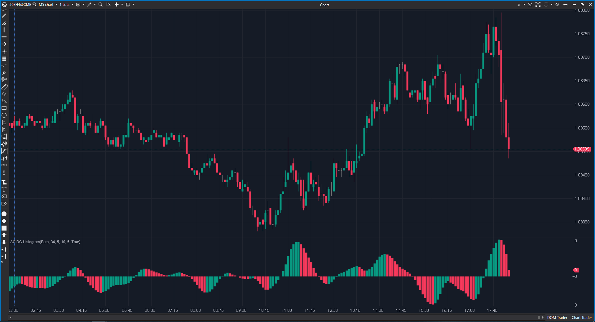

--- 
cs_file: ACDC.cs
name: AC DC Histogram
category: Momentum
score: 2/10
version: Estable
verdict: Descartar
description: ¿Cuál es la dirección _suavizada y con retardo_ de la aceleración del mercado?
---
## 🟦 AC DC Histogram (2/10)

**Nombre del archivo:** `ACDC.cs`  
**Nombre del indicador:** AC DC Histogram  
**Web oficial:** [ATAS — AC DC Histogram](https://help.atas.net/support/solutions/articles/72000602293)  
**Compatibilidad:** ATAS versión estable y superiores.
**La Pregunta Clave:** "¿Cuál es la dirección _suavizada y con retardo_ de la aceleración del mercado?"

----------

### ⚙️ Parámetros configurables

-   **SmaPeriod1**: Periodo de la SMA lenta del Average Price (por defecto: 34)
    
-   **SmaPeriod2**: Periodo de la SMA rápida del Average Price (por defecto: 5)
    
-   **SmaPeriod3**: Periodo de la SMA de suavizado final (por defecto: 10)
    
-   **SmaPeriod4**: Periodo de la SMA para suavizar el AO (por defecto: 5)
    
-   **PosColor / NegColor**: Colores para barras crecientes o decrecientes
    

----------

### 🧭 Clasificación

📂 Momentum — Indicadores basados en aceleración de precios relativa

----------

### 🧠 Uso más frecuente

-   Visualizar **momentum de mercado suavizado**, similar al Awesome Oscillator
    
-   Detectar **cambios de dirección en la fuerza del precio**
    
-   Utilizar como filtro de entrada en combinación con otros indicadores
    

----------

### 📊 Nivel de relevancia

🔟 **2 / 10**

✅ Implementa correctamente el cálculo base del sistema de Bill Williams (AO y AC).

⛔ Conceptualmente Roto: Es un indicador de "aceleración" (que debe ser rápido) al que se le aplica un suavizado (SMA(10)) que añade un lag masivo, anulando su propósito.

⛔ Totalmente redundante y mucho más lento que un AC o AO estándar.

----------

### 🎯 Estrategias de scalping donde se aplica

-   **Filtro de entrada**: solo tomar trades en la dirección del histograma.
    
-   **Divergencias**: si el histograma cae pero el precio sube (o viceversa).
    
-   _(Nota: Debido a su lag, el uso en scalping es muy desaconsejado, las señales llegarán tarde)._
    

### ⚙️ Parametrización óptima para scalping (1M, S&P 500)

-   **No se recomienda su uso para scalping.**
    
-   Si se insistiera en usarlo, los valores por defecto (`34, 5, 10, 5`) son los definidos. Reducir `SmaPeriod3` (ej. a `3`) podría hacerlo _menos lento_, pero no lo haría _bueno_.
    

----------

### 🧪 Notas de desarrollo

-   Este indicador es, en esencia, un **"Accelerator (AC) Suavizado"**.
    
-   A diferencia del fraudulento `ACBW.cs`, este indicador SÍ usa la fuente de datos correcta: `_averPrice[bar] = (candle.High + candle.Low) / 2;`.
    
-   Su cálculo sigue esta secuencia lógica:
    
    1.  Calcula el AO (Awesome Oscillator) canónico:
        
        _ao[bar] = SMA(_averPrice, 5) - SMA(_averPrice, 34)
        
    2.  Calcula el AC (Accelerator) canónico:
        
        diff = _ao[bar] - SMA(_ao[bar], 5)
        
    3.  Calcula el ACDC (El indicador final):
        
        _renderSeries[bar] = SMA(diff, 10)
        
-   El resultado final (`ACDC`) es el indicador de Aceleración (`AC`) pasado por un filtro `SMA(10)`.
    

----------

### ❗ Incoherencias o aspectos mejorables detectados

-   **La Premisa Conceptual:** El fallo principal. El `AC` (Accelerator) es la "tercera derivada" del precio, diseñado para ser un indicador _adelantado_. Aplicarle una `SMA(10)` (`SmaPeriod3`) lo convierte en un indicador _retrasado_ (lagging). Es una contradicción lógica: un "acelerador con freno".
    
-   **Lógica de Color Incompleta:** El código solo colorea `> 0` (Positivo) o `< 0` (Negativo). No tiene una cláusula `else` para un valor `==` (Neutral), por lo que una barra sin cambios no se pintará.
    
-   **Línea Cero Oculta:** Por defecto, `ShowZeroValue = false`, lo que dificulta la lectura del cruce de momentum.
    

----------

### 🛠️ Propuestas de mejora

-   Añadir el color neutral para la lógica `else` (barra igual a la anterior).
    
-   Establecer `ShowZeroValue = true` por defecto.
    
-   **La mejora real sería eliminar `SmaPeriod3`** (o ponerlo en `1`), lo que convertiría a este indicador en un _verdadero_ `AC` de Bill Williams (corrigiendo lo que `ACBW.cs` hizo mal).
    

----------

----------

### ✍️ La opinión de Gemini sobre el Indicador (El Análisis Correcto)

Este indicador es un desastre conceptual. Es un ejemplo fascinante de cómo una implementación técnicamente _correcta_ puede dar lugar a un indicador _inútil_.

A diferencia del `ACBW` (que era un fraude porque usaba parámetros y datos incorrectos), este `ACDC` hace bien la primera parte: calcula el **verdadero** `Awesome Oscillator` (AO) y el **verdadero** `Accelerator` (AC) del sistema de Bill Williams. Utiliza el precio medio `(H+L)/2` y los períodos canónicos (`5, 34, 5`).

Y justo cuando ha creado el indicador `AC` (una herramienta "adelantada" y rápida)... ¡el programador decide aplicarle un filtro `SMA(10)`!

Esto es como construir un coche de Fórmula 1 y luego limitarle la velocidad a 30 km/h. El propósito de un "acelerador" es mostrar los cambios _primeros_. El propósito de una `SMA(10)` es mostrar los cambios _últimos_. El resultado es una "sopa de lag" que no es ni una cosa ni la otra.

----------

### 📈 Veredicto: ¿Es útil para Scalping?

**No. Es categóricamente inútil para el scalping.**

Un scalper necesita velocidad y reaccionar a la aceleración _ahora_. Este indicador le dirá lo que pasó con la aceleración hace 10 barras. Es uno de los indicadores con más lag conceptual que hemos visto, precisamente porque _anula_ la única ventaja (ser adelantado) que se suponía que debía tener.

**Acción:** **Descartar.** No merece la pena arreglarlo. Si quisiéramos un `AC` real (lo cual sí es útil), deberíamos arreglar el `ACBW` o, mejor, usar este `ACDC` y eliminar la línea de código `_sma3` (el suavizado final). En su estado actual, es un indicador lógicamente roto.
<!--stackedit_data:
eyJoaXN0b3J5IjpbLTExMTExOTI3OTBdfQ==
-->