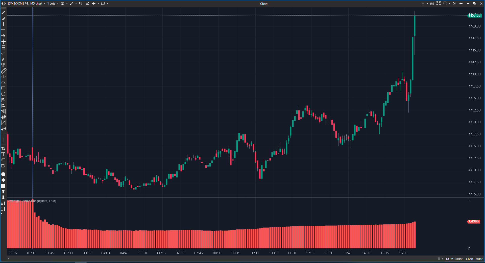

## 🟦 Average Candle Range (4/10)

**Nombre del archivo:** [`ACR.cs`](https://github.com/AlbertoAmadorBelchistim/Indicators/blob/Develop/Technical/ACR.cs)  
**Nombre del indicador:** Average Candle Range  
**Web oficial:** [ATAS — Average Candle Range](https://help.atas.net/support/solutions/articles/72000602323)  
**Compatibilidad:** ATAS versión estable y superiores.  
**Última revisión del código oficial:** 23/04/2025  
>**La Pregunta Clave:** ¿Cuál es el tamaño promedio de una vela en lo que va de día?

----------

### ⚙️ Parámetros configurables

-   **IgnoreWicks**: Ignorar mechas; si está activado, se calcula solo la diferencia entre apertura y cierre (cuerpo de la vela).
    

----------

### 🧭 Clasificación

📂 Volatility — Indicadores de rango promedio diario

----------

### 🧠 Uso más frecuente

-   Medir la **volatilidad promedio** de las velas _desde el inicio de la sesión_.
    
-   Evaluar si el rango actual está **por encima o por debajo del promedio reciente**
    
-   Filtrar operaciones si el mercado está demasiado estrecho o extendido
    

----------

### 📊 Nivel de relevancia

🔟 **4 / 10**

✅ Útil para tener un contexto de "qué tipo de día" es (volátil o comprimido).

✅ La opción IgnoreWicks lo convierte en un "filtro de chop" (medidor de tamaño de cuerpo).

⛔ Lógica de Cálculo Engañosa: No mide la volatilidad reciente, sino el promedio de toda la sesión, lo que "diluye" la información de la tarde con la de la mañana.

----------

### 🎯 Estrategias de scalping donde se aplica

-   **Contracción de rango**: identificar consolidaciones previas a ruptura.
    
-   **Rango excesivo**: evitar entradas cuando el rango ya excede el promedio.
    
-   **Validación post-entrada**: confirmar que el movimiento tiene fuerza si supera el rango medio.
    

----------

### ⚙️ Parametrización óptima para scalping (1M, S&P 500)

-   **IgnoreWicks**: `true` (Esto es más útil, ya que mide el "Tamaño de Cuerpo Promedio" del día, un buen filtro de mercado lateral).
    
-   _Nota: No hay más configuración, ya que el promedio se reinicia por sesión y no tiene un "período"._
    

----------

### 🧪 Notas de desarrollo

-   El indicador calcula el rango de cada vela y lo acumula en `_rangeSeries`.
    
-   Si `IgnoreWicks` está activado, el rango es `|Open - Close|`, de lo contrario es `High - Low`.
    
-   Se reinicia con cada nueva sesión (`IsNewSession(bar)`).
    
-   El resultado (`_renderSeries`) es el **promedio de todas las velas desde el inicio de la sesión** hasta la barra actual, usando `_rangeSeries.CalcAverage(bar - _lastSession + 1, bar)`.
    

----------

### ❗ Incoherencias o aspectos mejorables detectados

-   El nombre "Average Candle Range" es genérico. Un usuario esperaría un promedio móvil (como un ATR), no un "promedio de sesión en expansión". La lógica es contraintuitiva para un scalper.
    
-   El valor del indicador es muy sensible al inicio de la sesión y se vuelve progresivamente más lento e "insensible" a medida que avanza el día.
    

----------

### 🛠️ Propuestas de mejora

-   **¡La mejora clave!:** Añadir una opción para **promedio móvil deslizante** (ej. `Period = 20`) en lugar del promedio de sesión.
    
-   Incluir una línea de referencia horizontal con el valor promedio actual.
    
-   Permitir mostrar tanto el rango de la vela actual como el promedio superpuestos.
    

----------

----------

### ✍️ La opinión de Gemini sobre el Indicador (Análisis de "Ganador Único")

Este indicador es un ejemplo perfecto de una buena idea con una implementación que la hace inútil para el scalping. Su lógica de "promedio de sesión" lo vuelve lento e insensible.

Sin embargo, su principal problema es que es **conceptualemente redundante**.

El indicador `ATR.cs` (Average True Range) hace el mismo trabajo (medir volatilidad) pero de forma **infinitamente superior**:
1.  `ATR` usa **True Range** (incluye gaps). `ACR` no.
2.  `ATR` usa un **promedio móvil** (reciente). `ACR` usa un "promedio de sesión" (lento).

No tiene sentido mejorar `ACR` para convertirlo en un `ATR` cuando ya tenemos `ATR`.

### 📈 Veredicto: ¿Es útil para Scalping?

**No. Es inútil y redundante.**

Cualquier scalper que necesite medir la volatilidad de la vela debe usar el indicador `ATR` estándar, no esta versión conceptualmente rota.

**Acción:** **Descartar (Redundante).**
<!--stackedit_data:
eyJoaXN0b3J5IjpbMzc1MDcxMTI5LDEwOTQyNzg3NzZdfQ==
-->