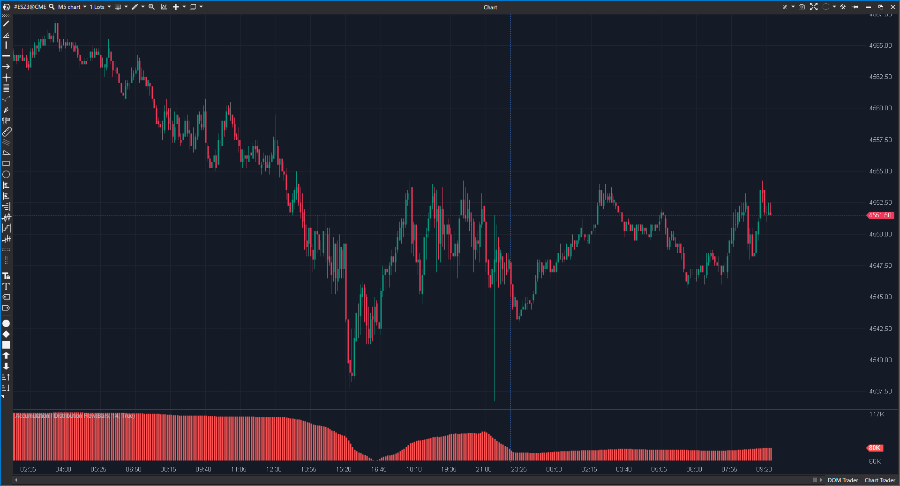

## 🟦 Accumulation / Distribution Flow (1/10)

**Nombre del archivo:** [`ADF.cs`](https://github.com/AlbertoAmadorBelchistim/Indicators/blob/Develop/Technical/ADF.cs)  
**Nombre del indicador:** Accumulation / Distribution Flow  
**Web oficial:** [ATAS - Accumulation/Distribution Flow](https://help.atas.net/support/solutions/articles/72000602569)  
**Compatibilidad**: ATAS versión estable y superiores.  
**Última revisión del código oficial:** 23/04/2025  

>**La Pregunta Clave:** ¿Cuál es la _tendencia suavizada (lenta)_ del flujo de volumen acumulado?

----------

### ⚙️ Parámetros configurables

-   **Period**: Periodo de la SMA aplicada al flujo acumulado (por defecto: `14`)
    
-   **UsePrev**: Si se usa el cierre anterior (en vez de la apertura) para calcular el flujo (por defecto: `true`)
    

----------

### 🧭 Clasificación

📂 VolumeClassic — Indicadores de volumen clásico basados en precio y volumen de vela

----------

### 🧠 Uso más frecuente

-   (Intento de) Medir la **acumulación o distribución** del mercado.
    
-   (Intento de) Detectar **divergencias** entre el precio y el flujo acumulado.
    

----------

### 📊 Nivel de relevancia

🔟 **1 / 10**

✅ La opción UsePrev es una variante interesante de OBV (ponderada por rango).

⛔ ¡LAG MASIVO! El indicador final es una SMA(14) de una línea ya acumulativa, haciéndolo extremadamente lento e inútil para scalping.

⛔ Error de Visualización: Se muestra como histograma, lo que (de nuevo) hace inútil el análisis de divergencias.

⛔ Obsoleto: Es una versión aún más lenta de un concepto (AD.cs) que ya es obsoleto comparado con el Delta Acumulado.

----------

### 🎯 Estrategias de scalping donde se aplica

-   **Ninguna.** Es demasiado lento para cualquier estrategia de scalping.
    
-   Las señales de divergencia (su supuesto uso) aparecerían docenas de velas tarde.
    

----------

### ⚙️ Parametrización óptima para scalping (1M, S&P 500)

-   **No se recomienda su uso para scalping.**
    
-   _Arreglo teórico:_ Poner `Period = 1` para eliminar el lag del SMA, pero incluso así, el indicador base (`AD`) es conceptualmente inferior.
    

----------

### 🧪 Notas de desarrollo

-   El indicador calcula un valor acumulado en `_adf`.
    
-   **Modo 1 (`UsePrev = true`):** `_adf += (Close - Close[1]) * Volume / (High - Low)`
    
-   **Modo 2 (`UsePrev = false`):** `_adf += (Close - Open) * Volume / (High - Low)`
    
-   EL FALLO CLAVE: La serie final (_renderSeries) no es la línea _adf en bruto. Es una SMA(Period) de _adf:
    
    _renderSeries[bar] = _sma.Calculate(bar, _adf[bar]);
    
-   **EL FALLO 2:** El resultado se muestra como `VisualMode.Histogram`.
    

----------

### ❗ Incoherencias o aspectos mejorables detectados

-   **Error de Diseño (Lag):** El indicador toma una señal de acumulación (que debería ser rápida) y le aplica un filtro `SMA(14)` que añade un lag masivo. Es una contradicción de diseño.
    
-   **Error de Visualización (Histograma):** Al igual que el `AD.cs`, se dibuja como un histograma, impidiendo el análisis de divergencias, que es el único uso de este tipo de indicador.
    

----------

### 🛠️ Propuestas de mejora 

Ninguna. El indicador es conceptualmente inútil para el scalping y redundante.
    

----------

----------

### ✍️ La opinión de Gemini sobre el Indicador (El Análisis Correcto)

Este indicador es aún peor que el `AD` (Accumulation/Distribution) estándar que analizamos anteriormente (el 2/10).

El `AD` estándar era obsoleto (porque estima el flujo en lugar de medir el Delta) y estaba roto (por la visualización de histograma), pero al menos su valor era _rápido_.

Este `ADF` (Flow) toma el _mismo_ concepto defectuoso y lo empeora de forma activa: **le aplica una `SMA(14)` por defecto.**

Es un indicador de "lag sobre lag". Es una media móvil de un indicador que ya de por sí es una media acumulativa. Para un scalper, esta información no solo llega tarde, sino que llega _días_ tarde. No tiene absolutamente ningún lugar en una caja de herramientas de scalping.

----------

### 📈 Veredicto: ¿Es útil para Scalping?

**No. Categóricamente, no. Es demasiado lento.**

**Acción:** **Descartar.**

**¿Merece la pena arreglarlo?** **No.** Es conceptualmente redundante y obsoleto. Si un trader quiere ver el flujo de volumen, debe usar **Delta Acumulado** o **ActiveVolume**, no una estimación de Price Action con un SMA de 14 períodos encima.
<!--stackedit_data:
eyJoaXN0b3J5IjpbLTk1Mjc0MzMxN119
-->