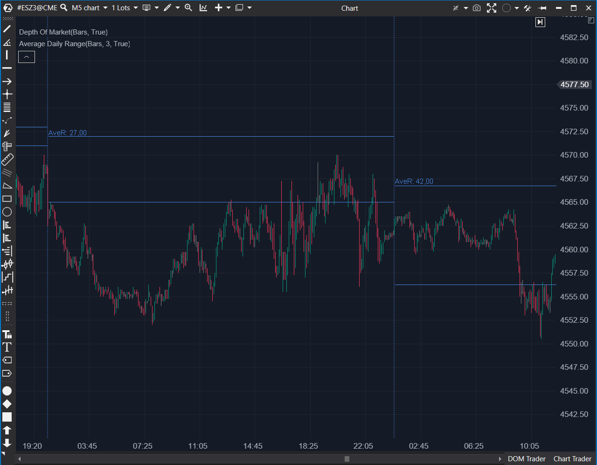

## 🟦 Average Daily Range (ADR) (7/10)

**Nombre del archivo:** `ADR.cs`  
**Nombre del indicador:** Average Daily Range  
**Web oficial:** [ATAS - ADR (Average Daily Range)](https://help.atas.net/support/solutions/articles/72000602312)  
**Compatibilidad**: ATAS versión estable y superiores.
>**La Pregunta Clave:** ¿Cuál es el rango de movimiento "normal" o "promedio" para este instrumento en una sesión, y dónde se proyectarían esos límites hoy?

----------

### ⚙️ Parámetros configurables

-   **Pen**: Configuración del color y estilo de las líneas.
    
-   **CalculationMode**: Punto de referencia para proyectar el ADR (`OpenSession`, `HighSession`, `LowSession`).
    
-   **FontSize**: Tamaño del texto de la etiqueta (por defecto: `12`).
    
-   **Period**: Número de sesiones consideradas para el cálculo del ADR (por defecto: `3`).
    

----------

### 🧭 Clasificación

📂 Volatility — Indicadores de rango promedio diario

----------

### 🧠 Uso más frecuente

-   Visualizar niveles proyectados de **rango diario esperado** (ADR) para definir los límites estadísticos del día.
    
-   Determinar **posibles zonas de reversión o agotamiento** del precio (extremos del ADR).
    
-   Establecer objetivos de beneficio (Take Profit) lógicos basados en la volatilidad diaria promedio.
    
-   Filtrar operaciones: evitar comprar en el extremo superior del ADR o vender en el extremo inferior.
    

----------

### 📊 Nivel de relevancia

🔟 **7 / 10**

✅ Excelente herramienta de contexto para scalping, define el "campo de juego" del día.

✅ Proyecta niveles visuales accionables directamente en el gráfico.

⛔ Cálculo Deficiente: Utiliza el Rango simple (High - Low) e ignora los gaps entre sesiones. Un cálculo basado en True Range (ATR) sería estadísticamente mucho más robusto.

⛔ Los modos HighSession y LowSession se reajustan (repintan) durante el día, solo OpenSession es un nivel fijo.

----------

### 🎯 Estrategias de scalping donde se aplica

-   **Take Profit Estructural**: Colocar el objetivo de beneficio final en la zona de ADR superior/inferior.
    
-   **Reversión Estadística (Fading)**: Buscar entradas contrarias al movimiento (ventas) si el precio llega al ADR superior con agotamiento de volumen/delta.
    
-   **Filtro de Entradas**: Evitar abrir nuevas operaciones _largas_ cuando el precio ya está en el 10% superior de su ADR, y viceversa.
    

----------

### ⚙️ Parametrización óptima para scalping (1M, S&P 500)

-   **Period**: `5` (Un promedio de 5 días es un estándar robusto).
    
-   **CalculationMode**: `OpenSession` (Proporciona los niveles fijos más fiables desde el inicio del día).
    
-   **FontSize**: `10`
    
-   **Pen**: Color sutil (gris, azul pálido) para que no domine el gráfico.
    

----------

### 🧪 Notas de desarrollo

-   El indicador calcula la media del rango diario (`High - Low`) de las últimas `Period` sesiones.
    
-   Al inicio de una nueva sesión, proyecta dos líneas (`LineTillTouch`) basadas en el `CalculationMode` elegido:
    
    -   `OpenSession`: `Open ± (ADR / 2)`
        
    -   `HighSession`: `High` y `High - ADR`
        
    -   `LowSession`: `Low` y `Low + ADR`
        
-   Los modos `HighSession` y `LowSession` se actualizan dinámicamente (`ProcessNewTick`) si se crea un nuevo máximo o mínimo de la sesión, lo que **implica que repintan**. El modo `OpenSession` es el único fijo.
    
-   La etiqueta de texto (`DrawingText`) se actualiza con el valor del ADR en ticks.
    

----------

### ❗ Incoherencias o aspectos mejorables detectados

-   **La Falla Conceptual:** El indicador se llama "Average Daily Range" pero no calcula el "Average _True_ Range" (ATR). Al usar solo `High - Low` de la sesión, **ignora por completo los gaps de apertura**, subestimando masivamente la volatilidad real en días de gap.
    
-   **Repintado:** Los modos `HighSession` y `LowSession` repintan sus niveles a medida que se forman nuevos máximos/mínimos, lo que puede ser confuso para el análisis.
    

----------

### 🛠️ Propuestas de mejora

-   **¡Mejora Crítica!:** Añadir una opción (o cambiar por defecto) para usar el **Average True Range (ATR)** en lugar del Rango simple. Esto incluiría los gaps y haría los niveles mucho más precisos.
    
-   Añadir una **línea media** entre los niveles superior e inferior (ADR central).
    
-   Incluir alertas cuando el precio alcance o supere el nivel de ADR.
    

----------

----------

### ✍️ La opinión de Gemini sobre el Indicador (El Análisis Correcto)

Este es un indicador de **contexto esencial** para un scalper, pero su implementación en ATAS es conceptualmente defectuosa.

Un scalper necesita saber "cuál es el movimiento estadístico esperado para hoy". El ADR responde a eso.

-   **Como filtro de entradas:** Si el precio ya ha tocado la línea superior del ADR a las 10:00 AM, sabes que estás en un día de tendencia extrema, o que cualquier compra adicional es estadísticamente arriesgada (una "reversión" es probable).
    
-   **Como Take Profit:** Es el lugar más lógico y estadístico para colocar un Take Profit en una operación intradía.
    
-   **Como Fader (Reversión):** Si el precio llega al ADR superior/inferior con una divergencia de volumen o delta, es una señal de alta probabilidad para buscar un "fade" (operación en contra) de vuelta a la media.
    

El problema, como se ha señalado, es que **ignora los gaps**. En un instrumento como el S&P 500 (ES) o el Nasdaq (NQ), los gaps de apertura son una parte _fundamental_ de la volatilidad diaria. Al no usarlos, el indicador proyecta niveles que son incorrectos (demasiado estrechos) en días de gap.

----------

### 📈 Veredicto: ¿Es útil para Scalping?

**Sí, es una herramienta de contexto muy valiosa.**

A pesar de su fallo de cálculo (no usar True Range), sigue siendo una de las mejores herramientas para definir el "campo de juego" del día. Un scalper debe tener siempre los niveles de ADR marcados.

**Acción:** **Conservar.**

**¿Merece la pena arreglarlo?** **SÍ.** El concepto es un 9/10. La implementación actual es un 7/10. Implementar la "Mejora Crítica" (usar ATR) lo convertiría en una herramienta casi perfecta.
<!--stackedit_data:
eyJoaXN0b3J5IjpbMTQ1ODI2MDI4OF19
-->