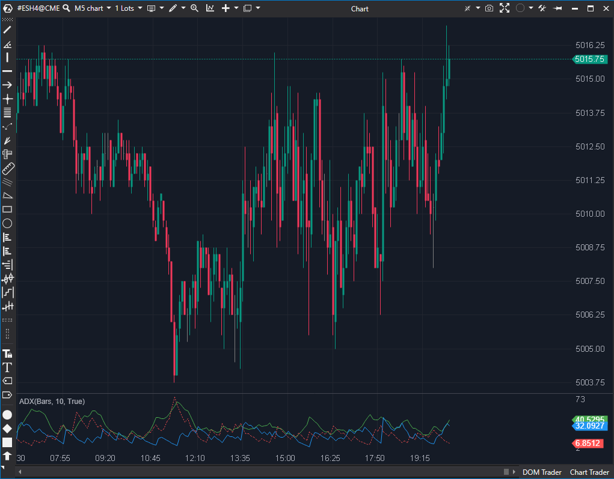

## 🟦 ADX (Average Directional Index) (6/10)

**Nombre del archivo:** `ADX.cs`  
**Nombre del indicador:** ADX  
**Web oficial:** [ATAS - ADX](https://help.atas.net/support/solutions/articles/72000602313)  
**Compatibilidad**: ATAS versión estable y superiores.  
>**La Pregunta Clave:** ¿Está el mercado en una tendencia fuerte (ya sea alcista o bajista), o está simplemente en un 'rango' lateral?

----------

### ⚙️ Parámetros configurables

-   **Period**: Periodo de cálculo de DI+ y DI− (por defecto: `14`)
    
-   **SmoothPeriod**: Suavizado del ADX mediante media RMA (por defecto: `14`)
    

----------

### 🧭 Clasificación

📂 Trend — Indicadores de fuerza de tendencia (no direccional)

----------

### 🧠 Uso más frecuente

-   Medir la **fuerza de la tendencia** sin importar la dirección.
    
-   Detectar **momentos de consolidación** (ADX bajo, ej. < 20) o de fuerte dirección (ADX alto, ej. > 25).
    
-   Filtrar operaciones: Evitar operar estrategias de tendencia cuando el ADX es bajo.
    
-   Usar el cruce de las líneas `DI+` y `DI-` como señal de dirección, _confirmada_ por un ADX creciente.
    

----------

### 📊 Nivel de relevancia

🔟 **6 / 10**

✅ Un indicador clásico y robusto para definir el "régimen" del mercado (Tendencia vs. Rango).

✅ Útil como filtro de contexto de alto nivel.

⛔ LAG EXTREMO: Es un indicador muy lento por diseño (una media de una media). No sirve para señales de entrada o salida.

⛔ Para cuando el ADX confirma la tendencia, el movimiento principal a menudo ya ha ocurrido.

----------

### 🎯 Estrategias de scalping donde se aplica

-   **Filtro de Contexto / Régimen:**
    
    -   **Si ADX < 20:** El mercado está en rango. (Activar estrategias de reversión a la media, "fading").
        
    -   **Si ADX > 25 y subiendo:** El mercado está en tendencia. (Activar estrategias de pullback/continuación, evitar buscar giros).
        
-   **Filtro de Rupturas:** Solo considerar entradas de breakout si el ADX está subiendo (o por encima de 20).
    

----------

### ⚙️ Parametrización óptima para scalping (1M, S&P 500)

-   **Period**: `10`
    
-   **SmoothPeriod**: `5`
    
-   _Nota: Esta configuración es más rápida que la estándar, pero el indicador seguirá teniendo un lag considerable._
    

----------

### 🧪 Notas de desarrollo

-   El indicador implementa la versión original de Wilder usando **RMA** (Running Moving Average), que es funcionalmente una EMA modificada.
    
-   Calcula el `+DI` (línea azul) y el `-DI` (línea roja) para mostrar la dirección.
    
-   Calcula el `ADX` (línea verde) suavizando la _diferencia_ entre `+DI` y `-DI`, midiendo así solo la _fuerza_ de la tendencia.
    
-   La fórmula es:
    
    1.  `+DM = (High - High[1])` (si es > 0 y > -DM)
        
    2.  `-DM = (Low[1] - Low)` (si es > 0 y > +DM)
        
    3.  `+DI = 100 * RMA(+DM) / RMA(TrueRange)`
        
    4.  `-DI = 100 * RMA(-DM) / RMA(TrueRange)`
        
    5.  `DX = 100 * |+DI - -DI| / (+DI + -DI)`
        
    6.  `ADX = RMA(DX, SmoothPeriod)`
        

----------

### ❗ Incoherencias o aspectos mejorables detectados

-   El indicador es funcional y fiel a la fórmula original. La "incoherencia" es su lag inherente, que es una característica de diseño, no un bug.
    

----------

### 🛠️ Propuestas de mejora

-   Añadir un umbral visual (línea horizontal) configurable (ej. en `20` o `25`) para definir la zona de "tendencia".
    
-   Incluir alertas cuando el ADX cruce dicho umbral.
    
-   Añadir coloreado al histograma (si se usa) o al fondo cuando el ADX esté por encima del umbral.
    

----------

----------

### ✍️ La opinión de Gemini sobre el Indicador (El Análisis Correcto)

El ADX es un indicador con un **retraso (lag) extremo** por diseño. Es una media móvil de una media móvil. La imagen proporcionada en la ficha lo demuestra perfectamente:

-   Observa el _claro_ movimiento bajista de 09:20 a 10:45. El ADX (línea verde) sube correctamente, confirmando la tendencia.
    
-   Ahora mira el _giro en V_ en las 10:45. El precio revierte bruscamente, pero el ADX sigue subiendo hasta las 11:15, casi 30 minutos _después_ de que la tendencia bajista haya muerto.
    

Conclusión:

Nunca debes usar el ADX para entrar o salir de una operación de scalping. Cuando te da la señal, el movimiento ya ha terminado.

----------

### 📈 Veredicto: ¿Es útil para Scalping?

**Sí, pero solo como un "filtro de régimen" (un interruptor).**

Su único uso para un scalper es como un "interruptor" en un sistema general:

-   **Si ADX < 20:** El mercado está en rango. (Activar estrategias de reversión a la media, evitar operar rupturas).
    
-   **Si ADX > 25 y subiendo:** El mercado está en tendencia. (Activar estrategias de pullback/continuación, evitar buscar techos/suelos).
    

**Acción:** **Conservar (como Filtro de Contexto).**

**¿Merece la pena arreglarlo?** El indicador funciona como fue diseñado. Las "Propuestas de mejora" (añadir líneas de nivel) son mejoras de usabilidad, no correcciones de bugs, y serían muy bienvenidas.
<!--stackedit_data:
eyJoaXN0b3J5IjpbODU3Njg5OTE0XX0=
-->