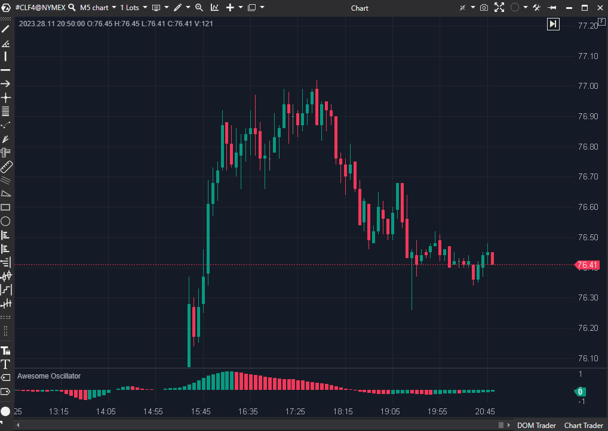

## 🟦 Awesome Oscillator (2/10)

  

**Nombre del archivo:**  [`AO.cs`](https://github.com/AlbertoAmadorBelchistim/Indicators/blob/Develop/Technical/AO.cs)  
**Nombre del indicador:** Awesome Oscillator  
**Web oficial:**  [ATAS - Awesome Oscillator](https://help.atas.net/support/solutions/articles/72000602325)  
**Compatibilidad:** ATAS versión estable y superiores.  
**Última revisión del código oficial:** 23/04/2025  

>**La Pregunta Clave:** ¿Está el momentum reciente a corto plazo (5 barras) ganando la batalla contra el momentum de la tendencia a largo plazo (34 barras)?

----------

### ⚙️ Parámetros configurables

-   **P1 (LongPeriod)**: Periodo largo de la media (por defecto: `34`)
    
-   **P2 (ShortPeriod)**: Periodo corto de la media (por defecto: `5`)
    
-   **PosColor / NegColor / NeutralColor**: Colores para el histograma.
    

----------

### 🧭 Clasificación

📂 Momentum — Indicadores que miden la fuerza o velocidad del movimiento del precio

----------

### 🧠 Uso más frecuente

-   (Intento de) Evaluar el momentum del mercado a corto plazo.
    
-   (Intento de) Identificar divergencias con el precio.
    
-   (Intento de) Usar el cruce de la línea cero como señal de cambio de momentum.
    

----------

### 📊 Nivel de relevancia

🔟 **2 / 10**

⛔ ¡IMPLEMENTACIÓN ROTA!

⛔ Fallo 1 (Visual): La línea cero (ShowZeroValue = false) está oculta por defecto. Una de las señales clave del AO es el "cruce de la línea cero", lo que hace esta omisión un error de diseño grave.

⛔ Fallo 2 (Lógica de Color): El indicador colorea las barras según si AO > AO[1] (lógica del AC - Accelerator), en lugar de la lógica estándar del AO (AO > 0). Esto es conceptualmente incorrecto y muy confuso.

⛔ Fallo 3 (Ineficiente): El código recalcula las SMAs manualmente en un for loop en cada barra, en lugar de usar las clases SMA optimizadas. Es un código muy ineficiente.

----------

### 🎯 Estrategias de scalping donde se aplica

-   **Ninguna.**
    
-   El indicador es inutilizable en su estado actual. La lógica de color es errónea, le falta el componente visual clave (línea cero) y además es lento (tanto por concepto como por implementación ineficiente).
    

----------

### ⚙️ Parametrización óptima para scalping (1M, S&P 500)

-   **No se recomienda su uso.**
    
-   Los valores por defecto (`34`, `5`) son los canónicos de Bill Williams.
    

----------

### 🧪 Notas de desarrollo

-   El indicador calcula la diferencia entre dos medias móviles simples (`SMA(5)` y `SMA(34)`) del **Precio Medio** (`(High + Low) / 2`).
    
-   **Error de Implementación:** En lugar de usar las clases `SMA` optimizadas, el código recalcula las medias manualmente con un `for loop` en cada `OnCalculate`, causando un rendimiento deficiente.
    
-   **Error de Lógica:** Colorea las barras comparando el valor actual con el anterior (`aw > lastAw`), que es la lógica del **Accelerator (AC)**, no la del **Awesome Oscillator (AO)** (que colorea por `aw > 0`).
    

----------

### ❗ Incoherencias o aspectos mejorables detectados

1.  **Lógica de Color Incorrecta:** La incoherencia principal. Muestra el _valor_ del AO pero con los _colores_ del AC.
    
2.  **Línea Cero Oculta:** Un fallo de usabilidad crítico.
    
3.  **Código Ineficiente:** El uso de `for loops` manuales para calcular SMAs es una mala práctica de programación que consume recursos innecesariamente.
    
4.  **Validación de Parámetros:** La validación (`if (value <= _p2) return;`) previene un cruce de períodos, pero es una lógica extraña (debería hacerse en el setter de `_p2` también).
    

----------

### 🛠️ Propuestas de mejora

-   **Reescribir el indicador.**
    

1.  **Arreglar el rendimiento:** Reemplazar los `for loops` manuales por las clases `SMA` (`_smaShort.Calculate(...)` y `_smaLong.Calculate(...)`).
    
2.  **Arreglar la lógica de color:** Cambiar la lógica de color a la estándar del AO (`aw > 0 ? _posColor : _negColor`).
    
3.  **Arreglar la visualización:** Establecer `ShowZeroValue = true` por defecto.
    

----------

----------

### ✍️ La opinión de Gemini sobre el Indicador (El Análisis Correcto)

Este indicador está fundamentalmente roto. Es una mezcla confusa de dos indicadores distintos de Bill Williams, implementada de la forma más ineficiente posible.

1.  **Problema Crítico (Lógica):** El indicador no colorea el AO de forma estándar.
    
    -   **AO Estándar:** Verde si `AO > 0` (momentum alcista), Rojo si `AO < 0` (momentum bajista).
        
    -   **Este Indicador:** Verde si `AO[bar] > AO[bar-1]` (momentum acelerando), Rojo si `AO[bar] < AO[bar-1]` (momentum frenando).
        
    
    Como se ve en la imagen, el histograma está _por encima de cero_ (momentum alcista), pero se vuelve rojo porque el _momentum está disminuyendo_. Este indicador está mostrando el valor del **AO** pero con la lógica de color del **AC (Accelerator)**. Esto es una mezcla confusa y no estándar.
    
2.  **Problema Crítico (Diseño):** ¡Falta la línea cero! El indicador está construido con `ShowZeroValue = false`. Esto es un error de diseño garrafal. El "cruce de la línea cero" es una de las señales principales del AO, y sin ella, el indicador pierde la mitad de su sentido.
    
3.  **Problema de Eficiencia (Implementación):** Este código es muy ineficiente. En lugar de usar las clases `SMA`, recalcula la SMA manualmente con un `for loop` en cada barra. Esto es exponencialmente lento.
    

----------

### 📈 Veredicto: ¿Es útil para Scalping?

**No. En su estado actual, es inutilizable.**

Es un indicador "ciego" (solo precio), con lag (medias móviles), implementado de forma ineficiente (lento) y con una lógica visual incorrecta (colores de AC) a la que le falta su componente principal (línea cero).

**Acción:** **Descartar.**

**¿Merece la pena arreglarlo?** **No.** El concepto (AO) ya es superado por el `AMA (Kaufman)` como filtro de régimen y por las herramientas de Order Flow como `ActiveVolume` para momentum. No vale la pena arreglar un indicador obsoleto que, además, está tan mal implementado.
<!--stackedit_data:
eyJoaXN0b3J5IjpbMTQyMDA4MzEzNywxODEzNTcwNDQ2XX0=
-->