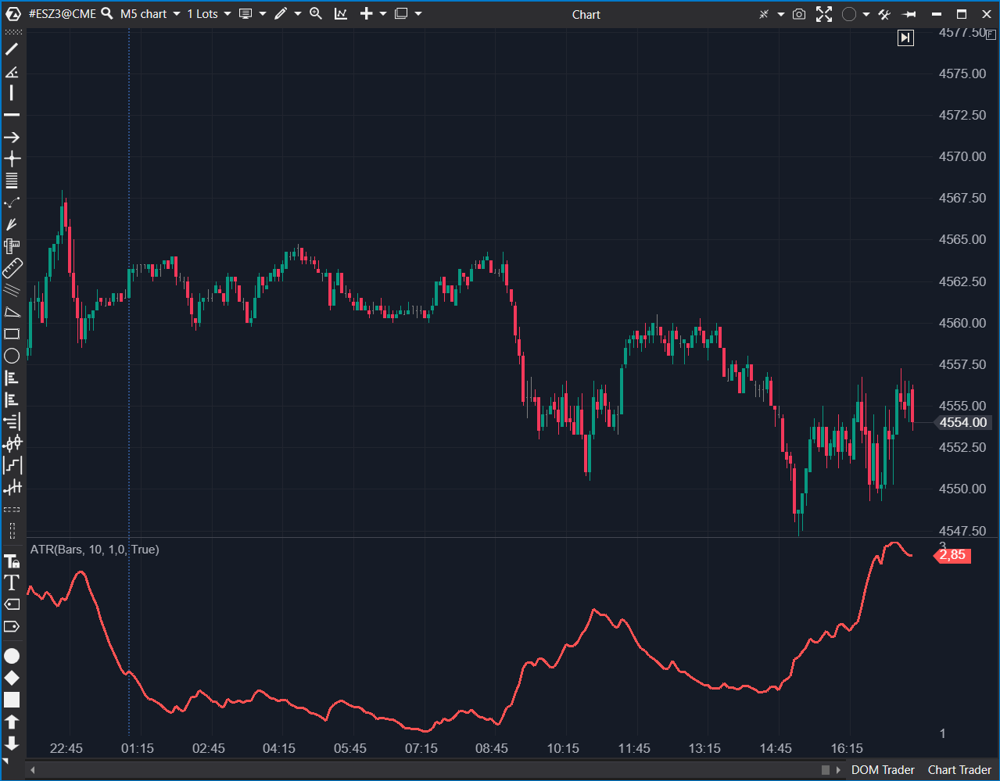

## 🟦 ATR (8/10)

  

**Nombre del archivo:**  [`ATR.cs`](https://github.com/AlbertoAmadorBelchistim/Indicators/blob/Develop/Technical/ATR.cs)  
**Nombre del indicador:** ATR  
**Web oficial:**  [ATAS - ATR](https://help.atas.net/support/solutions/articles/72000602536)  
**Compatibilidad:** ATAS versión stable y superiores.  
**Última revisión del código oficial:** 23/04/2025  
>**La Pregunta Clave:** ¿Cuál ha sido el tamaño real promedio (incluyendo gaps) de cada vela durante los últimos X períodos?

----------

### ⚙️ Parámetros configurables

-   **Period**: Periodo de cálculo del ATR (por defecto: `10`)
    
-   **Multiplier**: Multiplicador aplicado al valor del ATR (por defecto: `1`)
    

----------

### 🧭 Clasificación

📂 Volatility — Indicadores de volatilidad basados en rango verdadero medio

----------

### 🧠 Uso más frecuente

-   Medir la **volatilidad media reciente** de un instrumento (el "ruido" normal).
    
-   Ajustar **stops dinámicos** (ej. 1.5x o 2x ATR) para evitar ser "cazado" por el ruido.
    
-   Determinar el **tamaño de la posición** (Position Sizing) en base al riesgo y la volatilidad.
    
-   Filtrar entradas: Evitar operar en compresión extrema (ATR muy bajo).
    

----------

### 📊 Nivel de relevancia

🔟 **8 / 10**

✅ Herramienta de gestión de riesgo ESENCIAL. Responde a la pregunta: "¿De qué tamaño es el riesgo ahora mismo?".

✅ Permite un dimensionamiento de posición profesional (arriesgar la misma cantidad de $ por operación).

✅ Define stops lógicos basados en volatilidad, no en pips/ticks arbitrarios.

⛔ Implementación no estándar: Este código usa una SMA del True Range. La implementación canónica (de Wilder) y más reactiva usa una RMA/EMA, que da más peso a la volatilidad reciente.

⛔ No discrimina dirección, solo mide la magnitud del rango.

----------

### 🎯 Estrategias de scalping donde se aplica

-   **Stops Adaptativos**: Colocar el Stop Loss a `1.5 * ATR` o `2 * ATR` del precio de entrada.
    
-   **Filtro de "Chop"**: No operar breakouts si el ATR está por debajo de un umbral mínimo (mercado comprimido).
    
-   **Gestión de Riesgo (Position Sizing)**: Ajustar el tamaño de la posición inversamente proporcional al ATR para mantener un riesgo en $ constante.
    

----------

### ⚙️ Parametrización óptima para scalping (1M, S&P 500)

-   **Period**: `14` (Estándar de la industria)
    
-   **Multiplier**: `1.0`
    

✅ Refleja con precisión la volatilidad reciente.

✅ Evita entradas en momentos de compresión.

----------

### 🧪 Notas de desarrollo

-   El cálculo del TrueRange es correcto (incluye gaps):
    
    Math.Max(Math.Abs(low0 - close1), Math.Max(high0 - low0, Math.Abs(high0 - close1)))
    
-   Implementación Subóptima: El valor del ATR se calcula como una Media Móvil Simple (SMA) del True Range, como se ve en la fórmula de promedio ponderado que implementa:
    
    _values[bar] = ((...Period - 1) * _values[bar - 1] + trueRange) / ...Period;
    
-   La implementación canónica de Wilder usa una **RMA (Running Moving Average)**, que es una EMA con `Alpha = 1 / Period`.
    

----------

### ❗ Incoherencias o aspectos mejorables detectados

-   **Implementación No Estándar (SMA vs. EMA/RMA):** El uso de SMA es la principal debilidad. Hace que el indicador sea _menos reactivo_ a picos recientes de volatilidad en comparación con el ATR estándar que usan la mayoría de las otras plataformas.
    

----------

### 🛠️ Propuestas de mejora

-   **¡Mejora Crítica!:** Reemplazar el cálculo de SMA por una **EMA** (o RMA) para alinear el indicador con el estándar de la industria y hacerlo más reactivo a la volatilidad reciente.
    

----------

----------

### ✍️ La opinión de Gemini sobre el Indicador (El Análisis Correcto)

El **concepto** del ATR (9/10) es **esencial**. Debe estar en el arsenal de todo scalper. Responde a la pregunta más importante para la supervivencia: **"¿De qué tamaño es el riesgo?"**

Para un scalper del S&P 500, el ATR es fundamental:

1.  **Tamaño del Stop (Gestión de la Operación):** Es la herramienta principal. Si el ATR(14) en un M1 es de 1.5 puntos, sabes que un stop de 1 punto (4 ticks) es demasiado ajustado y será "cazado" por el ruido normal. El ATR te permite definir un stop _lógico_ (ej. 1.5x ATR) en lugar de uno _arbitrario_.
    
2.  **Tamaño de la Posición (Gestión del Riesgo):** Este es el uso más profesional. El ATR te permite arriesgar la misma cantidad de dinero en cada operación, sin importar la volatilidad.
    
    -   **Mercado Lento (ATR bajo):** `Riesgo de 100€ / (ATR bajo)` -> Posición Grande.
        
    -   **Mercado Rápido (ATR alto):** `Riesgo de 100€ / (ATR alto)` -> Posición Pequeña.
        
3.  **Filtro de "Chop":** Como mencionaste, si el ATR está en mínimos, es una señal visual para no operar rupturas.
    

El único problema es la **implementación (5/10)** de _este_ código, que es subóptima. El uso de SMA lo hace menos reactivo de lo que debería ser.

----------

### 📈 Veredicto: ¿Es útil para Scalping?

**Sí, es una herramienta de gestión de riesgo y contexto indispensable.**

A pesar de su implementación subóptima (SMA), el concepto es tan fuerte que sigue siendo una herramienta de 8/10.

**Acción:** **Conservar.**

**¿Merece la pena arreglarlo?** **SÍ.** Este indicador _debe_ ser arreglado. Reemplazar la lógica de cálculo de SMA por una EMA es una corrección prioritaria. Con esa simple corrección, este se convierte en uno de los indicadores de fondo más importantes del sistema.
<!--stackedit_data:
eyJoaXN0b3J5IjpbLTYwNDgwNDg4OV19
-->