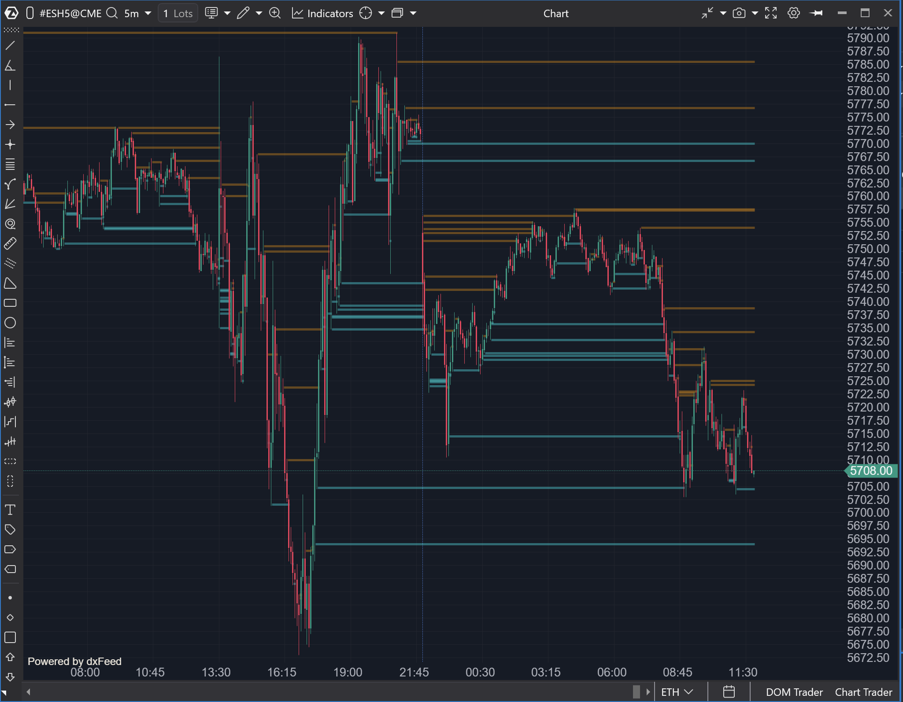

---
# 1. IDENTIFICACIÓN  
cs_file: AbsorptionModif.cs  
name: Absorption Modif  
version: Custom v0.1 (Larva)  

# 2. CLASIFICACIÓN  
group: Order Flow  
subgroup: Footprint  
comparison_group: "Cluster Analysis"  

# 3. VALORACIÓN (Score & Priority)  
score_current: 7/10  
score_potential: 8/10  
file_state: Estable  
effort: Medio  
action_priority: Baja  
system_priority: P3  

# 4. DECISIÓN  
recommended_action: Conservar (Reserva)  

# 5. ANÁLISIS  
description: ¿Qué niveles de precio muestran desequilibrio diagonal (Bid vs Ask del nivel adyacente) con stacking suficiente para convertirse en niveles persistentes hasta toque?  
gemini_summary: "AbsorptionModif replica de forma auditable el comportamiento observable del indicador Absorption oficial. Detecta stacked diagonal imbalances y los convierte en niveles persistentes hasta toque, actuando como overlay estructural sin generar señales directas."  
competitor_notes: "ClusterSearch/ClusterStatistic cubren imbalance y stacking como detección/validación. AbsorptionModif aporta una salida distinta: niveles persistentes derivados de absorción, útiles como overlay de contexto y ejecución."  
reusable_code: "Implementación clean-room de detección de stacked diagonal imbalance y conversión a LineTillTouch con contexto Buy/Sell."  

# 6. METADATOS  
analysis_date: 2025-12-24  
official_code_date: Unknown  
user_modification_date: 2025-12-24  
---  

## 🟦 Absorption Modif (7/10)  

**Nombre del archivo:** [`AbsorptionModif.cs`](https://github.com/AlbertoAmadorBelchistim/Indicators/blob/compile/myindicators/MyIndicators/AbsorptionModif.cs)  
**Nombre del indicador:** Absorption Modif  
**Web oficial (base conceptual):** [ATAS — Absorption](https://help.atas.net/support/solutions/articles/72000641183)  
**Compatibilidad:** ATAS Stable/Latest.  
**Última revisión del código oficial:** Unknown  
**Última revisión del código modificado:** 2025-12-24  

> **La Pregunta Clave:** ¿Qué niveles de precio muestran desequilibrio diagonal (Bid vs Ask del nivel adyacente) con stacking suficiente para convertirse en niveles persistentes hasta toque?  

  

---  

### ⚙️ Parámetros configurables  
- **Days Look Back (Days)**: Ventana histórica de cálculo en días (por sesiones).  
- **Ratio (AbsorptionRatio)**: Umbral de desequilibrio (p. ej., 300 = 3:1) aplicado en comparación diagonal entre niveles adyacentes.  
- **Stacked Levels (AbsorptionRange)**: Número mínimo de niveles consecutivos que deben cumplir el imbalance para validar la zona.  
- **Min Volume (AbsorptionVolume)**: Volumen mínimo exigido en el lado dominante para evitar ruido.  
- **Last Bar (CalculateLastBar)**: Incluye la vela en formación en el cálculo.  
- **Line Width**: Grosor de las líneas dibujadas.  
- **Bullish Color / Bearlish Color**: Colores para niveles asociados a Buy/Sell (según contexto del nivel).  
- **Use Alerts (UseAlerts)**: Activar alertas cuando se detectan nuevos niveles.  
- **Approximation Alert (UseCrossAlerts)**: Alertas de cruce del precio sobre niveles ya detectados.  
- **Alert File**: Archivo de sonido de alerta.  

---  

### 🧭 Clasificación  
**Grupo:** Order Flow  
**Subgrupo:** Footprint  
**Comparison Group:** "Cluster Analysis"  

---  

### 🧠 Uso más frecuente  
* Marcar **niveles persistentes** derivados de stacked diagonal imbalance.  
* Revisar sesiones y detectar zonas “defendidas” que actúan como soporte/resistencia microestructural.  
* Complementar filtros/validadores: primero detectas (Search/Statistic), después “memorizas” niveles relevantes.  

---  

### 📊 Nivel de relevancia  
🔟 **7 / 10**  

✅ Salida diferencial: convierte imbalance stacked en **niveles persistentes hasta toque**.  
✅ Encaja bien en revisión y en ejecución basada en niveles (S/R micro).  
⛔ Gran parte del valor de imbalance/stacking ya existe en ClusterSearch/ClusterStatistic; aquí el plus es la persistencia.  
⛔ No está diseñado como generador de señales primarias.  

---  

### 🎯 Estrategias de scalping donde se aplica  
* **Re-test de nivel**: tras una zona stacked, esperar pullback al nivel y confirmar reacción.  
* **Fade en resistencia/soporte micro**: nivel persistente como invalidación clara.  
* **Confluencia**: nivel de absorción + nivel estadístico (gamma/VSA) para aumentar calidad de setup.  

---  

### 🧪 Notas de desarrollo  
* Implementación **clean-room** basada en el comportamiento observable del indicador oficial.  
* Construcción de ladder `[price, bid, ask]` por vela mediante `GetPriceVolumeInfo`.  
* Detección **diagonal** (niveles adyacentes): Bid(i) vs Ask(i+1) y Ask(i+1) vs Bid(i), aplicando `Ratio` y `MinVolume`.  
* Validación por `Stacked Levels` y conversión a líneas `LineTillTouch` con contexto Buy/Sell.  
* Aplicación explícita del filtro **close-hold**: solo se conservan niveles no atravesados al cierre.  
* Estado actual: **larva funcional**, orientado a evaluación estratégica y uso como overlay.  

---  

### ❗ Incoherencias o aspectos mejorables detectados  
* Posible solapamiento conceptual con otros indicadores core de clusters e imbalances.  
* El valor añadido debe evaluarse siempre en combinación con el sistema principal, no de forma aislada.  

---  

### 🛠️ Propuestas de mejora  
* Mantener `AbsorptionModif` como overlay de niveles persistentes sin escalar complejidad.  
* Evaluar estadísticamente su aportación real frente a niveles derivados de clusters estándar.  

---  

### 💎 Valor Reutilizable (Código Donante)  
* Algoritmo de detección de stacked diagonal imbalance.  
* Conversión de eventos de absorción en niveles persistentes condicionados al cierre.  

---  

### ✍️ La opinión de ChatGPT sobre el Indicador  
AbsorptionModif mantiene intacto el valor conceptual del indicador original, pero lo hace auditable y controlable. Su utilidad real está en materializar zonas de absorción como niveles estructurales, no en competir con indicadores de detección activa. Debe considerarse una herramienta de contexto, no un motor de señal.  

---  

### 📈 Veredicto: ¿Es útil para Scalping?  
**Sí, como overlay de niveles (no como motor principal).**  

**Acción:** **Conservar (Reserva)**  

