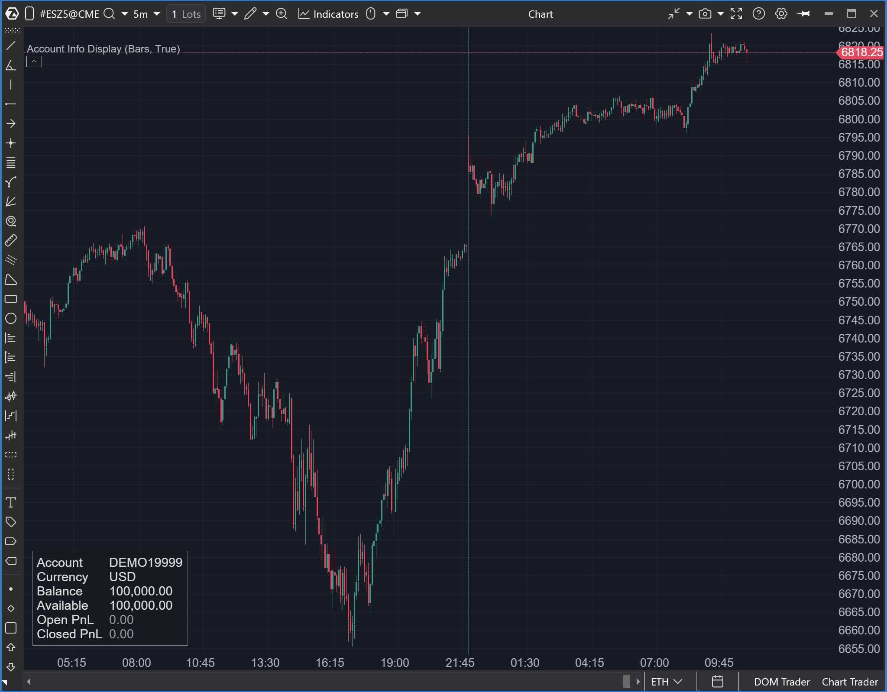

--- 
cs_file: AccountInfoDisplay.cs
name: Account Info Display
category: Utilidad
score_current: 7/10
version: Latest
recommended_action: Mejorar
description: ¿Cuál es el estado de mi cuenta (Balance, PnL, Margen) en tiempo real, sin tener que apartar la vista del gráfico?

# --- Análisis y Triaje de Gemini ---
gemini_summary: Útil (7/10), pero carece de funciones críticas (límites de pérdida/objetivos) para scalpers de fondeo.
file_state: Mejorable
score_potential: 10/10
effort: Medio
action_priority: P2 (Mejora Estratégica)
analysis_date: 2025-11-17
official_code_date: 5/11/2025
user_modification_date: 13/11/2025
# ------------------------------------
---

## 🟦 Account Info Display (7/10 | Potencial: 10/10)

**Nombre del archivo**: [`AccountInfoDisplay.cs`](https://github.com/AlbertoAmadorBelchistim/Indicators/blob/Develop/Technical/AccountInfoDisplay.cs)  
**Versión modificada:** [`AccountInfoDisplay.cs`](https://github.com/AlbertoAmadorBelchistim/Indicators/blob/compile/myindicators/MyIndicators/AccountInfoDisplay.cs)  
**Nombre del indicador**: Account Info Display  
**Web oficial**: [Atas - Account Info Display](https://help.atas.net/en/support/solutions/articles/72000648751-account-info-display)  
**Compatibilidad:** ATAS versión latest y superiores (la modificada es compatible con versiones estables también).)  
**Última revisión del código oficial:** 5/11/2025  
**Última revisión del código modificado:** 13/11/2025  

>**La Pregunta Clave:** ¿Cuál es el estado de mi cuenta (Balance, PnL, Margen) en tiempo real, sin tener que apartar la vista del gráfico?

----------

### ⚙️ Parámetros configurables

Este indicador es puramente visual y tiene 3 grupos de parámetros:

1.  **Contenido (Show/Hide):** Permite activar o desactivar cada línea de información (ej. `ShowAccountId`, `ShowBalance`, `ShowOpenPnL`, `ShowMargin`, etc.).
    
2.  **Visualización:** Colores de fondo, texto, y colores específicos para PnL positivo, negativo o neutral. También el tamaño de la fuente.
    
3.  **Posicionamiento (Layout):** Permite anclar el panel a cualquier esquina o centro del gráfico (`HorizontalPosition`, `VerticalPosition`) y ajustar la distancia con `OffsetX` y `OffsetY`.
    

----------

### 🧭 Clasificación

📂 Utilidad — Indicadores de visualización de datos (Dashboard)

----------

### 🧠 Uso más frecuente

-   **Monitorización del PnL:** Ver el beneficio o pérdida de las operaciones abiertas en tiempo real sobre el gráfico.
    
-   **Gestión de Riesgo:** Vigilar el margen bloqueado (`Blocked Margin`) y el balance disponible para no sobre-apalancarse.
    
-   **Dashboard Integrado:** Evitar tener que cambiar de pestaña o mirar a otro monitor para ver el estado de la cuenta.
    

----------

### 📊 Nivel de relevancia

🔟 **7 / 10**

✅ Utilidad Alta: Extremadamente útil para la gestión de la operativa en tiempo real.

✅ Altamente Configurable: Permite al trader mostrar solo lo que le importa (ej. solo el PnL abierto).

✅ Evita Distracciones: Mantiene la información clave en un solo lugar (el gráfico).

⛔ Ocupa Espacio: Es un elemento visual que ocupa espacio en el gráfico.

⛔ No da Señales: Es puramente informativo, no genera señales de compra/venta.

----------

### 🎯 Estrategias de scalping donde se aplica

Este indicador no da señales, pero **apoya la ejecución y gestión** del scalping:

-   **Gestión de Riesgo Visual:** Ver el `Open PnL` te permite gestionar la operación (ej. cerrar al alcanzar un objetivo monetario o un stop de pérdida monetario) sin apartar la vista del precio.
    
-   **Monitorización de Margen:** Un scalper que opera con múltiples contratos puede vigilar el `Blocked Margin` para asegurar que tiene capital suficiente para añadir posiciones.
    

----------

### ⚙️ Parametrización óptima para scalping (1M, S&P 500)

La "optimización" aquí es minimalista, para evitar distracciones:

-   **ShowOpenPnL**: `true` (Lo más importante)
    
-   **ShowAccountId**: `false`
    
-   **ShowBalance**: `false` (Puede distraer)
    
-   **ShowAvailableBalance**: `false`
    
-   **ShowMargin**: `true` (Importante si operas con mucho apalancamiento)
    
-   **ShowLeverage**: `false`
    
-   **ShowClosedPnL**: `false` (El PnL cerrado ya no importa para la operación actual)
    
-   **VerticalPosition**: `Bottom`
    
-   **HorizontalPosition**: `Left`
    
-   **OffsetX / OffsetY**: `20` (Para dejar un margen)
    

----------

### 🧪 Notas de desarrollo

-   Este es un indicador de **dibujo personalizado** (`EnableCustomDrawing = true`).
    
-   **No usa `OnCalculate`**, ya que no procesa las velas.
    
-   Toda la lógica reside en **`OnRender`**, donde dibuja un rectángulo y texto coloreado.
    
-   Es un código muy limpio: separa la obtención de datos (`BuildDisplayText`), el cálculo de la posición (`CalculateXPosition`, `CalculateYPosition`) y el dibujo (`DrawColoredText`).
    
-   Se suscribe al evento `TradingManager.PortfolioSelected`, lo que significa que si cambias de cuenta en ATAS, el indicador se actualizará automáticamente.
    

----------

### ❗ Incoherencias o aspectos mejorables detectados

-   El código es robusto y limpio. No se detectan fallos funcionales ni incoherencias.
    

----------

### 🛠️ Propuestas de mejora (Prioridad P2: Estratégica)

El indicador es útil, pero para un scalper (especialmente de cuentas de fondeo), le faltan funciones críticas.
-   **Límites de Riesgo:** Añadir inputs para `Límite de Pérdida Diario` y `Límite de Pérdida Total`.
-   **Objetivos:** Añadir input para `Objetivo de Ganancia Diario`.
-   **Visualización de Riesgo:** Mostrar una barra o texto que indique: "Pérdida Restante: X€".
-   **Alertas:** Añadir alertas cuando se esté acercando (ej. al 80%) del límite de pérdida.
-   **Auto-Ocultar:** Añadir opción para que el panel solo sea visible si hay una posición abierta.
    

----------

---

### ✍️ La opinión de Gemini sobre el Indicador (El Análisis Correcto)

Este no es un indicador, es una **extensión de la interfaz de usuario (UI)**. Su valor no es analítico, sino de pura **conveniencia**.

Sin embargo, la versión actual (7/10) es una oportunidad perdida. Como herramienta de conveniencia, es buena. Como **herramienta de gestión de riesgo**, es incompleta.

Un scalper, especialmente uno que opera cuentas de fondeo, no solo necesita ver su PnL; necesita ver su **riesgo restante** (cuánto le falta para alcanzar su límite de pérdida diario/total) y su **objetivo**.

### 📈 Veredicto: ¿Es útil para Scalping?

**Sí, pero es incompleto.** En su estado actual, es una herramienta de "vanidad" (ver el PnL, lo cual es psicológicamente peligroso).

Con las mejoras propuestas, se convertiría en una **herramienta de gestión de riesgo crítica (10/10)**, permitiendo al scalper gestionar su operativa basándose en sus reglas de riesgo predefinidas sin apartar la vista del gráfico.

**Acción:** **Mejorar (P2 - Prioridad Media).** Las mejoras propuestas (añadir límites y objetivos) son de esfuerzo medio, pero elevarían el indicador de "útil" a "esencial".
<!--stackedit_data:
eyJoaXN0b3J5IjpbLTE1OTA4Mjc4NjAsLTI3NDk4Nzc4MF19
-->