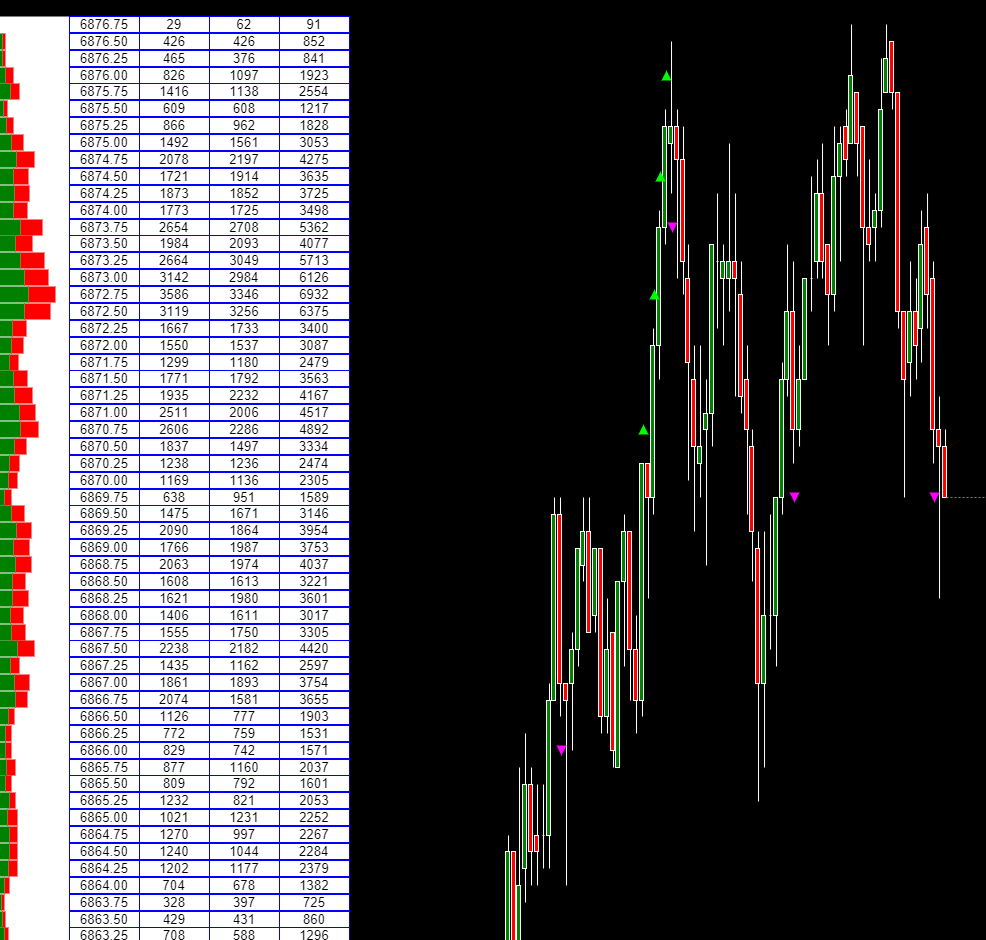

---
# 1. IDENTIFICACIÓN  
cs_file: ActiveVolume.cs  
name: Active Volume  
version: Custom v1.3  

# 2. CLASIFICACIÓN  
group: Order Flow  
subgroup: Volume Profile  
comparison_group: "Volume Nodes & Accumulation (VAP)"  

# 3. VALORACIÓN (Score & Priority)  
score_current: 9/10  
score_potential: 9/10  
file_state: Estable  
effort: Medio  
action_priority: Baja  
system_priority: P1  

# 4. DECISIÓN  
recommended_action: Conservar (Core)  

# 5. ANÁLISIS  
description: ¿En qué niveles de precio se está concentrando volumen agresivo significativo, filtrando el ruido minorista?  
gemini_summary: "Indicador Core de perfil de volumen filtrado. Aporta una lectura institucional clara al identificar acumulaciones reales de agresión Bid/Ask por precio."  
competitor_notes: "Frente a perfiles clásicos (VAP estándar), aporta calidad del volumen y direccionalidad, no solo cantidad."  
reusable_code: "Lógica de acumulación por precio con filtrado y renderizado manual de perfil."  

# 6. METADATOS  
analysis_date: 2025-12-26  
official_code_date: 2024-12-03  
user_modification_date: 2025-11-13  
---  

## 🏆 Active Volume (9/10)  

**Nombre del archivo:**  [`ActiveVolume.cs`](https://github.com/AlbertoAmadorBelchistim/Indicators/blob/Develop/Technical/ActiveVolume.cs)  
**Versión modificada:** [`ActiveVolume.cs`](https://github.com/AlbertoAmadorBelchistim/Indicators/blob/compile/myindicators/MyIndicators/ActiveVolume.cs)  
**Nombre del indicador:** Active Volume  
**Web oficial:** [ATAS — Active Volume](https://help.atas.net/ru-RU/support/solutions/articles/72000608343-active-volume)  
**Compatibilidad:** ATAS Stable / Alpha  
**Última revisión del código oficial:** 2024-12-03  
**Última revisión del código modificado:** 2025-11-13  

> **La Pregunta Clave:**  
> ¿Dónde están actuando los participantes agresivos relevantes cuando se filtra todo el ruido de micro-trades?  

---  

### ⚙️ Parámetros configurables  

**Settings**  
- **Filter:** Volumen mínimo del trade para ser contabilizado.  
- **RowWidth:** Ancho de cada fila de la tabla.  
- **ShowBid / ShowAsk / ShowVolume:** Mostrar columnas Bid, Ask y Total.  
- **Offset:** Desplazamiento horizontal de la tabla.  
- **DateFrom:** Fecha desde la que se inicia la acumulación.  
- **DigitsAfterComma:** Precisión decimal mostrada.  

**Profile**  
- **Mode:** BidAsk / Bid / Ask.  
- **ProfileWidth:** Ancho del perfil horizontal.  
- **ProfileOffset:** Offset del perfil respecto al precio.  
- **ProfileFillColor / BidProfileValueColor / AskProfileValueColor:** Colores del perfil.  

---  

### 🧭 Clasificación  
**Grupo:** Order Flow  
**Subgrupo:** Volume Profile  
**Comparison Group:** "Volume Nodes & Accumulation (VAP)"  

---  

### 🧠 Uso más frecuente  

- Identificar **zonas de absorción institucional**.  
- Localizar **nodos de volumen agresivo dominante**.  
- Confirmar rupturas reales vs falsas rupturas.  

---  

### 📊 Nivel de relevancia  
🔟 **9 / 10**  

✅ Filtrado efectivo del ruido minorista.  
✅ Lectura clara Bid / Ask por nivel.  
⛔ Requiere espacio visual y buena configuración.  

---  

### 🎯 Estrategias de scalping donde se aplica  

- Absorciones en resistencia/soporte.  
- Pullbacks hacia nodos de volumen agresivo.  
- Confirmación de continuación tras ruptura.  

---  

### ⚙️ Parametrización óptima para scalping (1M, S&P 500)  

| Parámetro | Valor | Justificación |  
|---------|------|---------------|  
| Filter | 50–100 | Elimina micro-trades irrelevantes |  
| Mode | BidAsk | Permite lectura completa de agresión |  
| ProfileWidth | 30 | Buen balance visibilidad / espacio |  
| DigitsAfterComma | 0–1 | Limpieza visual |  

---  

### ✨ Mejoras añadidas (Custom)  

- Ajustes de visualización y redondeo.  
- Mejor organización de tabla y perfil.  

---  

### 🧪 Notas de desarrollo  

- Uso intensivo de `CumulativeTrade`.  
- Diccionarios por precio con locking explícito.  
- Renderizado manual optimizado en `OnRender`.  

---  

### ❗ Incoherencias o aspectos mejorables detectados  

- Falta **reset automático por sesión**.  

---  

### 🛠️ Propuestas de mejora  

- Reset por sesión RTH configurable.  
- Modo Delta Neto por nivel (Bid–Ask).  

---  

### 💎 Valor Reutilizable (Código Donante)  

- Arquitectura de perfil horizontal custom.  

---  

### ✍️ La opinión de ChatGPT sobre el Indicador  

Es uno de los mejores ejemplos de cómo un perfil de volumen deja de ser descriptivo y pasa a ser **operativo**. Fundamental en cualquier sistema serio de scalping con Order Flow.  

---  

### 📈 Veredicto: ¿Es útil para Scalping?  

**Sí.**  

Especialmente para leer absorciones y validar niveles relevantes.  

**Acción:** **Conservar (Core)**  
