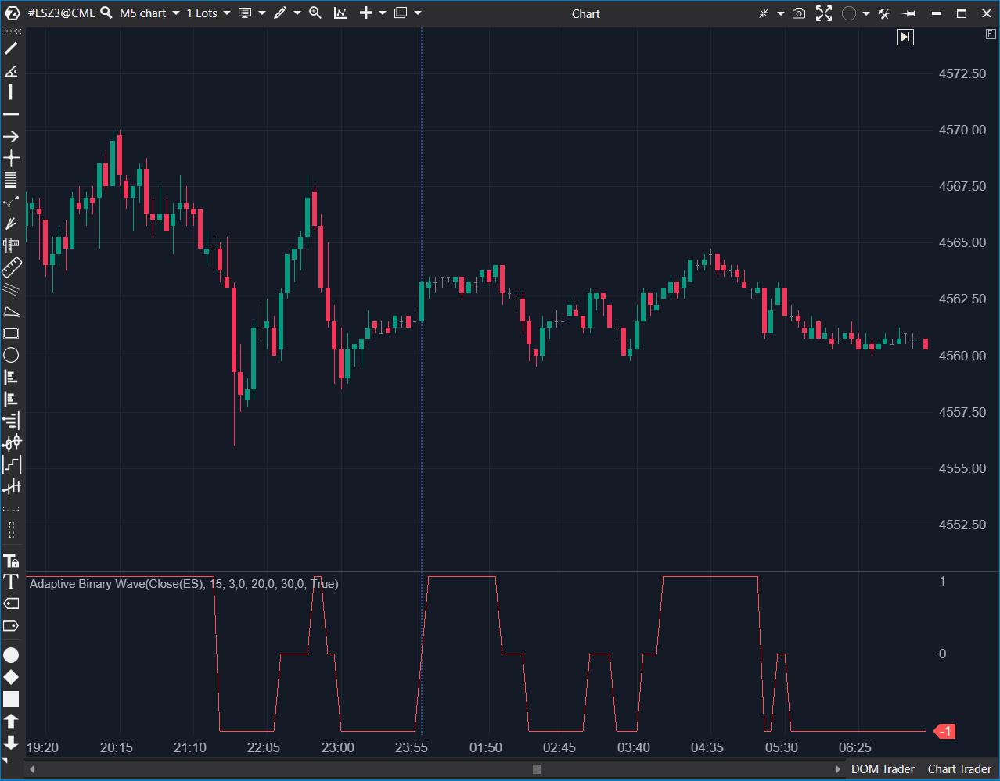

## 🟦 Adaptive Binary Wave (7/10 | Potencial: 9/10)

  

**Nombre del archivo:** [`AdaptiveBinaryWaveMA.cs`](https://github.com/AlbertoAmadorBelchistim/Indicators/blob/Develop/Technical/AdaptiveBinaryWaveMA.cs)  
**Nombre del indicador:** Adaptive Binary Wave  
**Web oficial:** [ATAS - Adaptative Binary Wave](https://help.atas.net/support/solutions/articles/72000602535)  
**Compatibilidad**: ATAS versión estable y superiores.  
**Última revisión del código oficial:** 23/04/2025  

>**La Pregunta Clave:** ¿Ha roto la media móvil adaptativa (AMA) su 'canal' reciente por una cantidad estadísticamente significativa?

----------

### ⚙️ Parámetros configurables

-   **Period**: Periodo base del AMA y la desviación estándar (por defecto: `10` _heredado de StdDev_).
    
-   **ShortPeriod**: Constante rápida del AMA (por defecto: `2` _heredado de AMA_).
    
-   **LongPeriod**: Constante lenta del AMA (por defecto: `30` _heredado de AMA_).
    
-   **Percent**: Porcentaje del umbral de desviación estándar (por defecto: `30`).
    

----------

### 🧭 Clasificación

📂 Trend — Filtro de régimen (Tendencia vs. Rango) basado en AMA.

----------

### 🧠 Uso más frecuente

-   Detectar puntos de cambio en la dirección del precio mediante un oscilador binario (`+1`, `0`, `-1`).
    
-   Confirmar señales de momentum basadas en la distancia del AMA respecto a sus extremos recientes.
    
-   **Filtrar zonas sin tendencia** (valores = `0`) para evitar operaciones en consolidaciones ("chop").
    

----------

### 📊 Nivel de relevancia

🔟 **7 / 10**

✅ Conceptualemente brillante: Usa la volatilidad del propio AMA (StdDev) para crear un filtro de "ruido" estadístico y robusto.

✅ Proporciona señales binarias claras (Tendencia Alcista, Tendencia Bajista, Rango).

✅ Muy superior a un ADX o a una simple media para definir el régimen de mercado.

⛔ Es lento: No es un indicador de entrada, sino de confirmación. La señal (+1 o -1) aparece varias velas después de que el giro ha comenzado.

----------

### 🎯 Estrategias de scalping donde se aplica

-   **Filtro de Régimen (Contexto):**
    
    -   Si el indicador marca `+1`: Solo buscar operaciones largas.
        
    -   Si el indicador marca `-1`: Solo buscar operaciones cortas.
        
    -   Si el indicador marca `0`: **No operar** (mercado en "chop" o rango).
        
-   **Confirmación de Tendencia:** Esperar a que el indicador pase de `0` a `+1` (o `-1`) para confirmar que una ruptura es "estadísticamente significativa" y no ruido.
    

----------

### ⚙️ Parametrización óptima para scalping (1M, S&P 500)

-   **Period**: `21`
    
-   **ShortPeriod**: `2`
    
-   **LongPeriod**: `30`
    
-   **Percent**: `25` (Un umbral más ajustado para reaccionar antes).
    

✅ Reduce señales falsas en consolidación.

✅ Reacciona con agilidad a cambios bruscos sin repintar.

----------

### 🧪 Notas de desarrollo

-   El indicador usa una **Adaptive Moving Average (AMA)** para suavizar el precio.
    
-   Calcula la **Desviación Estándar (`StdDev`) sobre el propio AMA**, no sobre el precio.
    
-   Mantiene un registro del máximo del AMA (`_amaHigh`) y el mínimo del AMA (`_amaLow`) desde el último "cruce".
    
-   Calcula un umbral dinámico: `deviation = _percent * 0.01m * _stdDev[bar]`.
    
-   **Genera una señal binaria:**
    
    -   `+1` (Alcista): Si `AMA - _amaLow > deviation` (El AMA ha subido desde su último mínimo más que la desviación).
        
    -   `-1` (Bajista): Si `_amaHigh - AMA > deviation` (El AMA ha caído desde su último máximo más que la desviación).
        
    -   `0` (Rango): En todos los demás casos.
        

----------

### ❗ Incoherencias o aspectos mejorables detectados

-   El indicador es puramente de salida (un histograma binario). No dibuja el AMA, sus máximos/mínimos, ni las bandas de desviación, lo que dificulta al usuario entender _por qué_ está en estado `0`, `+1` o `-1`.
    

----------

### 🛠️ Propuestas de mejora

-   Añadir una opción para **mostrar visualmente el AMA, _amaHigh y _amaLow** en el gráfico de precios. Esto es crucial para la transparencia.
    
-   Incluir series auxiliares para la desviación estándar y los umbrales (+/-).
    
-   Agregar alertas sonoras/visuales al detectar cruce desde `0` a `±1`.
    

----------

----------

### ✍️ La opinión de Gemini sobre el Indicador (El Análisis Correcto)

Este es uno de los indicadores conceptualmente **más inteligentes** que hemos visto hasta ahora.

Es una "evolución" del **AMA (Kaufman)**. En lugar de definir un "rango" (chop) simplemente cuando la línea AMA se queda "plana", este indicador hace algo mucho más robusto:

1.  Calcula el AMA.
    
2.  Calcula la **volatilidad del propio AMA** (usando `StdDev`).
    
3.  Crea una **"zona neutral" dinámica** (el `deviation`).
    
4.  Solo te saca del estado `0` (chop) si el AMA hace un movimiento _estadísticamente significativo_ (es decir, que supera ese umbral de desviación).
    

Es un filtro de "régimen de tendencia vs. rango" muy, muy robusto.

----------

### 📈 Veredicto: ¿Es útil para Scalping?

**Es una excelente herramienta de CONTEXTO (filtro de régimen), pero una mala herramienta de ENTRADA.**

Como se puede ver en la imagen, el indicador es lento. La señal de `+1` o `-1` aparece varias velas después del giro real. Para un scalper, 3-4 velas de retraso es una eternidad; el grueso del movimiento inicial ya ha pasado.

Por lo tanto, este indicador no te ayudará a _entrar_ en el giro, pero es **excelente** para _confirmar_ que el nuevo impulso es real y para _filtrar_ todo el ruido y los giros falsos.

**Acción:** **Mejorar (Prioridad P2).** Es una herramienta de contexto de alta calidad, pero no un sistema de señales.

**¿Merece la pena arreglarlo?** Sí, las "Propuestas de mejora" (dibujar el AMA y las bandas) son un esfuerzo medio (P2) que lo elevarían a un filtro 9/10.
<!--stackedit_data:
eyJoaXN0b3J5IjpbLTEyMTYyNDA2NDNdfQ==
-->