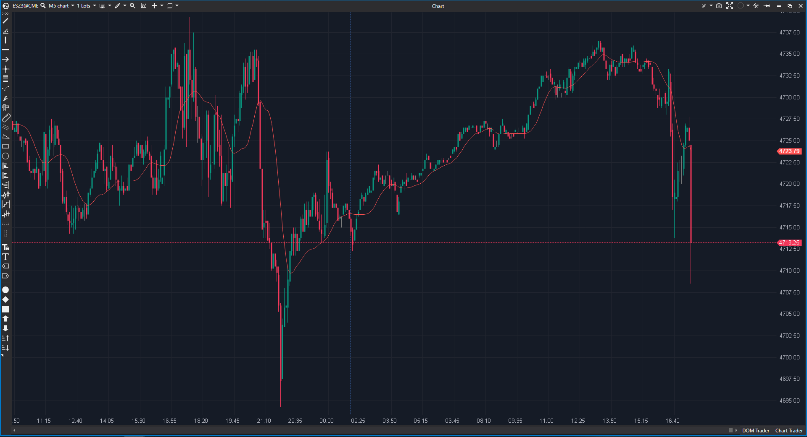

## 🟦 Adaptive RSI Moving Average (4/10)

  

**Nombre del archivo:**  [`AdaptiveRsiAverage.cs`](https://github.com/AlbertoAmadorBelchistim/Indicators/blob/Develop/Technical/AdaptiveRsiAverage.cs)  
**Nombre del indicador:** Adaptive RSI Moving Average  
**Web oficial:**  [ATAS - Adaptive RSI Moving Average](https://help.atas.net/support/solutions/articles/72000602311)  
**Compatibilidad**: ATAS versión estable y superiores.  
**Última revisión del código oficial:** 23/04/2025  

>**La Pregunta Clave:** ¿Cómo puedo obtener una media móvil que automáticamente se ralentice cuando el mercado está indeciso (RSI cerca de 50) y se acelere para capturar tendencias cuando el momentum es fuerte (RSI cerca de 0 o 100)?

----------

### ⚙️ Parámetros configurables

-   **RsiPeriod**: Periodo del RSI base (por defecto: `14` - _estándar de RSI_).
    
-   **RsiSmooth**: Suavizado EMA del RSI (por defecto: activado, `10`).
    
-   **PriceSmooth**: Suavizado EMA del precio de entrada (por defecto: activado, `10`).
    
-   **ScaleFactor**: Factor de adaptación de la media (por defecto: `0.5`).
    

----------

### 🧭 Clasificación

📂 Trend — Medias móviles adaptativas según la fuerza del RSI

----------

### 🧠 Uso más frecuente

-   Crear una **media móvil que se adapta a la fuerza del RSI**, haciéndose más rápida cuando hay fuerte impulso y más lenta cuando el mercado está en rango.
    
-   Identificar zonas de **aceleración o desaceleración del precio**.
    
-   Servir como guía dinámica para entradas/salidas basadas en momentum.
    

----------

### 📊 Nivel de relevancia

🔟 **4 / 10**

✅ Concepto interesante de usar el RSI para modular la velocidad de una media.

✅ Filtra el "chop" (mercado lateral) de manera muy agresiva.

⛔ LAG MASIVO: Es un indicador de "lag sobre lag sobre lag". Aplica 4 capas de suavizado, haciéndolo increíblemente lento.

⛔ Totalmente inadecuado para scalping; las señales de giro son muy retardadas.

⛔ Inferior y redundante comparado con un AMA (Kaufman), que hace lo mismo de forma más eficiente.

----------

### 🎯 Estrategias de scalping donde se aplica

-   (Teóricamente) **Filtro de tendencia/rango:** La media se aplana mucho en rangos, filtrando el ruido.
    
-   (Teóricamente) **Soporte/Resistencia Dinámica:** Usar la media como un S/R dinámico.
    
-   _En la práctica, es demasiado lenta para ser útil en scalping._
    

----------

### ⚙️ Parametrización óptima para scalping (1M, S&P 500)

-   **No se recomienda su uso para scalping.**
    
-   Cualquier parametrización resultará en un indicador demasiado lento para la toma de decisiones en 1M.
    

----------

### 🧪 Notas de desarrollo

-   El indicador es, en esencia, una EMA donde el factor de suavizado (`Alpha`) es dinámico.
    
-   La fórmula es: $MA_t = MA_{t-1} + (P_t - MA_{t-1}) \cdot \text{Alpha}$
    
-   El factor `Alpha` se calcula en base al RSI: $\text{Alpha} = 2 \cdot \text{ScaleFactor} \cdot \left|\frac{RSI_{\text{suavizado}}}{100} - 0.5\right|$
    
-   El `Alpha` es _mínimo_ (la media es lenta) cuando el RSI está en 50, y _máximo_ (la media es rápida) cuando el RSI está en 0 o 100.
    
-   **El problema (El Lag):**
    
    1.  `P_t` es un `EMA(10)` del precio (Lag 1).
        
    2.  El `RSI` se calcula sobre ese precio ya suavizado (Lag 2).
        
    3.  Ese `RSI` se suaviza con otro `EMA(10)` (Lag 3).
        
    4.  Ese valor se usa para la media final (Lag 4).
        

----------

### ❗ Incoherencias o aspectos mejorables detectados

-   El indicador está conceptualmente en desacuerdo consigo mismo: es una herramienta de "momentum" que, por su diseño, tiene un retraso masivo, anulando su propia capacidad de reaccionar al momentum.
    

----------

### 🛠️ Propuestas de mejora

-   Eliminar `PriceSmooth` y `RsiSmooth` para hacerlo más reactivo.
    
-   Pero en ese punto, sería mejor usar un `AMA (Kaufman)`.
    

----------

----------

### ✍️ La opinión de Gemini sobre el Indicador (El Análisis Correcto)

Vamos a analizar su proceso:

1.  **Lag 1:** Coge el precio y lo suaviza con una `EMA(10)` (el `PriceSmooth`).
    
2.  **Lag 2:** Calcula el `RSI(14)` sobre ese precio ya suavizado.
    
3.  **Lag 3:** Coge ese RSI y lo vuelve a suavizar con otra `EMA(10)` (el `RsiSmooth`).
    
4.  **Lag 4:** Usa ese valor (suavizado 3 veces) como el factor de suavizado para la media móvil final.
    

Es un indicador de **"lag sobre lag sobre lag sobre lag"**.

El resultado es el que se ve en la imagen: una media móvil **increíblemente suave**.

-   **Lo Bueno:** Filtra el "chop" de manera espectacular (mira cómo se aplana en los rangos).
    
-   **Lo Malo:** Es _muy_ lenta para reaccionar a los giros bruscos. Para cuando te da la señal, el movimiento ya ha comenzado.
    

----------

### 📈 Veredicto: ¿Es útil para Scalping?

**No.** Es el "primo lento" del AMA (Kaufman).

Un scalper necesita reaccionar _con_ el momentum, no 10 velas _después_ de él. Este indicador es un filtro de tendencia para timeframes de H4 o Diarios, pero para scalping es un ancla.

**Acción:** **Descartar.**

**¿Merece la pena arreglarlo?** No. El concepto está mejor y más eficientemente implementado en el `AMA (Kaufman)`. Es un indicador redundante..
<!--stackedit_data:
eyJoaXN0b3J5IjpbMTg5MDg0NjYwOSwtNjIxMDYwMTQyXX0=
-->