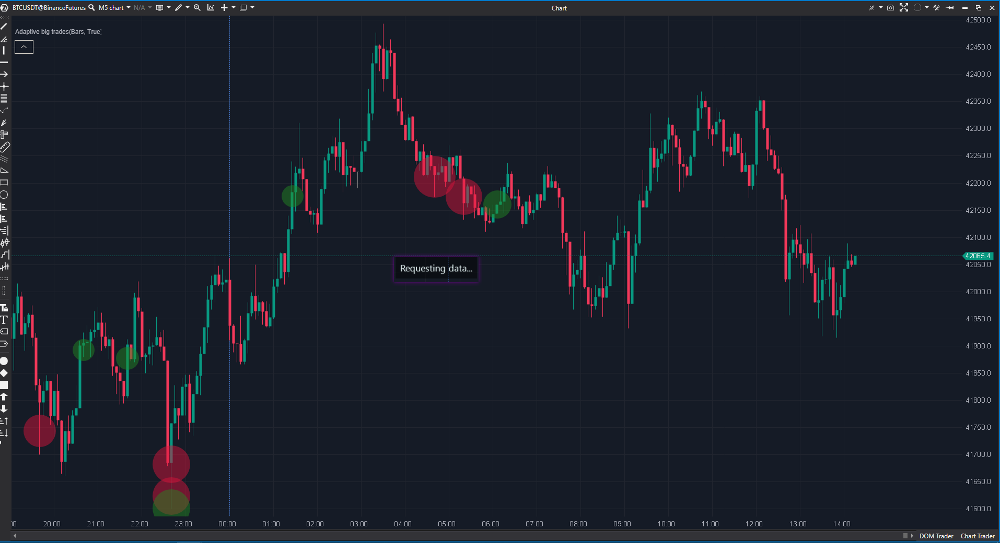

## 🟦 Adaptive Big Trades (9/10)

**Nombre del archivo:** No disponible en código abierto  
**Nombre del indicador:** Adaptive Big Trades  
**Web oficial:** [ATAS — Adaptive Big Trades](https://help.atas.net/support/solutions/articles/72000606745)  
**Compatibilidad:** ATAS Stable/Latest  
**Última revisión del código oficial:** Unknown  

> **La Pregunta Clave:**  
> ¿Dónde están las operaciones grandes en términos relativos a la liquidez actual, sin necesidad de definir umbrales fijos?

---

### ⚙️ Parámetros configurables (Indicador oficial)

- **Umbral adaptativo interno:**  
  El indicador calcula dinámicamente qué se considera un trade “grande” en función de la distribución de volúmenes del contexto actual.  
- **Visualización (tamaño / colores):**  
  Opciones básicas orientadas a legibilidad sobre velas, footprint o volumen.

---

### 🧭 Clasificación
**Grupo:** Order Flow  
**Subgrupo:** Footprint  
**Comparison Group:** "Big Trades Analysis"  

---

### 🧠 Uso más frecuente

* Confirmar **iniciativa real** en rupturas sin recalibrar filtros manualmente.  
* Detectar **absorción**: trade grande en extremo sin continuación posterior.  
* Validar **pullbacks**: reaparición de actividad grande a favor de la tendencia.  

---

### 📊 Nivel de relevancia
🔟 **9 / 10**

✅ Señal adaptativa: reduce errores de configuración y sesgo humano.  
✅ Muy accionable en M1 para ES cuando se combina con niveles y contexto.  

---

### 🎯 Estrategias de scalping donde se aplica

* **Breakout con iniciativa:** ruptura + trade grande a favor = confirmación.  
* **Absorción / rechazo:** trade grande en extremo + no hay continuación = reversión probable.  
* **Pullback con continuación:** actividad grande reaparece tras el retroceso.  

---

### ⚙️ Parametrización óptima para scalping (1M, S&P 500)

| Grupo | Parámetro | Valor recomendado | Justificación operativa |  
|---|---:|---:|---|  
| Visualización | Tamaño | Medio (26–34) | Legible sin tapar estructura. |  
| Colores | Contraste | Alto | Lectura rápida en estrés intradía. |  

---

### 🧪 Notas de desarrollo (estado del repositorio)

- El repositorio incluye **una implementación propia en estado “larva funcional”**, diseñada como **indicador de sistema**, no como clon del código cerrado.  
- La versión larvaria:
  - preserva la **idea central de señal adaptativa** (percentil relativo de volumen),  
  - es estable en histórico y tiempo real (dedupe, pruning, replay-safe),  
  - prioriza simplicidad y bajo coste de mantenimiento.  
- Elementos del oficial **intencionadamente no replicados**:
  - scheduler horario interno,  
  - normalización por top-N,  
  - updates por referencia exacta de trade.  

Este enfoque permite validar su **rol real dentro del sistema** antes de invertir en ingeniería adicional.

---

### ❗ Incoherencias o aspectos mejorables detectados

* Código oficial cerrado: no auditable completamente; la validación se apoya en pruebas A/B y observación de señal.  

---

### 🛠️ Propuestas de mejora (fase posterior)

* Confirmar rol final tras auditoría Footprint (primario vs confirmador).  
* Si se consolida como CORE definitivo:
  - ampliar opciones de scope y diagnóstico,  
  - optimizar mapeo trade→bar (cache + búsqueda binaria),  
  - evaluar alertas o visualización avanzada.  

---

### 💎 Valor Reutilizable (Código Donante)

* null  

---

### ✍️ La opinión de ChatGPT sobre el Indicador

Adaptive Big Trades es el mejor candidato a CORE del subgrupo por su definición adaptativa de “trade grande”. La decisión correcta es documentarlo y estabilizarlo ahora, manteniendo su versión de sistema en estado larva, y posponer cualquier sofisticación hasta que el torneo Footprint esté completamente resuelto.  

---

### 📈 Veredicto: ¿Es útil para Scalping?

**Sí**

Aporta una lectura robusta y contextual de la actividad relevante sin necesidad de tuning manual continuo.  

**Acción:** **Conservar (Core)**  
