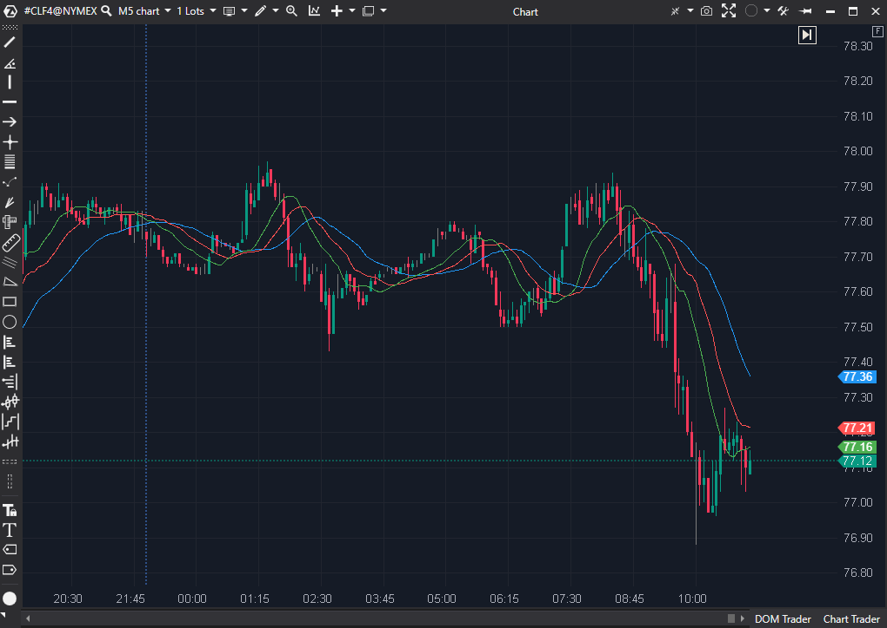

## 🟦 Alligator (6/10)

**Nombre del archivo:** `Alligator.cs`  
**Nombre del indicador:** Alligator  
**Web oficial:** [ATAS - Alligator](https://help.atas.net/support/solutions/articles/72000602579)  
**Compatibilidad:** ATAS versión estable y superiores.
**La Pregunta Clave:** ¿Está el mercado 'durmiendo' (en rango, con las medias entrelazadas) o está 'despierto y comiendo' (en tendencia, con las medias abiertas)?

----------

### ⚙️ Parámetros configurables

-   **JawPeriod**: Periodo de la mandíbula (por defecto: `13`)
    
-   **JawShift**: Desplazamiento de la mandíbula (por defecto: `8`)
    
-   **TeethPeriod**: Periodo de los dientes (por defecto: `8`)
    
-   **TeethShift**: Desplazamiento de los dientes (por defecto: `5`)
    
-   **LipsPeriod**: Periodo de los labios (por defecto: `5`)
    
-   **LipsShift**: Desplazamiento de los labios (por defecto: `3`)
    

----------

### 🧭 Clasificación

📂 Trend — Indicadores de filtro de régimen (Tendencia vs. Rango)

----------

### 🧠 Uso más frecuente

-   Identificar tendencias y zonas de consolidación.
    
-   Visualizar cruces de medias con desplazamiento temporal (shifts) para detectar entradas.
    
-   Operar con lógica de "boca del caimán" abierta (tendencia) o cerrada (rango).
    
-   Filtrar operaciones en función de la fase del mercado (expansión o compresión).
    

----------

### 📊 Nivel de relevancia

🔟 **6 / 10**

✅ Buen indicador visual de fase del mercado.

✅ Fácil de interpretar para estrategias tendenciales.

✅ Fiel a la implementación canónica de Bill Williams (usa SMMA y Median Price).

⛔ LAG MASIVO: Es un indicador extremadamente lento por diseño (usa SMMA + Shifts).

⛔ Redundante y obsoleto si ya se utiliza el AMA (Kaufman).

----------

### 🎯 Estrategias de scalping donde se aplica

-   **Filtro de Contexto (No Operar):** Si las líneas están entrelazadas ("Caimán durmiendo"), se prohíbe operar breakouts o tendencias.
    
-   **Filtro de Contexto (Operar):** Si las líneas están abiertas y ordenadas ("Caimán comiendo"), solo se permiten operaciones a favor de esa tendencia (ej. pullbacks a la línea de los "labios").
    
-   _Nota: Es demasiado lento para usarse como señal de entrada primaria._
    

----------

### ⚙️ Parametrización óptima para scalping (1M, S&P 500)

-   **JawPeriod**: `13`, **JawShift**: `8`
    
-   **TeethPeriod**: `8`, **TeethShift**: `5`
    
-   **LipsPeriod**: `5`, **LipsShift**: `3`
    
-   _Nota: Se deben usar los valores por defecto. Son los canónicos del sistema de Bill Williams. Cambiarlos rompe la lógica del indicador._
    

----------

### 🧪 Notas de desarrollo

-   El indicador usa medias móviles suavizadas (**SMMA**), que son inherentemente lentas y con mucho lag.
    
-   Utiliza el **Precio Medio** (`(GetCandle(bar).Low + GetCandle(bar).High) / 2`) como fuente de datos, lo cual es correcto según el sistema de Bill Williams.
    
-   Aplica **desplazamientos (`Shifts`)** a las medias, lo que añade _aún más lag_ al cálculo.
    
-   Dibuja 3 líneas: Jaw (azul, lenta), Teeth (roja, media), Lips (verde, rápida).
    

----------

### ❗ Incoherencias o aspectos mejorables detectados

-   El indicador funciona como fue diseñado. El "problema" es el diseño en sí mismo: es conceptualmente muy lento para el scalping.
    

----------

### 🛠️ Propuestas de mejora

-   Permitir seleccionar el tipo de media móvil (ej. `EMA` en lugar de `SMMA`) para hacerlo más rápido.
    
-   Añadir alertas por cruce entre líneas.
    

----------

----------

### ✍️ La opinión de Gemini sobre el Indicador (El Análisis Correcto)

Este indicador es un "clásico", pero para el scalping tiene un problema fundamental: **el LAG masivo**.

Es, por diseño, un "filtro de régimen" (Tendencia vs. Rango) increíblemente lento. Piénsalo:

1.  Usa **SMMA**, que es una de las medias móviles más lentas y con más lag.
    
2.  Aplica **tres** de ellas.
    
3.  Y luego **desplaza** (shiftea) esos cálculos hacia adelante, basando lo que ves hoy en lo que pasó hace 3, 5 y 8 barras.
    

Es el "lag sobre el lag sobre el lag".

¿Es útil?

Es un excelente filtro de fase de mercado.

-   **Líneas entrelazadas ("Caimán durmiendo"):** Te grita "¡NO OPERES RUPTURAS, ESTAMOS EN RANGO!".
    
-   **Líneas abiertas ("Caimán comiendo"):** Te confirma (muy tarde) que "OK, esto es una tendencia".
    

El problema para el Scalping:

Mira la captura de pantalla de la ficha. La gran caída comienza a las ~08:45. Las medias (que ya son lentas de por sí) no se cruzan y "abren la boca" de forma decisiva hasta las ~09:30. Para un scalper, la operación no es que haya empezado, ¡es que casi ha terminado!

----------

### 📈 Veredicto: ¿Es útil para Scalping?

**No. Es un indicador obsoleto y redundante.**

Ya hemos analizado y decidido **conservar** el **AMA (Kaufman) (7/10)**. El AMA hace _exactamente el mismo trabajo_ que el Alligator (diferenciar entre tendencia y rango), pero lo hace de una forma **infinitamente superior, más rápida y adaptativa**.

El Alligator es el abuelo lento del AMA. Dado que ya tenemos la herramienta moderna y rápida, no hay razón para usar la antigua y lenta.

**Acción:** **Descartar.**

**¿Merece la pena arreglarlo?** No. No hay nada que "arreglar". El indicador funciona, pero es conceptualmente inferior a otras herramientas que ya hemos conservado.
<!--stackedit_data:
eyJoaXN0b3J5IjpbMTEzODQ2OTg4XX0=
-->