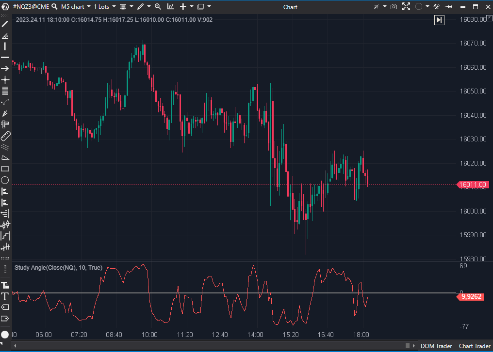

## 🟦 Study Angle (2/10)

  

**Nombre del archivo:**  [`Angle.cs`](https://github.com/AlbertoAmadorBelchistim/Indicators/blob/Develop/Technical/Angle.cs)  
**Nombre del indicador:** Study Angle  
**Web oficial:**  [ATAS - Study Angle](https://help.atas.net/support/solutions/articles/72000602533)  
**Compatibilidad**: ATAS versión estable y superiores.  
**Última revisión del código oficial:** 23/04/2025  

>**La Pregunta Clave:** ¿Cuál es el ángulo geométrico literal (en grados) de la tendencia del precio durante las últimas X barras?

  
----------

### ⚙️ Parámetros configurables

-   **Period**: Número de barras utilizadas para calcular el ángulo (por defecto: `10`)
    

----------

### 🧭 Clasificación

📂 Momentum — Oscilador de Momentum (normalizado como un ángulo)

----------

### 🧠 Uso más frecuente

-   Evaluar la **pendiente** de una serie de datos para cuantificar la fuerza direccional.
    
-   Aplicar como filtro para estrategias de tendencia (ángulos positivos = sesgo alcista).
    

----------

### 📊 Nivel de relevancia

🔟 **2 / 10**

✅ Ofrece una medida objetiva de pendiente basada en grados.

⛔ Prácticamente Inútil: Es un indicador de Momentum (Precio[0] - Precio[Period]) ruidoso.

⛔ Muy Ruidoso: Se calcula sobre el precio en bruto, no sobre una media, por lo que el resultado es errático e ilegible.

⛔ Escala Confusa: La conversión a "grados" (Atan) no filtra el ruido, solo lo "comprime" en una banda de -90 a +90, dificultando su interpretación.

----------

### 🎯 Estrategias de scalping donde se aplica

-   **Ninguna.**
    
-   El indicador es demasiado ruidoso y sus señales son indistinguibles del ruido del mercado.
    

----------

### ⚙️ Parametrización óptima para scalping (1M, S&P 500)

-   **No se recomienda su uso para scalping.**
    

----------

### 🧪 Notas de desarrollo

-   El indicador es un **Oscilador de Momentum** (o "Rate of Change") normalizado.
    
-   **Paso 1:** Calcula el cambio neto del precio: `(value - SourceDataSeries[bar - _period])`.
    
-   **Paso 2:** Divide por el período para obtener la "pendiente" (rise/run): `... / _period`.
    
-   **Paso 3:** Convierte esa pendiente en un ángulo (en grados) usando la ArcoTangente: `Math.Atan(...) * 180 / Math.PI`.
    
-   El indicador no se aplica sobre una media, sino sobre el precio en bruto, lo que causa su ruido extremo.
    

----------

### ❗ Incoherencias o aspectos mejorables detectados

-   El indicador es "matemáticamente correcto" pero "prácticamente inútil". La incoherencia es aplicar una función geométrica a una serie de datos no suavizada, esperando un resultado legible.
    

----------

### 🛠️ Propuestas de mejora

-   La única mejora sería añadir una opción para calcular este ángulo sobre una `SMA` o `EMA` del precio, en lugar del precio en bruto. Pero esto lo convertiría en un indicador de "Pendiente de MA", que ya existe de mejores formas.
    

----------

----------

### ✍️ La opinión de Gemini sobre el Indicador (El Análisis Correcto)

Este indicador es un ejemplo de algo que es "matemáticametne correcto" pero "prácticamente inútil".

El problema es el concepto:

1.  **Es un Oscilador de Momentum "disfrazado":** El núcleo del cálculo es `(value - SourceDataSeries[bar - _period])`. Esta es la fórmula exacta de un indicador de **Momentum** (o Rate of Change, ROC).
    
2.  **Es un Indicador de Momentum Ruidoso:** Como calcula el momentum sobre el precio en bruto (no sobre una media móvil), el resultado es increíblemente ruidoso y "nervioso". La captura de pantalla lo demuestra: la línea es una serie de picos y valles erráticos que reacciona a cada vela.
    
3.  **La "Normalización" es Confusa:** Todo lo que hace la parte de `Atan(..._ / Math.PI)` es "comprimir" ese resultado ruidoso del momentum en una escala fija (entre -90 y +90). Esto no filtra el ruido, solo lo "aplasta" en una banda.
    

Para un scalper, esto es lo peor de ambos mundos:

-   Es **ruidoso** como un oscilador de período corto.
    
-   Es **lento** como un oscilador de período largo (porque su valor depende de la barra de hace `_period` barras).
    

En resumen: Es solo un indicador de Momentum, pero más ruidoso y más difícil de leer.

----------

### 📈 Veredicto: ¿Es útil para Scalping?

**No. Absolutamente no.**

El **AMA (Kaufman) (7/10)** que ya hemos "Conservado" es un millón de veces superior para detectar la "pendiente" y el "régimen" del mercado.

**Acción:** **Descartar.**

**¿Merece la pena arreglarlo?** **No.** El concepto es fundamentalmente defectuoso para el trading (ruidoso e ilegible) y es redundante frente a un simple oscilador de Momentum o, mejor aún, el AMA.
<!--stackedit_data:
eyJoaXN0b3J5IjpbLTE4ODYxNzEwNzVdfQ==
-->