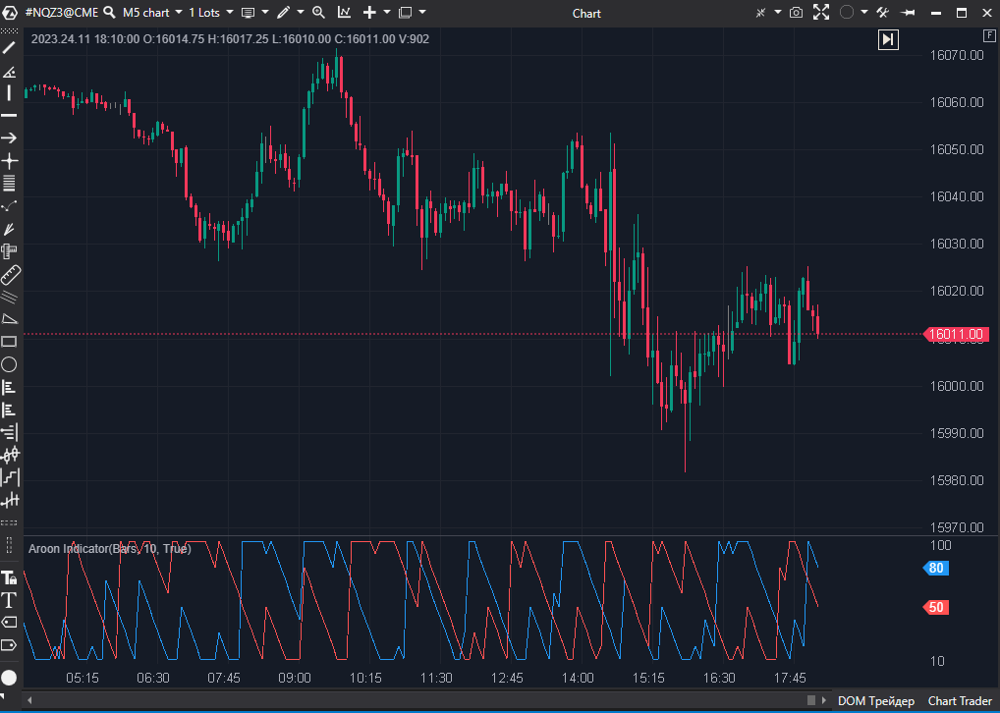

## 🟦 Aroon Indicator (3/10)

  

**Nombre del archivo:**  `AroonIndicator.cs`

**Nombre del indicador:** Aroon Indicator

**Web oficial:**  [ATAS - Aroon Indicator](https://help.atas.net/support/solutions/articles/72000602316)

**Compatibilidad**: ATAS versión estable y superiores.

 **La Pregunta Clave:** ¿La fortaleza del mercado proviene de haber hecho recientemente nuevos máximos, o de haber hecho recientemente nuevos mínimos?

----------

### ⚙️ Parámetros configurables

-   **Period**: Número de barras para evaluar el máximo y mínimo recientes (por defecto: `10`)
    

----------

### 🧭 Clasificación

📂 Momentum — Indicador de fuerza/tiempo de tendencia.

----------

### 🧠 Uso más frecuente

-   Detectar el **inicio o final de tendencias** (cruce de líneas AroonUp/AroonDown).
    
-   Medir la **fuerza de la tendencia**: AroonUp cerca de 100 indica tendencia alcista fuerte.
    
-   Identificar zonas de **consolidación** (ambas líneas bajan o se mueven erráticamente).
    

----------

### 📊 Nivel de relevancia

🔟 **3 / 10**

✅ Concepto clásico para medir el tiempo transcurrido desde un máximo/mínimo.

⛔ EXTREMADAMENTE RUIDOSO: La señal es un "zig-zag" errático e inestable en timeframes cortos, haciéndolo ilegible.

⛔ Es Lento: Es un indicador lagging que confirma un máximo/mínimo después de que ha ocurrido.

⛔ Obsoleto y Redundante: El AMA (Kaufman) hace un trabajo infinitamente superior al identificar fases de tendencia y rango.

----------

### 🎯 Estrategias de scalping donde se aplica

-   **Ninguna.**
    
-   El indicador es demasiado ruidoso y sus señales demasiado erráticas para ser utilizadas en scalping.
    

----------

### ⚙️ Parametrización óptima para scalping (1M, S&P 500)

-   **No se recomienda su uso para scalping.**
    

----------

### 🧪 Notas de desarrollo

-   Calcula el número de barras transcurridas desde el máximo más alto y el mínimo más bajo en el `Period` definido.
    
-   Fórmula Up: `100m * (_period - (bar - highValue.Bar)) / _period`
    
-   Fórmula Down: `100m * (_period - (bar - lowValue.Bar)) / _period`
    
-   **Implementación Ineficiente:** El código usa `_extValues.OrderByDescending(x => x.High).First()` en cada barra. Esto es computacionalmente costoso (O(n log n)) para encontrar un máximo/mínimo, aunque para un `Period` pequeño (10-20) el impacto es mínimo.
    

----------

### ❗ Incoherencias o aspectos mejorables detectados

-   La principal incoherencia es conceptual: es un indicador diseñado para gráficos Diarios (para medir "días desde el máximo") que se ofrece en una plataforma de scalping, donde su señal es puro ruido.
    
-   La implementación de `OnCalculate` (buscando el max/min con `OrderBy`) es funcional pero ineficiente.
    

----------

### 🛠️ Propuestas de mejora

-   Reemplazar la búsqueda `OrderBy` por un bucle `for` simple que mantenga un registro del `highestHighBar` y `lowestLowBar`, lo cual sería mucho más eficiente (O(n)).
    

----------

----------

### ✍️ La opinión de Gemini sobre el Indicador (El Análisis Correcto)

**El Problema: Es un Indicador "Digital" y Ruidoso**

El Aroon no mide la _magnitud_ del momentum (como el RSI). Solo mide el _tiempo_. Su pregunta es binaria: "¿Ha ocurrido un nuevo máximo/mínimo en las últimas X barras? Sí/No".

El resultado, como se ve perfectamente en la captura de pantalla, es un oscilador **extremadamente ruidoso y dentado**. No te da una lectura suave del "momentum"; te da un zig-zag frenético que es muy difícil de interpretar en tiempo real para un scalper.

-   A las 09:00, el AroonUp (azul) está en 100 (tendencia alcista fuerte).
    
-   Cinco minutos después (09:05), está en 50 (tendencia débil).
    
-   Diez minutos después (09:15), está de nuevo en 100.
    

Un scalper no puede tomar decisiones con una señal tan errática.

----------

### 📈 Veredicto: ¿Es útil para Scalping?

**No. Es un claro "Descartar".**

1.  **Es Demasiado Ruidoso:** Como demuestra la captura de pantalla, es inutilizable en gráficos de M1/M5.
    
2.  **Es Lento:** El indicador es, por diseño, un seguidor de tendencias lento. Te confirma un nuevo máximo _después_ de que ha pasado.
    
3.  **Tenemos Herramientas Mejores:** El **AMA (Kaufman) (7/10)** que ya hemos "Conservado" hace un trabajo infinitamente superior al identificar "fases de tendencia" y "fases de rango" de una manera suave, visual y mucho más rápida.
    

Es un indicador clásico diseñado para gráficos diarios, no para el scalping moderno.

**Acción:** **Descartar.**

**¿Merece la pena arreglarlo?** **No.** Aunque se podría optimizar el código (arreglando la ineficiencia de `OrderBy`), el concepto fundamental del indicador (un oscilador de _tiempo_ en lugar de _magnitud_) no es adecuado para el scalping y es redundante frente al AMA.
<!--stackedit_data:
eyJoaXN0b3J5IjpbLTEzNzMxMjQ1MF19
-->