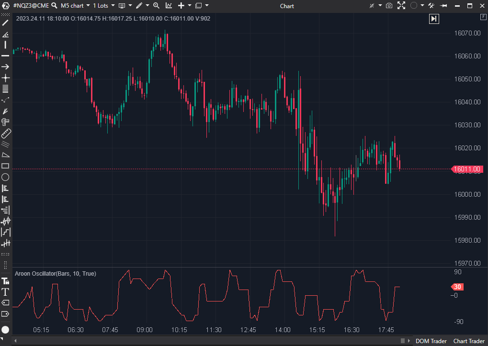

## 🟦 Aroon Oscillator (3/10)

**Nombre del archivo**: [`AroonOscillator.cs`](https://github.com/AlbertoAmadorBelchistim/Indicators/blob/Develop/Technical/AroonOscillator.cs)  
**Nombre del indicador**: Aroon Oscillator  
**Web oficial**: [ATAS — Aroon Oscillator](https://help.atas.net/support/solutions/articles/72000602317-aroon-oscillator)  
**Compatibilidad**: ATAS versión estable y superiores.  
**Última revisión del código oficial:** 23/04/2025  
>**La Pregunta Clave:** ¿Qué fuerza es más fuerte y reciente: la que está creando nuevos máximos (AroonUp) o la que está creando nuevos mínimos (AroonDown)?

----------

### ⚙️ Parámetros configurables

-   **Period**: Periodo del indicador Aroon interno (por defecto: `10`)
    

----------

### 🧭 Clasificación

📂 Momentum — Indicador de fuerza de tendencia (oscilador)

----------

### 🧠 Uso más frecuente

-   Identificar la **dirección de la tendencia** basándose en un único oscilador.
    
    -   **Valores > 0** indican que AroonUp es más fuerte (tendencia alcista).
        
    -   **Valores < 0** indican que AroonDown es más fuerte (tendencia bajista).
        
-   Usar el cruce por la línea cero como señal de cambio de tendencia.
    

----------

### 📊 Nivel de Relevancia

🔟 **3 / 10**

✅ Simplifica las dos líneas del AroonIndicator en una sola.

⛔ Hereda todos los problemas: Es igual de ruidoso, lento y errático que el AroonIndicator base.

⛔ Visualización Engañosa: Como se ve en la imagen, el resultado es un zig-zag "digital" (no suave) que es inutilizable para el scalping.

----------

### 🎯 Estrategias de scalping donde se aplica

-   (Teóricamente) Comprar al cruzar el nivel 0 hacia arriba; vender al cruzar hacia abajo.
    
-   **En la práctica, no es aplicable**. La señal es demasiado ruidosa y llega demasiado tarde.
    

----------

### ⚙️ Parametrización óptima para scalping (1M, S&P 500)

-   **Ninguna**. El indicador es conceptualmente inadecuado para el scalping de alta frecuencia.
    

----------

### 🧪 Notas de desarrollo

-   Este es un indicador "envoltorio" (wrapper). No calcula nada por sí mismo.
    
-   Crea una instancia interna del `AroonIndicator` (`_ai`).
    
-   Su única lógica es la resta de las dos líneas del indicador base:
    
    _renderSeries[bar] = AroonUp[bar] - AroonDown[bar];
    

----------

### ❗ Incoherencias o aspectos mejorables detectados

-   El indicador es redundante. No ofrece nueva información, solo una visualización diferente (y no mejor) de los datos del `AroonIndicator`.
    

----------

### 🛠️ Propuestas de mejora

-   No hay mejoras que "arreglen" el concepto.
    

----------

----------

### ✍️ La opinión de Gemini sobre el Indicador (El Análisis Correcto)

Este indicador coge los datos ruidosos y lentos del `AroonIndicator` (que puntuamos 3/10) y los presenta de una forma diferente, pero no mejor.

El `AroonIndicator` base era inutilizable para scalping porque sus señales (basadas en el _tiempo_ desde el último H/L, no en la _magnitud_) eran erráticas, "dentadas" y lentas.

Este oscilador simplemente resta esas dos líneas dentadas. El resultado, como era de esperar, es un oscilador igualmente dentado, ruidoso y lento que cruza el cero constantemente sin sentido. No filtra el ruido, no acelera la señal y no aporta ninguna claridad.

----------

### 📈 Veredicto: ¿Es útil para Scalping?

**No. Es un claro "Descartar", con más motivo que el anterior.**

Es un indicador de libro de texto diseñado para gráficos diarios de acciones, y es fundamentalmente inútil para el scalping del S&P 500. Es redundante y se basa en un indicador (Aroon) que ya hemos descartado.

**Acción:** **Descartar.**

**¿Merece la pena arreglarlo?** **No.** El indicador no está "roto"; es un "wrapper" de un indicador que ya hemos determinado que es conceptualmente inútil para el scalping. No hay nada que arreglar.
<!--stackedit_data:
eyJoaXN0b3J5IjpbLTE0NjYzODU5MjRdfQ==
-->