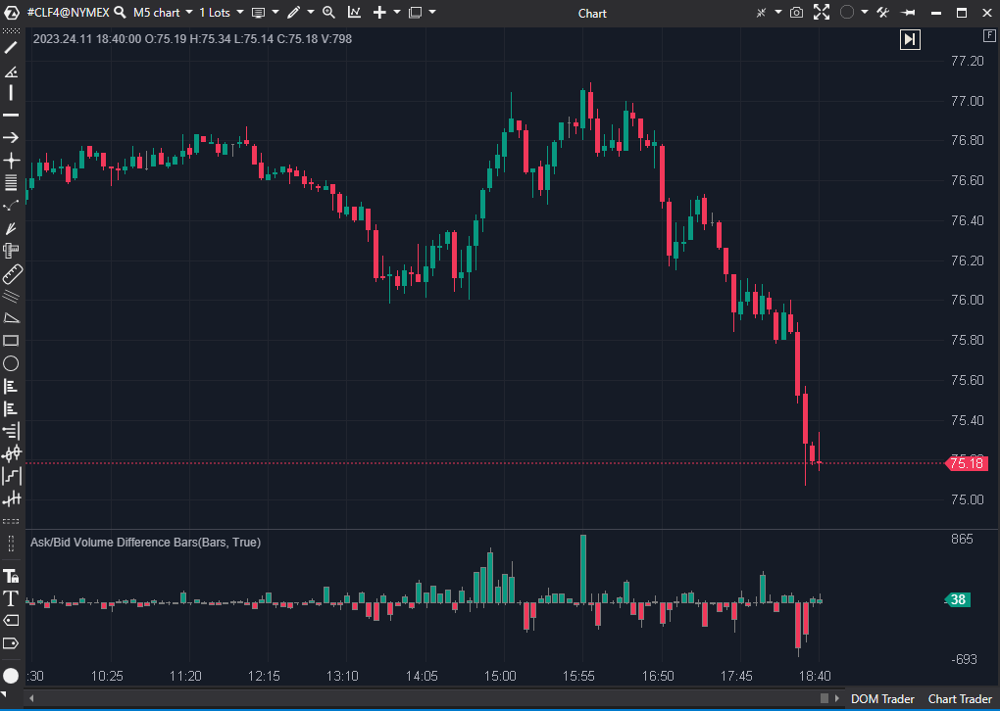

## 🟦 Ask/Bid Volume Difference Bars (6.5/10)

  

**Nombre del archivo:** [`AskBidBars.cs`](https://github.com/AlbertoAmadorBelchistim/Indicators/blob/Develop/Technical/AskBidBars.cs)  
**Nombre del indicador:** Ask/Bid Volume Difference Bars  
**Web oficial:** [ATAS - Ask/Bid Volume Difference Bars](https://help.atas.net/support/solutions/articles/72000602527)  
**Compatibilidad**: ATAS versión estable y superiores.  
**Última revisión del código oficial:** 23/04/2025  
> **La Pregunta Clave:** ¿Cuál fue el volumen agresivo neto (Delta) de esta vela, e igualmente importante, cuál fue el rango interno (Delta Máx/Mín) de la batalla entre compradores y vendedores dentro de esa vela?

----------

### ⚙️ Parámetros configurables

Este indicador **no tiene parámetros configurables** expuestos en la UI.

----------

### 🧭 Clasificación

📂 VolumeOrderFlow — Visualizador del Delta (Neto, Máximo, Mínimo) por vela.

----------

### 🧠 Uso más frecuente

-   Representar la **batalla interna del Delta** en una vela (Delta Neto, Delta Máximo y Delta Mínimo).
    
-   Visualizar **absorciones**: una mecha larga (Min/Max Delta) con un cierre (Delta Neto) en la dirección opuesta.
    
-   Detectar **agotamiento**: mechas largas en ambos lados con un cierre cercano a cero.
    
-   Ver la agresión neta (el cuerpo de la vela) de un vistazo.
    

----------

### 📊 Nivel de relevancia

🔟 **6.5 / 10**

✅ Visualmente potente: Resume la "historia" de la batalla del Delta de una vela en una sola barra.

✅ Muestra la absorción (mechas largas) de forma que un histograma de Delta normal no puede.

⛔ FALLO DE DISEÑO: No incluye una línea de cero (ShowZeroValue = false), lo que hace muy difícil anclar visualmente los valores y comparar velas.

⛔ Redundante si ya se utilizan gráficos de clúster (footprint), que muestran esta información con mucha más granularidad.

----------

### 🎯 Estrategias de scalping donde se aplica

-   **Validar presión dominante**: El cuerpo de la vela (Delta Neto) confirma la agresión.
    
-   **Detectar Absorción**: Buscar velas con mechas inferiores largas (MinDelta negativo) pero un cierre positivo (Delta Neto positivo), indicando que los vendedores fueron absorbidos.
    
-   **Detectar Agotamiento**: Velas con mechas largas en ambos lados (MaxDelta alto y MinDelta bajo) pero un cierre de Delta Neto cercano a cero.
    

----------

### ⚙️ Parametrización óptima para scalping (1M, S&P 500)

-   N/A. El indicador no tiene parámetros.
    
-   Se recomienda usarlo en un panel separado y añadir manualmente una "Línea Horizontal" en el valor `0` para hacerlo legible.
    

----------

### 🧪 Notas de desarrollo

-   El indicador crea una **serie de velas personalizada (`CandleDataSeries`)** que _no_ representa el precio, sino el DELTA.
    
-   **High** = `candle.MaxDelta` (La agresión compradora máxima alcanzada dentro de la vela).
    
-   **Low** = `candle.MinDelta` (La agresión vendedora máxima alcanzada dentro de la vela).
    
-   **Close** = `candle.Delta` (El Delta neto final de la vela).
    
-   `Open` no se usa.
    
-   Los colores de las velas se heredan de la configuración del gráfico (`UpCandleColor`, `DownCandleColor`), lo cual es confuso ya que colorea la vela según `Close > Open`, pero `Open` no está definido (siempre es 0).
    

----------

### ❗ Incoherencias o aspectos mejorables detectados

1.  **¡Falta la Línea Cero!** Es el fallo de usabilidad más grave. Sin una línea de cero, el oscilador "flota" y es imposible juzgar la magnitud o la polaridad de un vistazo.
    
2.  **Lógica de Color Confusa:** El indicador se colorea como una vela (comparando `Close` con `Open`), pero el `Open` de esta serie siempre es `0` (por defecto). Esto significa que la vela será verde si `Delta > 0` y roja si `Delta < 0`. Aunque esto _funciona_, una lógica de color explícita sería más robusta.
    

----------

### 🛠️ Propuestas de mejora

-   **¡Mejora Crítica!:** Añadir una línea de cero (`LineSeries`) al indicador, o establecer `ShowZeroValue = true` en la serie `_renderSeries`.
    
-   Añadir parámetros para controlar los colores (PosColor/NegColor) basados en el Delta Neto, en lugar de heredar los colores de las velas del gráfico.
    

----------

----------

### ✍️ La opinión de Gemini sobre el Indicador (El Análisis Correcto)

1. El Valor Único (Las Mechas):

Un histograma de Delta normal solo te muestra el "Close" (Delta neto). El verdadero poder de este indicador, como has visto, está en las "mechas" (MaxDelta y MinDelta).

Una vela que cierra con `Delta = +10` es alcista. Pero:

-   Si su `MinDelta` (mecha inferior) fue de `+5`, significa que los compradores dominaron de principio a fin.
    
-   Si su `MinDelta` (mecha inferior) fue de `-500`, significa que los vendedores golpearon con fuerza, fueron totalmente absorbidos y los compradores tomaron el control.
    

Este indicador te permite ver esa "historia de absorción" de un solo vistazo.

2. Tu Propuesta de Mejora es la Clave:

De todas tus excelentes propuestas, esta es la más importante:

> "Incluir una línea base (eje cero) para identificar con claridad la dirección del delta."

**Correcto.** Como se ve en la imagen de la ficha, el indicador "flota" en el panel. Sin una línea de cero, es visualmente difícil saber si un Delta de +10 está _por encima_ o _por debajo_ de un Delta de -5. Esta es la mejora **esencial** que necesita este indicador para ser legible.

----------

### 📈 Veredicto: ¿Es útil para Scalping?

**Sí, pero con un gran "pero"**: es **redundante** para un trader avanzado.

-   **¿Por qué es útil?** Es un "dashboard" de Delta excelente. Te da un resumen visual de la batalla interna de cada vela, mucho más rico que un simple histograma de Delta.
    
-   **¿Por qué es redundante?** Si ya usas un **gráfico de clúster (footprint)**, estás viendo esta información (y 10 veces más) en cada nivel de precio. Si usas el indicador `ActiveVolume` que vimos antes (el 8/10), estás viendo la acumulación de estos deltas en los niveles clave.
    

**Acción:** **Conservar (con reservas).**

Tu 6.5/10 es la nota perfecta. Es una herramienta de "visualización" de Delta muy inteligente. Si te gusta tener un "resumen" rápido de la batalla del Delta sin tener que abrir un gráfico de clúster, este indicador es excelente para eso, especialmente si le añades manualmente una línea de cero.

**¿Merece la pena arreglarlo?** **Sí.** El arreglo es trivial (añadir `LineSeries.Add(new LineSeries("Zero") { Value = 0, Color = Colors.Gray });` en el constructor) y lo convierte de "ilegible" a "útil".

<!--stackedit_data:
eyJoaXN0b3J5IjpbMTIwMTE5OTYwNV19
-->