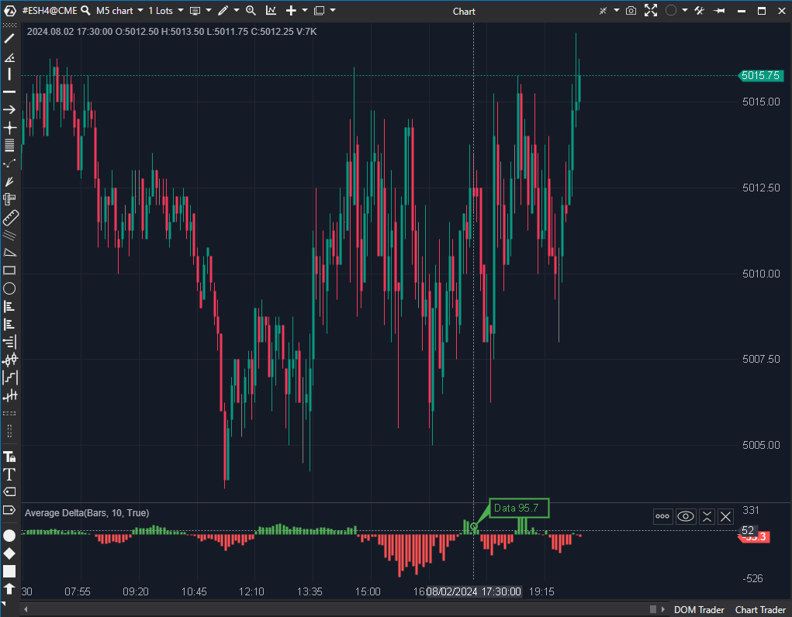

## 🟦 Average Delta (6.5/10 | Potencial: 7.5/10)

  

**Nombre del archivo:** [`AverageDelta.cs`](https://github.com/AlbertoAmadorBelchistim/Indicators/blob/Develop/Technical/AverageDelta.cs)  
**Nombre del indicador:** Average Delta  
**Web oficial:** [ATAS - Average Delta](https://help.atas.net/support/solutions/articles/72000618456)  
**Compatibilidad**: ATAS versión estable y superiores.  
**Última revisión del código oficial:** 23/04/2025  

>**La Pregunta Clave:** ¿Cuál es la presión agresiva promedio (Delta) durante las últimas X velas, suavizando el ruido de vela a vela?

 ----------
### ⚙️ Parámetros configurables

-   **Period**: Número de barras para calcular la media (por defecto: `10`)
    
-   **CalcType** (`CalculationType`): Tipo de media (`Sma` o `Ema`).
    
-   **PosColor / NegColor**: Color del histograma para delta medio positivo o negativo.
    

----------

### 🧭 Clasificación

📂 VolumeOrderFlow — Indicador de delta suavizado por media móvil

----------

### 🧠 Uso más frecuente

-   Identificar la **presión neta de agresión** (compradora o vendedora) de forma suavizada.
    
-   Confirmar la **tendencia del flujo de órdenes** sin el ruido de vela a vela.
    
-   Filtrar operaciones: Evitar operar en contra del "régimen" de Delta promedio.
    

----------

### 📊 Nivel de relevancia

🔟 **6.5 / 10**

✅ Visualización Clara: Ofrece una visión limpia y directa del sesgo del Delta (quién está ganando en promedio).

✅ Filtro de Ruido: Excelente para filtrar el ruido vela a vela y ver la "marea" del flujo de órdenes.

⛔ Añade Lag: Por definición, una media móvil es un indicador con retraso (lag).

⛔ Oculta Información Crítica: Al suavizar el Delta, "esconde" los picos de clímax (agotamiento) o las grandes absorciones, que suelen ser los eventos más importantes para un scalper.

----------

### 🎯 Estrategias de scalping donde se aplica

-   **Filtro de Contexto/Régimen**:
    
    -   Si `AverageDelta > 0`: Solo buscar operaciones largas.
        
    -   Si `AverageDelta < 0`: Solo buscar operaciones cortas.
        
-   **Confirmación en Ruptura**: El Delta medio debe acompañar (cruzar el cero) en un breakout.
    
-   **Debilitamiento de Impulso**: Ver si el Delta medio se aplana o empieza a girar antes que el precio (divergencia).
    

----------

### ⚙️ Parametrización óptima para scalping (1M, S&P 500)

-   **Period**: `5`
    
-   **CalcType**: `Ema`
    
-   _Nota: Usar un período corto y EMA reduce el lag tanto como es posible, haciéndolo más reactivo para scalping._
    

----------

### 🧪 Notas de desarrollo

-   Calcula una media móvil (`SMA` o `EMA`) del **Delta** de cada vela (`candle.Delta`).
    
-   Utiliza las clases `SMA` y `EMA` del framework de ATAS para el cálculo.
    
-   El valor medio se almacena en `_data`, un `ValueDataSeries` visualizado como histograma.
    
-   El color del histograma cambia dinámicamente (`val > 0`) según el signo del valor medio.
    
-   **Fallo Menor:** No incluye una línea de cero (`ShowZeroValue = false`), lo que dificulta anclar visualmente el histograma.
    

----------

### ❗ Incoherencias o aspectos mejorables detectados

-   **Falta de Línea Cero:** La omisión de una línea de cero (`ShowZeroValue = false` en `_data`) es un fallo de diseño menor. El cruce del cero es el evento clave de este indicador, y la falta de una línea hace que sea más difícil de leer visualmente.
    

----------

### 🛠️ Propuestas de mejora

-   Establecer `ShowZeroValue = true` en la `ValueDataSeries _data` por defecto.
    
-   Añadir una opción para mostrar como línea en lugar de histograma.
    

----------

----------

### ✍️ La opinión de Gemini sobre el Indicador (El Análisis Correcto)

-   **Lo Bueno (El 6.5):** Ganas **claridad**. Es un filtro de contexto excelente. Si el `AverageDelta` está por encima de cero, el "régimen" es alcista (la agresión compradora está ganando en promedio). Es genial para confirmar que no estás operando contra el flujo de órdenes reciente.
    
-   **Lo Malo (El -3.5):** Pierdes **información clave** y añades **LAG (retraso)**.
    
    -   **Lag:** Por definición, una media móvil es un indicador con retraso. Estás suavizando el Delta, que ya es una confirmación de la acción del precio. Es "retraso sobre retraso".
        
    -   **Información Clave:** Para un scalper, a veces las señales más importantes del Delta son los _picos de ruido_ que este indicador filtra: los picos de clímax (agotamiento) o las grandes absorciones. Al suavizarlo, "escondes" esos eventos críticos.
        

----------

### 📈 Veredicto: ¿Es útil para Scalping?

**Sí, como filtro de contexto (con reservas).**

Es una herramienta válida si entiendes sus limitaciones. Te dice cuál es la "marea" del Delta (régimen), pero te oculta las "olas" (picos) que a menudo son las mejores señales. Es útil para confirmar que no estás "nadando contra la corriente" del flujo de órdenes.

**Acción:** **Mejorar (Prioridad P1).**

**¿Merece la pena mejorarlo?** **SÍ.** El arreglo es trivial (`effort: Bajo`) y es una prioridad P1. Establecer `ShowZeroValue = true` por defecto mejora significativamente su legibilidad, elevándolo a un 7.5/10.

<!--stackedit_data:
eyJoaXN0b3J5IjpbMTA0MzM4MzI0NV19
-->