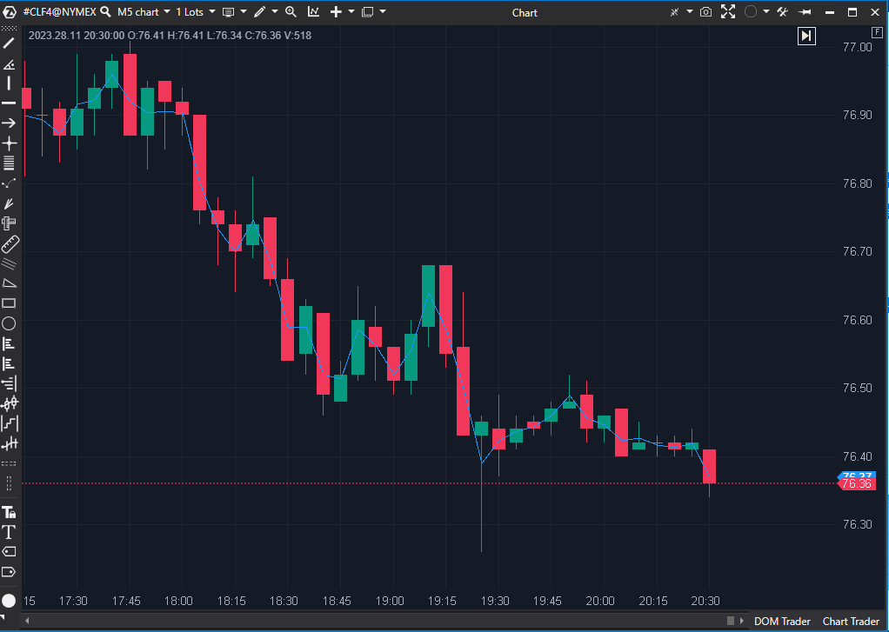

## 🟦 Average Price for Bar (2/10)

  

**Nombre del archivo:** `AveragePriceBar.cs`
**Nombre del indicador:** Average Price for Bar
**Web oficial:** [https://help.atas.net/support/solutions/articles/72000602324](https://help.atas.net/support/solutions/articles/72000602324)
**Compatibilidad** : ATAS versión estable y superiores.

**La Pregunta Clave:** ¿En lugar de solo el 'Cierre', cuál es el precio promedio interno (ej. Mediana, Típico) de cada vela individual?

----------

### ⚙️ Parámetros configurables

-   **CalcMode**: Método de cálculo del precio medio por vela (por defecto: `Hlc3`)
    
    -   `Hl2` = (High + Low) / 2 (Precio Mediano)
        
    -   `Hlc3` = (High + Low + Close) / 3 (Precio Típico)
        
    -   `Ohlc4` = (Open + High + Low + Close) / 4 (Precio Promedio)
        
    -   `Hl2c4` = (High + Low + 2 × Close) / 4 (Promedio Ponderado por Cierre)
        

----------

### 🧭 Clasificación

📂 Price — Indicador de precio (no es una media móvil)

----------

### 🧠 Uso más frecuente

-   (Teóricamente) Trazar una línea que representa el "Precio Típico" o "Precio Mediano" de cada vela individual.
    
-   (Teóricamente) Usar como fuente de datos alternativa para otros indicadores.
    

----------

### 📊 Nivel de relevancia

🔟 **2 / 10**

⛔ 100% Redundante: Este indicador es funcionalmente inútil. La mayoría de los indicadores estándar (SMA, EMA, RSI, etc.) ya permiten al usuario seleccionar Typical (HLC3) o Median (HL2) como su fuente de datos (Source).

⛔ Añade Ruido Visual: No es una media móvil, no suaviza nada. Es una línea ruidosa que sigue al precio casi tick por tick.

⛔ No Filtra Nada: Al no tener período, no proporciona ningún filtro de tendencia, momentum o régimen.

----------

### 🎯 Estrategias de scalping donde se aplica

-   **Ninguna.**
    
-   Añade ruido visual sin filtrar el precio, lo que es contraproducente para un scalper.
    

----------

### ⚙️ Parametrización óptima para scalping (1M, S&P 500)

-   **No se recomienda su uso.**
    

----------

### 🧪 Notas de desarrollo

-   El indicador **no es una media móvil**. No tiene un parámetro de `Period` para suavizar.
    
-   Es un cálculo "vela a vela". Es funcionalmente un `SMA(1)` de una fuente de datos específica (Median, Typical, etc.).
    
-   Simplemente dibuja una línea que conecta el precio promedio (según `CalcMode`) de cada barra.
    

----------

### ❗ Incoherencias o aspectos mejorables detectados

-   La existencia misma de este indicador es una incoherencia. Es "código hinchado" (bloat) porque duplica una funcionalidad (selección de fuente de precio) que ya existe en todos los demás indicadores principales.
    

----------

### 🛠️ Propuestas de mejora

-   La única propuesta de mejora es eliminar este indicador del repositorio para evitar la confusión del usuario y reducir el código redundante.
    

----------

----------

### ✍️ La opinión de Gemini sobre el Indicador (El Análisis Correcto)

Este indicador es el ejemplo perfecto de una herramienta que es **100% redundante**.

**Me explico:**

-   Muchos otros indicadores (SMA, EMA, RSI, etc.) te permiten elegir _sobre qué_ se calculan. En la configuración de un SMA, puedes elegir `Source = Close`, `Source = Open`, `Source = Typical (HLC3)`, `Source = Median (HL2)`, etc.
    
-   Este indicador (`AveragePriceBar`) es, literalmente, un `SMA(1)` con la fuente cambiada. No es una _media móvil_, no suaviza nada, no tiene "período".
    
-   Es solo una línea que sigue el "Precio Típico" o el "Precio Mediano" de cada vela.
    

Como puedes ver en la imagen de la ficha, el resultado es una línea ruidosa que sigue al precio casi tick por tick, pero que no es ni el `High`, ni el `Low`, ni el `Close`.

----------

### 📈 Veredicto: ¿Es útil para Scalping?

**No. Es un claro "Descartar".**

1.  **Añade Ruido Visual:** Es una línea nerviosa más en el gráfico que no te da información clara sobre la tendencia o el momentum.
    
2.  **No Filtra Nada:** Al no ser una _media móvil_, no suaviza el precio.
    
3.  **Es Redundante:** Si quisieras el "Precio Típico", simplemente usarías una `EMA(20)` aplicada al "Precio Típico". Este indicador no aporta valor.
    

**Acción:** **Descartar.**

**¿Merece la pena arreglarlo?** **No.** El indicador no está "roto", es conceptualmente redundante e inútil. No hay nada que arreglar.
<!--stackedit_data:
eyJoaXN0b3J5IjpbMTIyNjE3MDEyOCwyMDM5Njk1NjE5XX0=
-->