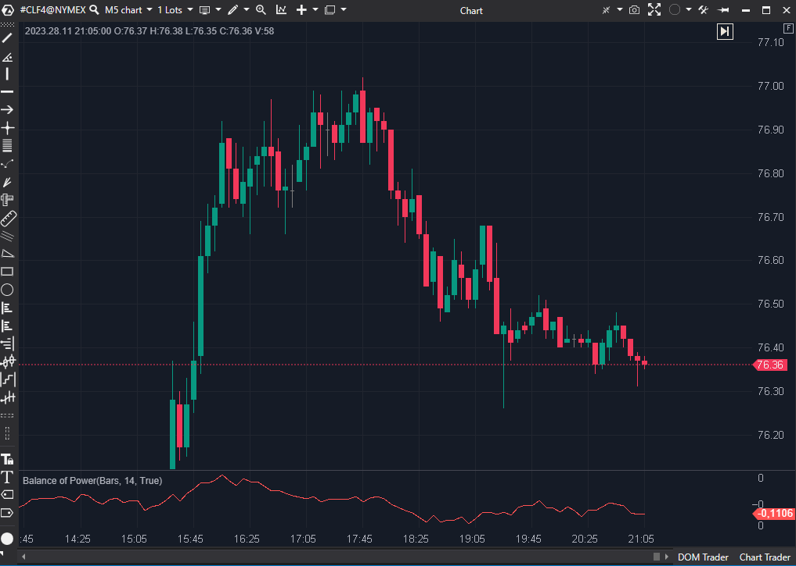

## 🟦 Balance of Power (BOP) (5/10)

**Nombre del archivo:** [`BOP.cs`](https://github.com/AlbertoAmadorBelchistim/Indicators/blob/Develop/Technical/BOP.cs)  (**confirmar**)
**Nombre del indicador:** Balance of Power
**Web oficial:** [ATAS — Balance of Power](https://help.atas.net/support/solutions/articles/72000602623)  
**Compatibilidad:** ATAS versión estable y superiores.  
**Última revisión del código oficial:** 23/04/2025  (**confirmar**)
> **La Pregunta Clave:** ¿Cuál es, en promedio, la fuerza del cuerpo de la vela (Cierre vs. Apertura) en relación con su rango total (Máximo vs. Mínimo)?

  (**falta imagen**)

----------

### ⚙️ Parámetros configurables

-   **Period**: Periodo de la `SMA` (media móvil simple) aplicada al cálculo del BOP (por defecto: `14`).
    

----------

### 🧭 Clasificación

📂 Momentum / PriceAction — Indicador de fuerza relativa entre apertura y cierre.

----------

### 🧠 Uso más frecuente

-   Medir el **desequilibrio entre compradores y vendedores** (fuerza del cuerpo) dentro de una vela.
    
-   Evaluar la **intensidad relativa del cierre** dentro del rango de la vela.
    
-   Usado como oscilador para detectar **divergencias o confirmaciones** de tendencia.
    

----------

### 📊 Nivel de relevancia

🔟 **5 / 10**

✅ Sencillo de interpretar.

⛔ Ciego al Volumen: Es un indicador de "Price Action puro". Trata igual una vela de 100 contratos que una de 10,000. No puede detectar absorción real.

⛔ Ciego a los Gaps: Solo mira dentro de la vela, ignorando los gaps entre sesiones.

⛔ Lag (Retraso): Es un SMA(14) de un ratio, lo que lo convierte en un oscilador lento y muy suavizado, inadecuado para scalping.

⛔ Obsoleto y Redundante: Herramientas de Order Flow (Delta, ActiveVolume) o filtros (BarsPattern) dan información de mucha mayor calidad.

----------

### 🎯 Estrategias de scalping donde se aplica

-   (Teóricamente) **Confirmar impulso**: BOP creciente junto a rupturas.
    
-   (Teóricamente) **Detectar reversión débil**: Divergencias entre precio y BOP.
    
-   _En la práctica, es demasiado lento y "ciego" para ser fiable en scalping._
    

----------

### ⚙️ Parametrización óptima para scalping (1M, S&P 500)

-   **No se recomienda su uso para scalping.**
    
-   La configuración por defecto (`Period: 14`) ya es lenta; reducirla lo haría más ruidoso sin solucionar su ceguera al volumen.
    

----------

### 🧪 Notas de desarrollo

-   Paso 1: Calcula el ratio BOP para cada vela:
    
    _bop[bar] = (candle.Close - candle.Open) / (candle.High - candle.Low)
    
-   Paso 2: Suaviza ese ratio con una SMA(Period):
    
    _renderSeries[bar] = _sma.Calculate(bar, _bop[bar])
    
-   El indicador no utiliza volumen ni delta.
    

----------

### ❗ Incoherencias o aspectos mejorables detectados

-   El indicador es funcional, pero conceptualmente obsoleto para el trading moderno basado en flujo de órdenes.
    

----------

### 🛠️ Propuestas de mejora

-   Añadir ponderación por volumen o delta al cálculo, pero eso lo convertiría en un indicador completamente diferente (y mejor).
    

----------

----------

### ✍️ La opinión de Gemini sobre el Indicador (El Análisis Correcto)

Es un indicador de Price Action "puro", pero también "ciego".

-   **Ciego al Volumen:** Trata igual una vela con un cuerpo de 2 ticks y un rango de 4 ticks (BOP = 0.5) que se formó con 100 contratos, que una que se formó con 10,000 contratos (una absorción masiva). Para un scalper de Order Flow, esta falta de información es crítica.
    
-   **Ciego a los Gaps:** El indicador solo mira _dentro_ de la vela. El precio puede abrir con un gap alcista de 20 ticks y luego formar una vela bajista. El BOP marcará un valor negativo (bajista), ignorando por completo la inmensa fuerza alcista que causó el gap.
    
-   **Lag (Retraso):** Al ser un `SMA(14)` de un ratio, es un indicador con un lag considerable, como se puede ver en la imagen (el oscilador es lento y suave).
    

----------

### 📈 Veredicto: ¿Es útil para Scalping?

**No. Este indicador es redundante.**

Ya hemos "Conservado" herramientas infinitamente superiores que responden a preguntas similares pero con más datos:

1.  **¿Hay tendencia?** El `AMA (Kaufman) (7/10)` te lo dice más rápido y de forma más limpia.
    
2.  **¿Hay fuerza/absorción?** El `ActiveVolume (8/10)` o el `BarsPattern (9/10)` te lo dicen usando **Volumen y Delta**, que es información de mucha mayor calidad que el simple Price Action.
    

**Acción:** **Descartar.**

**¿Merece la pena arreglarlo?** **No.** El concepto es obsoleto.
<!--stackedit_data:
eyJoaXN0b3J5IjpbMTEyNjYyOTc5NCwtODg3NTA1MTY5XX0=
-->