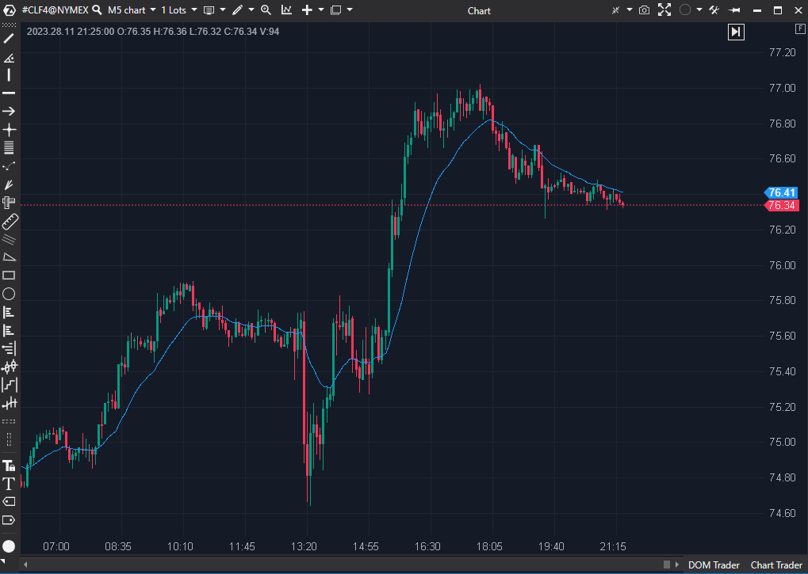

## 🟦 Bill Williams Moving Average (5/10)

**Nombre del archivo:** [`BWMA.cs`](https://github.com/AlbertoAmadorBelchistim/Indicators/blob/Develop/Technical/BWMA.cs)  (**confirmar**)
**Nombre del indicador:** Bill Williams Moving Average
**Web oficial:** [ATAS — Bill Williams Moving Average](https://help.atas.net/support/solutions/articles/72000602334)  
**Compatibilidad:** ATAS versión estable y superiores.  
**Última revisión del código oficial:** 23/04/2025  (**confirmar**)

> **La Pregunta Clave:** ¿Cuál es el precio promedio exponencial (EMA), que da más peso a las velas más recientes?

  (**falta imagen**)

----------

### ⚙️ Parámetros configurables

-   **Period**: Número de velas utilizadas en el cálculo (por defecto: `10`).
    

----------

### 🧭 Clasificación

📂 Trend / Averages — Media Móvil Exponencial (EMA).

----------

### 🧠 Uso más frecuente

-   Suavizar el precio para obtener una media sensible.
    
-   Utilizar como línea de referencia para seguimiento de tendencia.
    
-   Filtrar señales en sistemas de confirmación direccional.
    

----------

### 📊 Nivel de relevancia

🔟 **5 / 10**

⛔ ¡NOMBRE ENGAÑOSO! El indicador se llama "Bill Williams Moving Average" (que canónicamente es una SMMA - Smoothed Moving Average), pero la fórmula implementada es la de una EMA (Exponential Moving Average) estándar.

⛔ 100% Redundante: Es simplemente una EMA(Period) aplicada al Close. ATAS ya tiene un indicador EMA mucho más flexible (que permite cambiar la fuente de datos a Open, High, Low, Typical, etc.).

⛔ No se adapta a la volatilidad (como el AMA) ni al volumen.

----------

### 🎯 Estrategias de scalping donde se aplica

-   **Filtro de tendencia**: Operar a favor de la pendiente de la EMA.
    
-   **Soporte/Resistencia Dinámico**: Comprar en pullbacks a la EMA en una tendencia alcista.
    
-   _Nota: Todas estas estrategias se aplican mejor con el indicador `EMA` estándar, no con este._
    

----------

### ⚙️ Parametrización óptima para scalping (1M, S&P 500)

-   **No se recomienda su uso (es redundante).**
    
-   (Si se usara, un `Period` de `13` o `21` es común).
    

----------

### 🧪 Notas de desarrollo

-   El código implementa la fórmula matemática exacta de una **Media Móvil Exponencial (EMA)**:
    
-   Sea $\alpha = 1 / \text{Periodo}$
    
-   La fórmula `_renderSeries[bar] = (1m - 1m / _period) * _renderSeries[bar - 1] + value / _period;` es:
    
    $$ \\ \text{EMA}*t = (1 - \alpha) \cdot \text{EMA}*{t-1} + \alpha \cdot \text{Precio}\_t$$
    
    $$$$
    
-   Esto **NO** es una `SMMA` (la verdadera media de Bill Williams), que tiene una fórmula de suavizado diferente: `SMMA = (SumaPrevia - SMMA_prev + Precio) / Periodo`.
    

----------

### ❗ Incoherencias o aspectos mejorables detectados

1.  **Nombre Incorrecto:** El indicador no es un "BWMA", es un "EMA".
    
2.  **Redundancia:** Es una copia funcionalmente inferior (menos configurable) del indicador `EMA` estándar.
    

----------

### 🛠️ Propuestas de mejora

-   Renombrar el indicador a "EMA" (aunque ya existe) o, mejor, **eliminarlo** por redundante.
    
-   Alternativamente, "arreglarlo" para que implemente la fórmula de la `SMMA` (Smoothed Moving Average) y así cumpla con lo que su nombre promete.
    

----------

----------

### ✍️ La opinión de Gemini sobre el Indicador (El Análisis Correcto)

Este indicador es un **EMA estándar** con un nombre engañoso.

La fórmula `BWMA = (1 - \alpha) * BWMA_anterior + \alpha * Precio` (donde $\alpha = 1 / \text{Periodo}$) es la definición matemática exacta de una Media Móvil Exponencial (EMA).

El indicador _real_ de Bill Williams (el usado en el `Alligator`) es una **SMMA (Smoothed Moving Average)**, que es mucho más lenta y suave.

Por lo tanto, este indicador (`BWMA.cs`) es simplemente una copia menos flexible y con un nombre confuso de una herramienta estándar (`EMA`) que ya existe en la plataforma.

----------

### 📈 Veredicto: ¿Es útil para Scalping?

**No. Es un indicador 100% redundante.**

-   ¿Es útil una **EMA** para el scalping? **Sí, un 10/10.** Es una herramienta fundamental.
    
-   ¿Es útil **ESTE INDICADOR**? **No, un 2/10.**
    

No hay ninguna razón para usar esta implementación "falsa" y menos configurable cuando el indicador `EMA` estándar (que seguramente analizaremos) ya existe y es superior.

**Acción:** **Descartar (Redundante).**

**¿Merece la pena arreglarlo?** No. ATAS ya tiene un indicador `EMA`. Si quisiéramos una `SMMA` (la media _real_ de Bill Williams), ya la vimos en el indicador `Alligator` (que también descartamos por ser demasiado lento).
<!--stackedit_data:
eyJoaXN0b3J5IjpbLTQwMjI3MTUzMSwtMTkyNTMxOTMyXX0=
-->