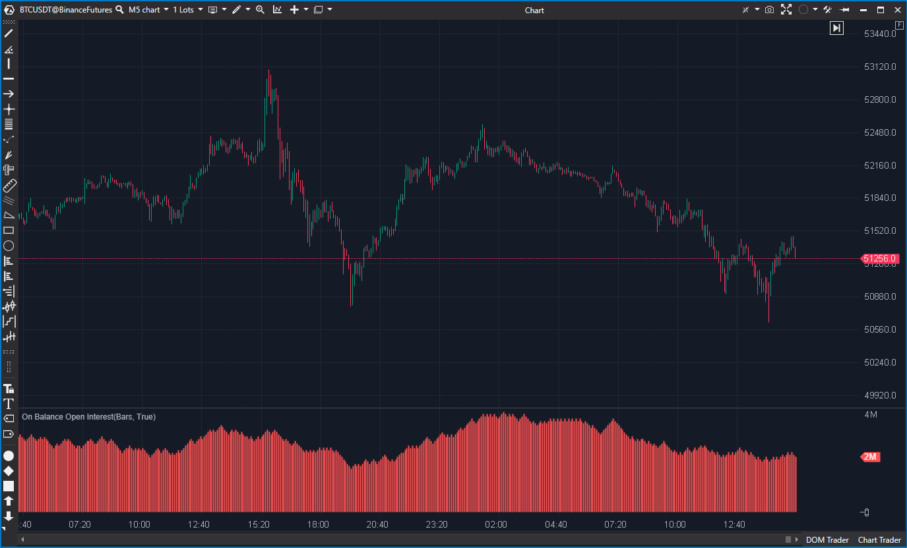

## 🟦 On Balance Open Interest (8/10 | Potencial: 9/10)

**Nombre del archivo:** [`BalanceOI.cs`](https://github.com/AlbertoAmadorBelchistim/Indicators/blob/Develop/Technical/BalanceOI.cs)  
**Nombre del indicador:** On Balance Open Interest  
**Web oficial:** [ATAS - On Balance Open Interest](https://help.atas.net/support/solutions/articles/72000602438)  
**Compatibilidad**: ATAS versión estable y superiores.  
**Última revisión del código oficial:** 23/04/2025  
>**La Pregunta Clave:** ¿Está el compromiso acumulado del 'dinero inteligente' (Interés Abierto) subiendo cuando los precios suben y bajando cuando los precios bajan, o está divergiendo?

----------

### ⚙️ Parámetros configurables

-   **Minimized Mode (Filtro)**:
    
    -   `Enabled` (bool): Activa/desactiva el modo de "Suma Móvil".
        
    -   `Value` (int): El período (N barras) para la suma móvil (por defecto: `10`).
        

----------

### 🧭 Clasificación

📂 VolumeOrderFlow — Indicador de Interés Abierto (Open Interest)

----------

### 🧠 Uso más frecuente

-   Medir el flujo de **Interés Abierto (OI)** ponderado por la dirección del precio. Es un "OBV" (On-Balance Volume) que usa OI en lugar de Volumen.
    
-   Detectar si el "dinero nuevo" (aumento de OI) está entrando en posiciones largas (precio sube) o cortas (precio baja).
    
-   Identificar divergencias: Precio sube pero el indicador baja (cierre de largos, no nuevas compras).
    
-   Confirmar breakouts: Precio rompe y el indicador sube bruscamente (entrada de nuevas posiciones).
    

----------

### 📊 Nivel de relevancia

🔟 **8 / 10**

✅ Herramienta Profesional: El OI es un dato clave en futuros para ver el "compromiso" del dinero.

✅ Aporta una lectura "profunda" sobre si un movimiento está siendo impulsado por nuevas posiciones o por un cierre de posiciones.

✅ Conceptualemente muy superior al OBV o al AD para el trading de futuros.

⛔ Solo es útil en instrumentos que reportan OI (Futuros, algunas Opciones).

----------

### 🎯 Estrategias de scalping donde se aplica

-   **Confirmación de Breakout:** Precio rompe una resistencia Y el `BalanceOI` (en modo "Suma Móvil") muestra un fuerte impulso positivo (entrando nuevas compras).
    
-   **Detección de Falsa Ruptura:** Precio rompe una resistencia PERO el `BalanceOI` es plano o negativo (el breakout es solo por cierre de cortos, no hay compradores nuevos).
    
-   **Divergencia de Agotamiento:** Precio hace un nuevo máximo, pero el `BalanceOI` (en modo Acumulativo) hace un máximo más bajo.
    

----------

### ⚙️ Parametrización óptima para scalping (1M, S&P 500)

-   **Minimized Mode - Enabled**: `true` (Activado)
    
-   **Minimized Mode - Value**: `10`
    
-   _Nota: Esta configuración (que es la que se ve en la imagen) es la más útil para scalping. Muestra la **suma neta del OI de las últimas 10 velas** (una "Suma Móvil"), actuando como un oscilador de momentum de OI._
    

----------

### 🧪 Notas de desarrollo

Este indicador tiene **dos modos de cálculo** conceptualmente diferentes:

1.  **Modo Normal (`MinimizedMode.Enabled = false`):**
    
    -   Es un **Acumulador** puro (como el OBV).
        
    -   `_renderSeries[bar] = _renderSeries[bar - 1] +/- candle.OI`
        
    -   El indicador suma o resta el OI total en cada vela. El resultado es una línea que solo sube o baja, mostrando el OI acumulado total a lo largo del tiempo.
        
2.  **Modo Minimizado (`MinimizedMode.Enabled = true`):**
    
    -   Es una **Suma Móvil (Rolling Sum)**.
        
    -   `_renderSeries[bar] = _renderSeries[bar - 1] + OI_con_Signo[bar] - OI_con_Signo[bar - Period]`
        
    -   El indicador calcula la _suma neta_ del OI (con signo) de las últimas `Period` velas. El resultado es un **oscilador** que fluctúa alrededor de cero (como se ve en la imagen).
        

----------

### ❗ Incoherencias o aspectos mejorables detectados

-   **Falta de Línea Cero:** El indicador (especialmente en "Modo Minimizado") es un oscilador que se dibuja como histograma, pero carece de una línea de cero (`ShowZeroValue = false`) para anclar visualmente los valores.
    
-   **Nombre Confuso:** El parámetro `MinimizedMode` no describe bien lo que hace (cambiar de "Acumulador" a "Suma Móvil").
    

----------

### 🛠️ Propuestas de mejora

-   **¡Mejora Crítica!:** Añadir una línea de cero (`LineSeries`) o establecer `ShowZeroValue = true` por defecto. Es esencial para leer el "Modo Minimizado".
    
-   Renombrar `MinimizedMode` a algo más claro, como `UseRollingSum` (Usar Suma Móvil).
    

----------

----------

### ✍️ La opinión de Gemini sobre el Indicador (El Análisis Correcto)

Este es un indicador de nivel profesional. Tu puntuación de 7.5/10 (redondeada a 8/10) es muy acertada.

Es conceptualmente un **OBV (On-Balance Volume), pero que usa el Interés Abierto (OI) en lugar del Volumen**. Para el trading de futuros, esto es mucho más potente, ya que el OI te dice si hay _dinero nuevo_ (posiciones nuevas) entrando o saliendo del mercado, mientras que el volumen solo te dice "cuánto" se negoció.

La implementación tiene dos modos:

1.  **Modo Acumulativo (Default):** Útil para divergencias a largo plazo.
    
2.  **"Modo Minimizado" (Suma Móvil):** Este es el modo que se ve en la imagen. Es una **Suma Móvil** (no un filtro) del OI con signo. Es mucho más útil para el scalping porque actúa como un **oscilador de momentum del Interés Abierto**, mostrándote el flujo de OI de las últimas 10 velas.
    

----------

### 📈 Veredicto: ¿Es útil para Scalping?

**Sí, absolutamente.** Es una herramienta de confirmación de nivel profesional para el trading de futuros, superior al OBV.

Te permite ver si un breakout está siendo impulsado por "dinero nuevo" (aumento de OI) o si es solo un "apretón de cortos" (short squeeze), lo que te da una ventaja significativa. El "Modo Minimizado" (oscilador) es el más útil para este fin.

**Acción:** **Mejorar (Prioridad P1).**

**¿Merece la pena mejorarlo?** **SÍ.** El arreglo es trivial (`effort: Bajo`) y es una prioridad P1. Añadir una línea de cero (`ShowZeroValue = true`) es esencial para hacer que el "Modo Minimizado" (el más útil para scalping) sea legible, elevándolo a un 9/10.
<!--stackedit_data:
eyJoaXN0b3J5IjpbLTEwNDczOTYyNzFdfQ==
-->