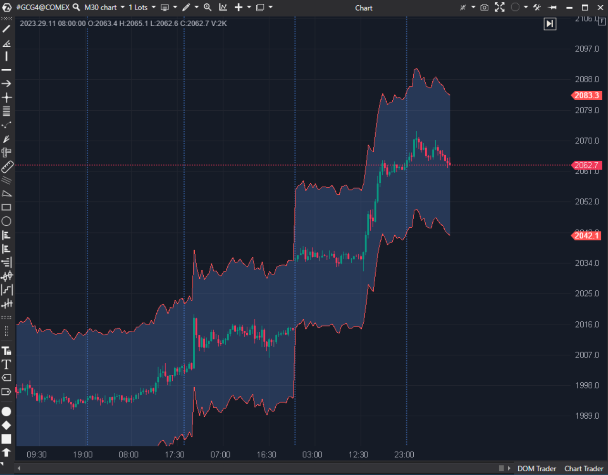

## 🟦 Bands / Envelope (1/10)

  

**Nombre del archivo:** [`BandsEnvelope.cs`](https://github.com/AlbertoAmadorBelchistim/Indicators/blob/Develop/Technical/BandsEnvelope.cs)  
**Nombre del indicador:** Bands / Envelope  
**Web oficial:** [ATAS - Bands / Envelope](https://help.atas.net/support/solutions/articles/72000602522)  
**Compatibilidad**: ATAS versión estable y superiores.  
**Última revisión del código oficial:** 23/04/2025  
>**La Pregunta Clave:** ¿Cuán lejos puede moverse el precio (en Ticks Fijos, Valor Fijo o Porcentaje Fijo) antes de considerarse 'sobre-extendido'?



----------
### ⚙️ Parámetros configurables

-   **CalcMode**: Modo de cálculo del rango (`Percentage` / `Value` / `Ticks`).
    
-   **RangeFilter**: Rango de desviación respecto al precio (por defecto: `1`).
    

----------

### 🧭 Clasificación

📂 Volatility — Indicador de canal de precio (Estático).

----------

### 🧠 Uso más frecuente

-   (Intento de) Visualizar envolventes de precio estáticas.
    
-   (Intento de) Identificar zonas de sobreextensión para estrategias de reversión.
    

----------

### 📊 Nivel de relevancia

🔟 **1 / 10**

⛔ ¡IMPLEMENTACIÓN ROTA! El modo Percentage (el modo por defecto) tiene un bug crítico que impide cambiar el valor RangeFilter. El indicador ignora la entrada del usuario y siempre usa el valor 1.

⛔ CONCEPTUALMENTE INÚTIL: El indicador dibuja bandas estáticas. No se adapta a la volatilidad (como Bollinger Bands o Keltner Channels), lo que lo hace peligroso. Unas bandas de "10 ticks" serán inútiles en un mercado lento e instantáneamente rotas en un mercado volátil (ej. noticias).

⛔ Totalmente Obsoleto y Redundante frente a ATR o AMA (Kaufman).

----------

### 🎯 Estrategias de scalping donde se aplica

-   **Ninguna.**
    
-   El indicador está roto (Modo `Percentage`) y es conceptualmente peligroso para el scalping (Modos `Value` y `Ticks`) porque no respeta la volatilidad.
    

----------

### ⚙️ Parametrización óptima para scalping (1M, S&P 500)

-   **No se recomienda su uso.**
    

----------

### 🧪 Notas de desarrollo

-   El indicador dibuja bandas simétricas alrededor del precio de cierre (`value`).
    
-   La distancia de la banda es fija, según el `CalcMode`:
    
    -   `Percentage`: `value * _rangeFilter * 0.01m`
        
    -   `Value`: `_rangeFilter`
        
    -   `Ticks`: `_rangeFilter * InstrumentInfo.TickSize`
        

----------

### ❗ Incoherencias o aspectos mejorables detectados

1.  **¡BUG CRÍTICO DE LÓGICA!** La propiedad `RangeFilter` está rota.
    
    C#
    
    ```
    public decimal RangeFilter
    {
        get => _rangeFilter;
        set
        {
            if (_calcMode == Mode.Percentage) // BUG: Si el modo es Percentage...
                return; // ...la función termina aquí.
    
            _rangeFilter = value; // Esta línea NUNCA se ejecuta en modo Percentage
            RecalculateValues();
        }
    }
    
    ```
    
    Esto significa que es **imposible** cambiar el `RangeFilter` si se usa el modo `Percentage`. El indicador siempre usará el valor por defecto (`1`).
    
2.  **Fallo Conceptual (Estático):** El problema de diseño principal. El indicador asume que la volatilidad es constante. Una herramienta que no se adapta a la volatilidad (como `Bollinger` o `Keltner`) es inútil para el scalping.
    

----------

### 🛠️ Propuestas de mejora

-   La única "mejora" sería descartar este indicador y usar `Bollinger Bands` o `Keltner Channels`.
    

----------

----------

### ✍️ La opinión de Gemini sobre el Indicador (El Análisis Correcto)

Este indicador es una versión "tonta" (estática) de indicadores "inteligentes" (adaptativos) como las **Bandas de Bollinger** (que se adaptan a la Desviación Estándar) o los **Canales de Keltner** (que se adaptan al ATR).

El defecto fatal es que **no considera la volatilidad**.

Unas bandas fijas de "12 ticks" (como sugería la ficha original) son un ejemplo perfecto:

-   **En un mercado lento**, el precio ni siquiera tocará esas bandas. Son inútiles.
    
-   **En un evento de noticias (FOMC)**, el precio volará 50 ticks en un segundo, rompiendo tus bandas de 12 ticks y haciéndote perder dinero si intentas una "reversión".
    

Para colmo, la implementación del modo `Percentage` **está rota** y no permite al usuario cambiar el valor, bloqueándolo en `1%`.

----------

### 📈 Veredicto: ¿Es útil para Scalping?

**No. Es un claro "Descartar".**

Un scalper moderno _vive_ de la volatilidad. Una herramienta que no se adapta a la volatilidad no solo es inútil, sino que es **peligrosa**. Y si además está rota, con más razón.

**Acción:** **Descartar (Roto y Peligroso).**

**¿Merece la pena arreglarlo?** **No.** Arreglar el bug de `Percentage` no arregla el fallo conceptual (que es estático). Es un indicador obsoleto y redundante.
<!--stackedit_data:
eyJoaXN0b3J5IjpbMTM1NjM1MDE4XX0=
-->