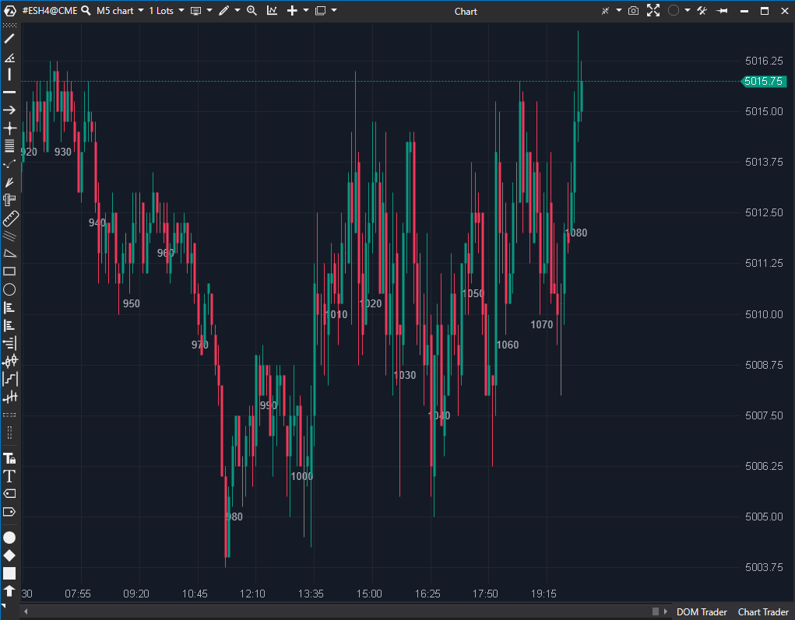

## 🟦 Bar Numbering (4/10)

  

**Nombre del archivo:** [`BarNumbering.cs`](https://github.com/AlbertoAmadorBelchistim/Indicators/blob/Develop/Technical/BarNumbering.cs)  
**Nombre del indicador:** Bar Numbering  
**Web oficial:** [ATAS - Bar Numbering](https://help.atas.net/support/solutions/articles/72000618457)  
**Compatibilidad**: ATAS versión estable y superiores.  
**Última revisión del código oficial:** 23/04/2025  

>**La Pregunta Clave:** ¿Cuántas velas han pasado desde el inicio de la sesión, y puedes etiquetarlas cada X velas, por favor?  

  

----------
### ⚙️ Parámetros configurables

-   **Font / FontColor**: Tipografía y color del número.
    
-   **DisplayBottom**: Mostrar el número en la parte inferior del gráfico (en lugar de bajo la vela).
    
-   **Offset**: Desplazamiento vertical (Y) en píxeles.
    
-   **Period**: Frecuencia con la que se dibuja el número (por defecto: `10`, es decir, cada 10 velas).
    
-   **ResetOnSession**: Reiniciar la numeración al comenzar una nueva sesión (por defecto: `false`).
    

----------

### 🧭 Clasificación

📂 Utilidad / Visualización — Herramienta de ayuda visual para el gráfico.

----------

### 🧠 Uso más frecuente

-   Visualizar de forma clara la **cantidad de velas transcurridas**.
    
-   **Backtesting visual** de estrategias basadas en el tiempo (ej. "entrar tras 5 velas de rango").
    
-   Medir la duración de patrones o movimientos sin tener que contar manualmente.
    

----------

### 📊 Nivel de relevancia

🔟 **4 / 10**

✅ Muy útil para estudios visuales, backtesting o desarrollo de estrategias basadas en conteo de barras.

✅ Flexible (permite resetear por sesión y cambiar la frecuencia).

⛔ No es un indicador de trading. No aporta señales ni información de mercado (precio, volumen, etc.).

⛔ Ruido Visual: En un gráfico de scalping en vivo, añade números que saturan la pantalla sin dar información accionable.

----------

### 🎯 Estrategias de scalping donde se aplica

-   (Solo en fase de **Análisis/Backtesting**):
    
    -   Contar barras desde un evento clave (apertura, ruptura) para medir la duración de los impulsos.
        
    -   Probar estrategias basadas en tiempo (ej. "entrar tras N velas de consolidación").
        

----------

### ⚙️ Parametrización óptima para scalping (1M, S&P 500)

-   **No se recomienda su uso para trading en vivo.**
    
-   **Para Análisis/Backtesting:**
    
    -   **Period**: `5`
        
    -   **ResetOnSession**: `true`
        
    -   **Font**: Arial 10, **FontColor**: Gris
        

----------

### 🧪 Notas de desarrollo

-   Es un indicador de **dibujo personalizado** (`EnableCustomDrawing = true`).
    
-   No usa la serie de datos principal, solo la usa para almacenar el contador.
    
-   **`OnCalculate`:** Mantiene un contador de barras. Si `ResetOnSession` es `true`, el contador se reinicia a `0` en `IsNewSession()`.
    
-   **`OnRender`:** Dibuja el número de la barra (`barNum`) solo si `barNum % Period == 0` (usando el operador módulo para filtrar por frecuencia).
    

----------

### ❗ Incoherencias o aspectos mejorables detectados

-   El código es limpio y funciona como se espera para su propósito (utilidad de conteo).
    

----------

### 🛠️ Propuestas de mejora

-   Permitir **iniciar el conteo desde un punto seleccionado manualmente** (un clic) en lugar de solo desde el inicio del gráfico o de la sesión.
    

----------

----------

### ✍️ La opinión de Gemini sobre el Indicador (El Análisis Correcto)

Este indicador no es de "trading", sino de "utilidad/visualización". Tu puntuación de 4.5/10 (redondeada a 4/10) es la correcta. Es una herramienta de "ayuda visual" que puede ser útil en sistemas muy específicos, pero que no aporta información de mercado.

-   **Para el Trading en Vivo:** Le daría un **2/10**. Ocupa espacio visual y no da información relevante para tomar una decisión en tiempo real.
    
-   **Para el Backtesting Visual:** Le daría un **8/10**. Si estás probando una estrategia del tipo "entrar 3 velas después de un impulso", esta herramienta es fantástica para contar visualmente.
    

Dado que el objetivo es crear un sistema de _trading_ en vivo, esta herramienta no aporta valor a la operativa.

----------

### 📈 Veredicto: ¿Es útil para Scalping?

**No. Es una herramienta de análisis/backtesting, no una herramienta de trading en vivo.**

Las "Estrategias" donde se aplica ("Contar barras desde evento clave") son cosas que un trader hace mentalmente o en fase de análisis, pero que no necesita que un indicador le "pinte" en el gráfico en tiempo real, saturándolo de números.

**Acción:** **Descartar.**

**¿Merece la pena arreglarlo?** El indicador funciona perfectamente. No hay nada que "arreglar", simplemente es una herramienta para un propósito diferente (análisis, no trading).
<!--stackedit_data:
eyJoaXN0b3J5IjpbMjE1MzI4NTg5XX0=
-->