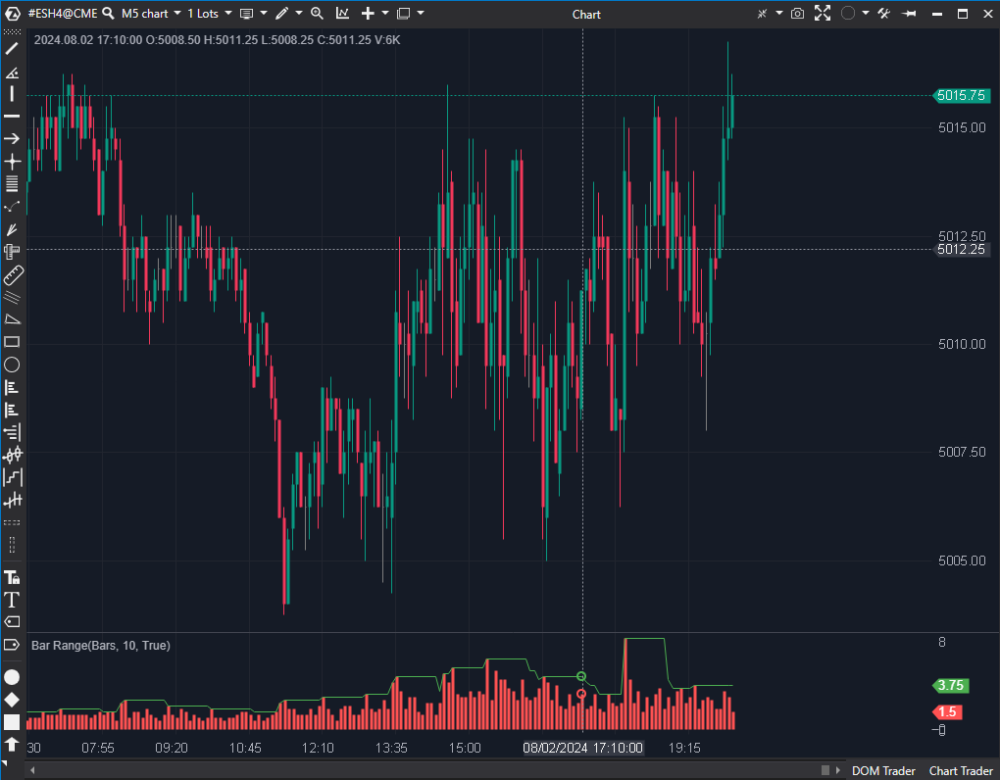

## 🟦 Bar Range (5/10)

  

**Nombre del archivo:** [`BarRange.cs`](https://github.com/AlbertoAmadorBelchistim/Indicators/blob/Develop/Technical/BarRange.cs)  
**Nombre del indicador:** Bar Range  
**Web oficial:** [ATAS - Bar Range](https://help.atas.net/support/solutions/articles/72000618458)  
**Compatibilidad**: ATAS versión estable y superiores.  
**Última revisión del código oficial:** 23/04/2025  

>**La Pregunta Clave:** ¿Cuál es el rango (Máximo - Mínimo) de cada vela, y cuál ha sido el rango más alto de las últimas X velas?

----------

### ⚙️ Parámetros configurables

-   **ShowMaxVolume**: Mostrar línea con el mayor rango alcanzado (por defecto: `false`).
    
-   **HiVolPeriod**: Número de velas a considerar para hallar el mayor rango (por defecto: `14`).
    
-   **LineColor**: Color de la línea de mayor rango (por defecto: Verde).
    

----------

### 🧭 Clasificación

📂 Volatility — Indicador de rango vertical de velas (no suavizado).

----------

### 🧠 Uso más frecuente

-   Medir la **volatilidad intrabarra** mediante el rango (`High - Low`).
    
-   Visualizar cambios de régimen (expansión o contracción de rango).
    
-   Detectar velas de rango extremo (velas de clímax) comparándolas con la línea de `ShowMaxVolume`.
    

----------

### 📊 Nivel de relevancia

🔟 **5 / 10**

✅ Útil para validar contextos de alta o baja volatilidad.

⛔ Conceptualemente Inferior al ATR: Mide High - Low, por lo que ignora los gaps entre velas, subestimando la volatilidad real.

⛔ Ruidoso: Al no estar suavizado (como el ATR), el histograma es errático y difícil de interpretar para un análisis de volatilidad promedio.

⛔ Redundante: El ATR (que ya conservamos) hace el mismo trabajo de forma mucho más robusta (incluye gaps y suaviza el resultado).

----------

### 🎯 Estrategias de scalping donde se aplica

-   **Velas de clímax**: Identificar una vela cuyo rango (barra del histograma) es inusualmente grande.
    
-   **Contracción-expansión**: Detectar compresión (barras de histograma muy bajas) seguida de una barra de expansión.
    

----------

### ⚙️ Parametrización óptima para scalping (1M, S&P 500)

-   **HiVolPeriod**: `20`
    
-   **ShowMaxVolume**: `true`
    
-   _Nota: No se recomienda su uso; el `ATR` es superior._
    

----------

### 🧪 Notas de desarrollo

-   El indicador calcula el rango simple de cada vela: `this[bar] = candle.High - candle.Low;`
    
-   Se representa como un histograma (`VisualType = VisualMode.Histogram`).
    
-   Usa internamente un indicador `Highest` para calcular y dibujar (opcionalmente) el rango más alto de las últimas `HiVolPeriod` barras.
    

----------

### ❗ Incoherencias o aspectos mejorables detectados

-   **Ignora Gaps:** La principal debilidad. No calcula el "True Range", solo el rango de la vela.
    
-   **Ruidoso:** Al no estar promediado/suavizado, es difícil de usar para definir un stop loss o un tamaño de posición, tareas para las que el `ATR` es ideal.
    

----------

### 🛠️ Propuestas de mejora

-   Reemplazar `High - Low` por el cálculo del **True Range**.
    
-   Añadir una opción de **suavizado (SMA/EMA)**.
    
-   _Nota: Si se aplicaran estas mejoras, se convertiría en el indicador `ATR`._
    

----------

----------

### ✍️ La opinión de Gemini sobre el Indicador (El Análisis Correcto)

Este indicador es un ejemplo perfecto de una herramienta que es **100% redundante**.

Ya hemos analizado y decidido **"Conservar y Mejorar"** el indicador **ATR (8/10)**. Comparemos ambos:

-   **Bar Range (Este indicador):**
    
    -   Mide `High - Low` (ignora los gaps).
        
    -   Es "ruidoso" (muestra el valor de cada vela sin suavizar).
        
-   **ATR (El que conservamos):**
    
    -   Mide el **True Range** (incluye los gaps, lo cual es vital).
        
    -   **Suaviza** el valor con una media móvil para mostrar la _volatilidad promedio_, eliminando el ruido.
        

El **ATR** es una herramienta conceptualmente **muy superior** para hacer exactamente el mismo trabajo. El `BarRange` no te da ninguna información que el ATR no te dé ya, y la información del ATR es de mayor calidad.

----------

### 📈 Veredicto: ¿Es útil para Scalping?

**No. Es redundante.**

No hay ninguna razón para tener este indicador en un sistema de scalping si ya se tiene el `ATR`.

**Acción:** **Descartar.**

**¿Merece la pena arreglarlo?** **No.** Arreglarlo (añadiendo True Range y suavizado) lo convertiría literalmente en el indicador `ATR`, que ya existe y hemos conservado.
<!--stackedit_data:
eyJoaXN0b3J5IjpbMjY5NjcwNzgzXX0=
-->