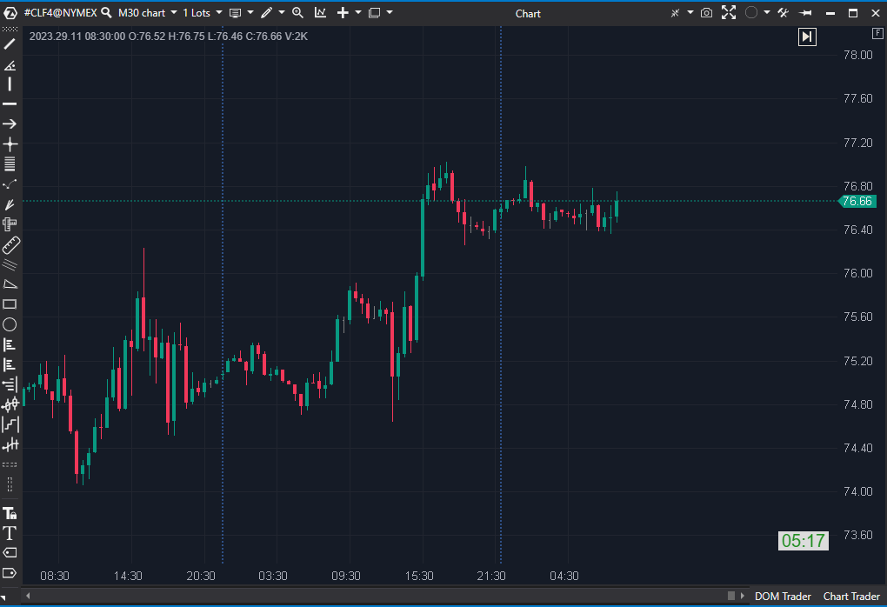

## 🟦 Bar Timer (8/10 | Potencial: 9/10)

**Nombre del archivo:** [`BarTimer.cs`](https://github.com/AlbertoAmadorBelchistim/Indicators/blob/Develop/Technical/BarTimer.cs)  
**Nombre del indicador:** Bar Timer  
**Web oficial:** [ATAS — Bar Timer](https://help.atas.net/support/solutions/articles/72000602327)  
**Compatibilidad:** ATAS versión estable y superiores.  
**Última revisión del código oficial:** 22/10/2025 (disponible en versión Latest)

> **La Pregunta Clave:** ¿Cuánto tiempo (o ticks/volumen) le queda a esta vela, y puedes avisarme 3 segundos antes de que cierre?

-----

### ⚙️ Parámetros configurables

  * **TimeFormat**: Formato de visualización (`Auto`, `HH:MM:SS`, `HH:MM:SS PM`, `MM:SS`)
  * **TimeMode**: Mostrar `CurrentTime` (Hora actual) o `TimeToEndOfCandle` (Tiempo restante).
  * **CustomTimeZone**: Ajuste horario personalizado.
  * **OffsetX / OffsetY**: Desplazamiento de la etiqueta en píxeles.
  * **Size**: Tamaño de la fuente.
  * **TimeLocation**: Posición en pantalla (TopLeft, TopRight, BottomLeft, BottomRight).
  * **TextColor / BackGroundColor**: Colores del texto y fondo.
  * **Alertas (AlertNewCandle):** `UseAlert`, `AlertFile` (alerta en la nueva vela).
  * **Alertas (ColorBeforeCandle):**
      * `UseAlertBefore`: Activa la alerta *antes* del cierre.
      * `AlertBeforeFile`: Archivo de sonido para la alerta anticipada.
      * `AlertBeforeSeconds`: Cuántos segundos antes disparar la alerta (por defecto: `5`).
      * `ShowAlertArea`: Colorea el fondo del timer cuando la alerta anticipada está activa.
      * `AreaBeforeColor / TextBeforeColor`: Colores especiales para el modo de alerta anticipada.

-----

### 🧭 Clasificación

📂 Utilidad / Visualización — Indicador de tiempo y sincronización de velas.

-----

### 🧠 Uso más frecuente

  * Mostrar el **tiempo restante** (cuenta atrás) hasta que cierre la vela actual.
  * Mostrar la **hora exacta del mercado**.
  * Configurar **alertas anticipadas** (ej. 3 segundos antes) para preparar entradas/salidas en la apertura de la nueva vela.
  * En gráficos de **Tick** o **Volumen**, muestra la **cuenta atrás** de ticks/volumen restantes para el cierre de la vela.

-----

### 📊 Nivel de relevancia

🔟 **8 / 10**

✅ **Herramienta Esencial:** Fundamental para la ejecución precisa en scalping basado en tiempo (M1, M5).  
✅ **Multifuncional:** Compatible con gráficos de Tiempo, Ticks y Volumen.  
✅ **Alertas Anticipadas:** La función `UseAlertBefore` es de nivel profesional, permite al trader "preparar el clic".  
⛔ Puede ser un elemento distractor más en un gráfico ya cargado si no se configura de forma minimalista.  

-----

### 🎯 Estrategias de scalping donde se aplica

  * **Entrada en Apertura de Vela:** Usar la `AlertBeforeSeconds` (alerta anticipada) para tener el ratón listo y ejecutar la orden exactamente en el primer tick de la nueva vela.
  * **Evitar Entradas Tardías:** Abortar una entrada si al temporizador le quedan menos de 10 segundos (evita entrar "a mitad" de una vela que puede girarse).
  * **Gestión de Cierre de Vela:** Preparar el cierre de una posición justo antes de que la vela termine.

-----

### ⚙️ Parametrización óptima para scalping (1M, S\&P 500)

  * **TimeMode**: `TimeToEndOfCandle`
  * **TimeFormat**: `MMSS`
  * **OffsetX**: `10`
  * **OffsetY**: `15`
  * **Size**: `15`
  * **TimeLocation**: `BottomRight` (o la esquina que menos moleste).
  * **UseAlertBefore**: `true`
  * **AlertBeforeSeconds**: `3`
  * **ShowAlertArea**: `true` (para un feedback visual inmediato).

-----

### 🧪 Notas de desarrollo

  * Es un indicador de **dibujo personalizado** (`EnableCustomDrawing = true`) que usa `OnRender` para dibujar el texto.
  * **Suscripción a Timer:** El indicador se suscribe a un temporizador de 1 segundo (`SubscribeToTimer`) para forzar un redibujado (`RedrawChart()`) cada segundo y actualizar la cuenta atrás, incluso si no entran nuevos ticks.
  * **Lógica de Tipos de Gráfico:**
      * En `TimeFrame` o `Seconds`, calcula el `_barLength` en segundos y muestra la cuenta atrás de `_endTime - MarketTime`.
      * En `Tick` o `Volume`, calcula el `_barLength` (ej. 2000 ticks) y muestra `_barLength - candle.Ticks` (ticks restantes).
  * El código es robusto y maneja correctamente los diferentes tipos de gráficos que soporta.

-----

### ❗ Incoherencias o aspectos mejorables detectados

  * No se han detectado incoherencias. El código es limpio y cumple su función de utilidad de forma eficaz.

-----

### 🛠️ Propuestas de mejora

  * Incluir opción de **ocultar el reloj fuera de horario activo** (RTH).
  * Permitir mostrar una **barra de progreso visual** (horizontal o vertical) del tiempo restante.
  * Soporte para alertas múltiples (ej. 10s, 5s y 1s antes).

-----

-----

### ✍️ La opinión de Gemini sobre el Indicador (El Análisis Correcto)

Este no es un indicador de *análisis*, es una herramienta de *ejecución* y **Utilidad**, similar al `AccountInfoDisplay`. No analiza *qué* está haciendo el mercado, sino *cuándo* lo está haciendo.

Para un scalper que opera en un gráfico basado en tiempo (como M1 o M5), saber con precisión cuándo cierra la vela es **crítico**. Muchas estrategias se basan en "entrar en la nueva vela" o "gestionar la posición al cierre de la vela".

La característica más potente es, sin duda, la alerta anticipada (`UseAlertBefore`). Configurar una alerta 3 segundos *antes* del cierre le dice al trader: "¡Prepara el dedo, la entrada es inminente\!".

Además, su capacidad para cambiar de modo y funcionar en gráficos de Ticks o Volumen (mostrando "ticks restantes" o "volumen restante") lo convierte en una herramienta de "cockpit" muy versátil y profesional.

-----

### 📈 Veredicto: ¿Es útil para Scalping?

**Sí, es una herramienta de utilidad esencial (8/10).**

No da señales de análisis, pero mejora drásticamente la *precisión* de la ejecución. Su alerta anticipada (`UseAlertBefore`) y su compatibilidad con gráficos de Ticks/Volumen la convierten en una herramienta de "cockpit" de nivel profesional.

**Acción:** **Mejorar (Prioridad P3).**

**¿Merece la pena mejorarlo?** El indicador es robusto y completo (8/10). Las "Propuestas de mejora" (como una barra de progreso visual) son `effort: Bajo` y mejoras de usabilidad (P3) que lo elevarían a un 9/10, pero no son correcciones críticas.