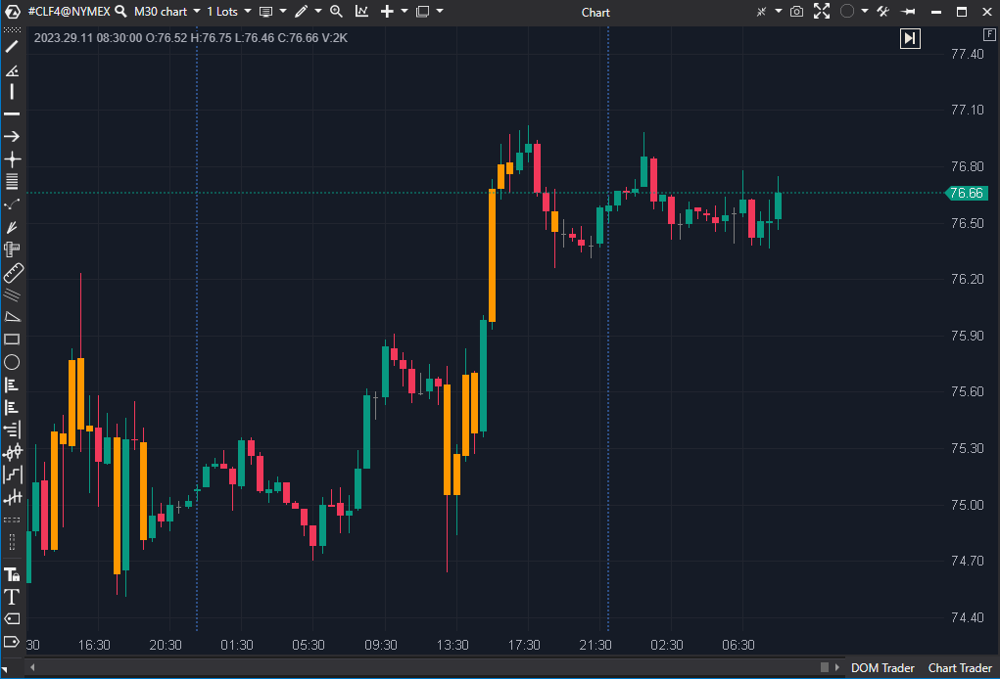

## 🟦 Bar's Volume Filter (7/10 | Potencial: 9/10)

**Nombre del archivo:** [`BarVolumeFilter.cs`](https://github.com/AlbertoAmadorBelchistim/Indicators/blob/Develop/Technical/BarVolumeFilter.cs)  
**Nombre del indicador:** Bar's Volume Filter  
**Web oficial:** [ATAS — Bar's Volume Filter](https://help.atas.net/support/solutions/articles/72000602326)  
**Compatibilidad:** ATAS versión estable y superiores.  
**Última revisión del código oficial:** 23/04/2025  

> **La Pregunta Clave:** ¿Qué velas de este gráfico cumplen mi criterio específico de Volumen, Delta o Ticks (ej. 'Volumen \> 1500' y solo 'dentro de la sesión RTH')?

-----

### ⚙️ Parámetros configurables

  * **Type** (`VolumeType`): Tipo de dato usado para filtrar (por defecto: `Volume`):
      * `Volume`: volumen total de la vela
      * `Ticks`: número de ejecuciones
      * `Delta`: diferencia entre agresión ask y bid
      * `Bid`: volumen vendido agresivamente
      * `Ask`: volumen comprado agresivamente
  * **MinimumFilter**: Valor mínimo requerido para marcar la vela (por defecto: `0`, desactivado).
  * **MaximumFilter**: Valor máximo permitido para marcar la vela (por defecto: `100`, activado).
  * **FilterColor**: Color aplicado a las velas que cumplan el criterio (por defecto: Naranja).
  * **TimeFilterEnabled**: Activa el filtro por horario.
  * **StartTime / EndTime**: Define el rango horario de aplicación.

-----

### 🧭 Clasificación

📂 VolumeOrderFlow — Filtro visual de volumen/ticks/delta por vela.

-----

### 🧠 Uso más frecuente

  * **Resaltar velas significativas** que cumplen un criterio de volumen, delta o ticks.
  * **Filtrar ruido:** Ocultar visualmente (no coloreando) las velas irrelevantes (ej. bajo volumen).
  * **Aislar eventos institucionales:** Marcar solo velas con Delta o Volumen extremo.
  * **Filtro de Sesión:** Aplicar el análisis solo al horario operativo relevante (ej. RTH).

-----

### 📊 Nivel de relevancia

🔟 **7 / 10**

✅ **Herramienta Esencial:** Un filtro de contexto/ruido fundamental.  
✅ **Altamente Configurable:** Permite al trader definir qué es una "vela importante" (por Volumen, Delta, Ticks, etc.).  
✅ **Filtro de Sesión (RTH):** El `TimeFilterEnabled` es crucial para ignorar el ruido de la sesión nocturna/asiática.  
⛔ No es un indicador de "señal", sino un "filtro visual".  

-----

### 🎯 Estrategias de scalping donde se aplica

  * **Filtro de Ruido:** El uso principal. Configurar para colorear solo velas de alto volumen/delta e ignorar el resto.
  * **Velas de Clímax/Ignición:**
      * `Type`: `Volume`, `MinimumFilter`: `1500` (o un valor alto).
      * `Type`: `Delta`, `MinimumFilter`: `500` (para deltas extremos).
  * **Filtro de Horario (RTH):**
      * `TimeFilterEnabled`: `true`
      * `StartTime`: `15:30` (Apertura ES)
      * `EndTime`: `22:00` (Cierre ES)

-----

### ⚙️ Parametrización óptima para scalping (1M, S\&P 500)

  * **Type**: `Volume`
  * **MinimumFilter**: `Enabled = true`, `Value = 1500` (ajustar según volatilidad).
  * **MaximumFilter**: `Enabled = false`
  * **TimeFilterEnabled**: `true`
  * **StartTime**: `15:30` (CET)
  * **EndTime**: `22:00` (CET)
  * **FilterColor**: Naranja brillante o Cian.

✅ Muestra claramente barras de alta actividad ("dinero institucional") durante la sesión americana.  
✅ Ayuda a enfocar el análisis solo donde hay participación real.

-----

### 🧪 Notas de desarrollo

  * El indicador usa `PaintbarsDataSeries` para colorear las velas que cumplen *todos* los criterios activados.
  * El filtro `TimeFilterEnabled` se aplica *después* de los filtros de valor (Min/Max).
  * La lógica de tiempo maneja correctamente las sesiones que cruzan la medianoche (`StartTime <= EndTime`).
  * El indicador es un "filtro" puro; no calcula nuevos valores, solo evalúa los datos de la vela (`candle.Volume`, `candle.Delta`, etc.).

-----

### ❗ Incoherencias o aspectos mejorables detectados

  * El código es limpio y funcional. La única incoherencia es el valor por defecto de `MaximumFilter` (`Enabled = true`, `Value = 100`), que filtrará la mayoría de las velas por defecto y puede confundir a un usuario nuevo. Sería más lógico tener ambos filtros desactivados (`Enabled = false`) por defecto.

-----

### 🛠️ Propuestas de mejora

  * Incluir opción de **alerta sonora** al encontrar una vela que cumple el filtro.
  * Añadir etiquetas numéricas opcionales (ej. mostrar el valor del Delta) sobre la vela filtrada.

-----

-----

### ✍️ La opinión de Gemini sobre el Indicador

Este no es un indicador de "señales", es un **filtro visual de contexto**, y es una de las herramientas de utilidad más importantes.

1.  **Es un Filtro de "Ruido":** Su propósito principal es *eliminar* el ruido. El scalping está lleno de velas que no significan nada (bajo volumen, bajo delta). Este indicador te permite "apagar" visualmente esas velas y centrar tu atención **solo en las velas que importan**: aquellas donde hay una gran participación (alto volumen) o una gran agresión (alto delta).

2.  **Multifacético (VolumeType):** El poder de este indicador radica en el parámetro `Type`. Te permite crear diferentes "lentes" para ver el mercado:

      * `Type = Volume`: Muestra las "velas de clímax" o de "ignición".
      * `Type = Delta`: Muestra las velas de "agotamiento" o "absorción".
      * `Type = Ticks`: Muestra las velas de "alta actividad/HFT".

3.  **Parametrización Profesional:** La configuración óptima (`MinimumFilter: 1500`, `TimeFilterEnabled: true` de 15:30 a 22:00) es *exactamente* como un scalper profesional del S\&P 500 usaría esta herramienta. Demuestra un entendimiento claro de su propósito: **ignorar el ruido de la noche y centrarse solo en la actividad institucional de la sesión principal (RTH).**

-----

### 📈 Veredicto: ¿Es útil para Scalping?

**Sí. Es una herramienta de utilidad esencial (7/10).**

Es un filtro de "ruido" fundamental. Permite al scalper definir qué es una "vela importante" (alto volumen, alto delta) y centrar su atención solo en esos eventos, ignorando el ruido de baja participación, especialmente fuera del horario RTH.

**Acción:** **Mejorar (Prioridad P2).**

**¿Merece la pena mejorarlo?** **SÍ.** El indicador funciona perfectamente (7/10). Las mejoras de usabilidad (`effort: Medio`), como añadir alertas o permitir filtros combinados (ej. Volumen Y Delta), lo convertirían en una herramienta 9/10.