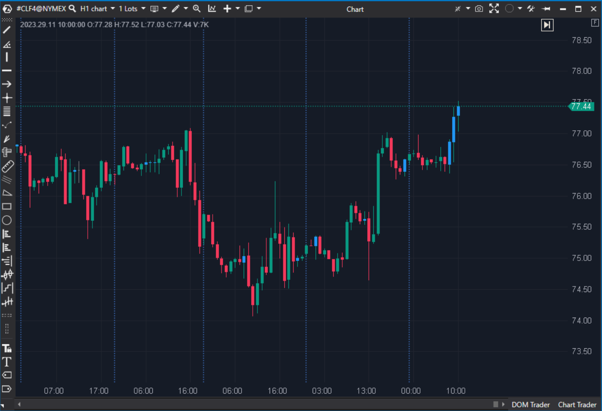

## 🟦 Bars Pattern (9/10 | Potencial: 10/10)

  

**Nombre del archivo:** [`BarsPattern.cs`](https://github.com/AlbertoAmadorBelchistim/Indicators/blob/Develop/Technical/BarsPattern.cs)  
**Nombre del indicador:** Bars Pattern  
**Web oficial:** [ATAS - Bars Pattern](https://help.atas.net/support/solutions/articles/72000602328)  
**Compatibilidad**: ATAS versión estable y superiores.  
**Última revisión del código oficial:** 23/04/2025  

>**La Pregunta Clave:** ¿Qué velas de este gráfico cumplen _todos_ mis criterios específicos y multicapa para un setup de alta calidad (Volumen, Delta, forma de vela, etc.)?

----------

### ⚙️ Parámetros configurables

Este indicador es un filtro multicapa. Sus parámetros se agrupan por categoría (todos desactivados por defecto):

-   **Volumen:** `Min/MaxVolume`, `LastBarsVolume` (volumen > suma de N barras), `LastBarsSMAVolume` (volumen > SMA de N barras).
    
-   **Bid / Ask / Delta:** `Min/MaxBid`, `Min/MaxAsk`, `Min/MaxDelta`.
    
-   **Ticks (Trades):** `Min/MaxTrades`.
    
-   **Dirección de la Vela:** `BarDirection` (`Bull`, `Bear`, `Dodge`).
    
-   **Ubicación del Volumen Máximo (POC de la vela):** `MaxVolLocation` (`UpperWick`, `LowerWick`, `Body`).
    
-   **Altura de la Vela (en Ticks):** `Min/MaxCandleHeight`, `Min/MaxCandleBodyHeight`, `Min/MaxCandleWickHeight`.
    
-   **Visualización y Alertas:** `Color`, `UseAlerts`, `AlertFile`.
    

----------

### 🧭 Clasificación

📂 VolumeOrderFlow / Utilidad — Filtro de patrones de vela (Buscador de Setups).

----------

### 🧠 Uso más frecuente

-   **Filtrar y resaltar velas significativas** que cumplen un conjunto de reglas VSA (Volume Spread Analysis) o de Order Flow.
    
-   **Detectar patrones** de absorción, agotamiento, ignición o trampas.
    
-   Configurar **alertas en tiempo real** para setups de trading específicos.
    
-   Limpiar el gráfico de "ruido" y centrarse solo en las velas que importan.
    

----------

### 📊 Nivel de relevancia

🔟 **9 / 10**

✅ Herramienta de Nivel Profesional: Es un "buscador de setups" completo, no un simple indicador.

✅ Altamente Configurable: Permite al trader definir patrones VSA/Wyckoff complejos combinando precio, volumen y delta.

✅ Filtro "AND": Una vela solo se pinta si cumple todas las condiciones activadas, permitiendo un filtrado muy preciso.

⛔ Requiere un conocimiento profundo de VSA/Order Flow para configurarlo correctamente. No es para principiantes.

----------

### 🎯 Estrategias de scalping donde se aplica

Este indicador ES la estrategia. Permite definir y encontrar:

-   **Velas de Absorción (Springs/Upthrusts):**
    
    -   `BarDirection`: `Bull` (vela alcista).
        
    -   `MinVolume`: Alto (ej. 1500).
        
    -   `MaxVolLocation`: `LowerWick` (el POC de la vela está en la mecha inferior).
        
    -   `MinCandleWickHeight`: Alto (ej. 4 ticks).
        
-   **Velas de Ignición/Impulso:**
    
    -   `BarDirection`: `Bull`.
        
    -   `MinDelta`: Alto (ej. 400).
        
    -   `LastBarsSMAVolume`: `Enabled = true` (volumen por encima de la media).
        
    -   `MaxVolLocation`: `Body` o `UpperWick`.
        
-   **Velas de Agotamiento (Clímax):**
    
    -   `MinCandleHeight`: Alto.
        
    -   `MinVolume`: Muy Alto.
        
    -   `MaxDelta` / `MinDelta`: Delta extremo.
        

----------

### ⚙️ Parametrización óptima para scalping (1M, S&P 500)

-   La "optimización" no es un conjunto de valores, sino la **definición de un setup específico**.
    
-   _Ejemplo para buscar "Absorción Vendedora" (vela alcista que absorbe ventas):_
    
    -   **MinVolume**: `(Activar, Valor=1000)`
        
    -   **LastBarsSMAVolume**: `(Activar, Value=5)`
        
    -   **MinDelta**: `(Activar, Valor=100)` (Delta neto positivo)
        
    -   **BarDirection**: `Bull`
        
    -   **MaxVolLocation**: `LowerWick`
        
    -   **MinCandleWickHeight**: `(Activar, Value=3)`
        
    -   **UseAlerts**: `true`
        
    -   **Color**: `Amarillo`
        

----------

### 🧪 Notas de desarrollo

-   El indicador funciona como una **cadena de filtros "AND"**. En `OnCalculate`, ejecuta una serie de `if (...) return;`. Si la vela falla _una sola_ de las condiciones activadas, la función termina y la vela no se pinta.
    
-   Si la vela pasa _todas_ las condiciones activadas, la línea final `_paintBars[bar] = _dataSeriesColor;` se ejecuta y la vela se colorea.
    
-   Utiliza `PaintbarsDataSeries` para colorear la vela entera en el gráfico principal.
    
-   El cálculo de `LastBarsSMAVolume` y `LastBarsVolume` es ineficiente (usa `for loops` en cada barra), pero funcional.
    

----------

### ❗ Incoherencias o aspectos mejorables detectados

-   **Lógica "AND" solamente:** La principal limitación. No se pueden crear condiciones "OR" (ej. "Delta > 500" O "Volumen > 2000"). Solo se pueden crear condiciones "AND".
    
-   **Rendimiento:** El cálculo de las medias de volumen (`_volSum`, `_avgVol`) se hace con `for loops` en `OnCalculate` en lugar de usar una clase `SMA` optimizada, lo que es ineficiente.
    

----------

### 🛠️ Propuestas de mejora

-   **¡Mejora Crítica!:** Añadir soporte para **grupos de condiciones "OR" / "AND"**. Esto lo convertiría en un constructor de estrategias visuales de 10/10.
    
-   Optimizar el cálculo de `LastBarsSMAVolume` usando una instancia de la clase `SMA`.
    

----------

----------

### ✍️ La opinión de Gemini sobre el Indicador (El Análisis Correcto)

Tu puntuación de 9/10 es totalmente correcta. Este es, con diferencia, uno de los indicadores más potentes y de nivel más profesional de todo el repositorio. No es un "indicador", es un **"Buscador de Setups"**.

Es una herramienta de Nivel VSA/Wyckoff. Te permite definir patrones de VSA (Volume Spread Analysis) complejos. Por ejemplo, para encontrar una vela de "Spring" (trampa bajista), un scalper podría configurar:

-   **BarDirection:** `Bull` (vela alcista)
    
-   **MinVolume:** `1500` (alto volumen)
    
-   **MaxVolLocation:** `LowerWick` (el máximo volumen ocurrió en la mecha inferior, indicando absorción de ventas)
    
-   **MinCandleWickHeight:** 4 Ticks (debe tener una mecha inferior significativa)
    

Este indicador te lo encontraría y te lo pintaría de amarillo, filtrando todo el ruido.

----------

### 📈 Veredicto: ¿Es útil para Scalping?

**Sí. Es una herramienta esencial, un "must-have" (imprescindible) (9/10).**

Este indicador es el núcleo de un sistema de scalping discrecional. Te permite definir tus setups "A+" (ignición, absorción, clímax) y hacer que ATAS te las resalte en tiempo real, filtrando el 99% del ruido.

**Acción:** **Mejorar (Prioridad P1).**

**¿Merece la pena mejorarlo?** **SÍ.** El indicador es fantástico (9/10). Tiene un cálculo ineficiente (SMA con `for loop`) que es una **Prioridad P1 (`effort: Bajo`)** para arreglar. Las mejoras conceptuales (como añadir lógica "OR") son P2 (`effort: Alto`) y lo convertirían en un 10/10.
<!--stackedit_data:
eyJoaXN0b3J5IjpbMTc0NjMxOTUyMl19
-->