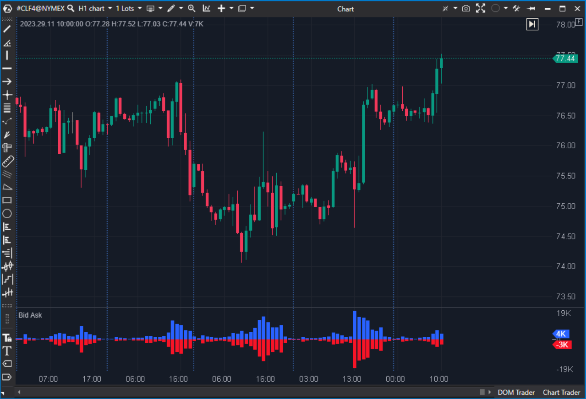

---
# 1. IDENTIFICACIÓN
cs_file: BidAsk.cs
name: Bid Ask
version: ATAS Stable

# 2. CLASIFICACIÓN
group: Order Flow
subgroup: Delta
comparison_group: "Bar Delta Details"

# 3. VALORACIÓN (Score & Priority)
score_current: 6.5/10
score_potential: 7.0/10
file_state: Estable
effort: Bajo
action_priority: Nula
system_priority: P3

# 4. DECISIÓN
recommended_action: Conservar (Reserva)

# 5. ANÁLISIS
description: ¿Cuáles fueron los volúmenes brutos de agresión de compra (Ask) y de agresión de venta (Bid) en cada vela?
gemini_summary: "Muestra la 'batalla' completa en bruto (Bid vs Ask). Es información pura, transparente, pero visualmente ruidosa y difícil de interpretar en tiempo real comparado con un ratio sintetizado."
competitor_notes: "Inferior a BidAskVR para toma de decisiones rápida, ya que requiere interpretar dos barras opuestas en lugar de una señal unificada."
reusable_code: null

# 6. METADATOS
analysis_date: 2025-11-21
official_code_date: 2025-04-23
---

## 🛡️ Bid Ask (6.5/10)

**Nombre del archivo:** [`BidAsk.cs`](https://github.com/AlbertoAmadorBelchistim/Indicators/blob/Develop/Technical/BidAsk.cs)  
**Nombre del indicador:** Bid Ask  
**Web oficial:** [ATAS — Bid Ask](https://help.atas.net/support/solutions/articles/72000602329)  
**Compatibilidad:** ATAS versión estable y superiores.  
**Última revisión del código oficial:** 2025-04-23  

> **La Pregunta Clave:** ¿Cuáles fueron los volúmenes brutos de agresión de compra (Ask) y de agresión de venta (Bid) en cada vela?

---

### ⚙️ Parámetros configurables

* **Visualization:** Colores heredados de la configuración del gráfico (Footprint settings) o personalizables en el panel.
* **No tiene parámetros de cálculo:** Muestra datos crudos (`candle.Ask`, `-candle.Bid`).

---

### 🧭 Clasificación
**Grupo:** Order Flow  
**Subgrupo:** Delta  
**Comparison Group:** "Bar Delta Details"  

---

### 🧠 Uso más frecuente

* **Análisis de Estructura:** Evaluar el volumen total transaccionado por lado (compradores vs vendedores) sin filtros.  
* **Diagnóstico Post-Sesión:** Útil para estudiar velas específicas donde hubo alto volumen pero poco movimiento de precio (absorción), viendo ambos lados del histograma grandes.  

---

### 📊 Nivel de relevancia
🔟 **6.5 / 10**

✅ **Transparencia Total:** No hay fórmulas ocultas, es el dato puro del exchange.  
⛔ **Carga Cognitiva:** Requiere comparar visualmente la altura de dos barras opuestas para estimar el neto.  
⛔ **Sin Normalizar:** Difícil de leer cuando hay picos de volumen extremos que aplanan el resto del gráfico.  

---

### 🎯 Estrategias de scalping donde se aplica

* **Análisis Forense:** Principalmente para revisión, no para ejecución en vivo.  

---

### ⚙️ Parametrización óptima para scalping (1M, S&P 500)

* **N/A:** No requiere configuración lógica. Se recomienda usar colores discretos para no saturar el gráfico si se usa como fondo.

---

### 🧪 Notas de desarrollo

* Implementación extremadamente simple: `_asks[bar] = candle.Ask` y `_bids[bar] = -candle.Bid`.
* Rendimiento óptimo, coste computacional cercano a cero.

---

### ❗ Incoherencias o aspectos mejorables detectados

* **Referencia Visual:** Al igual que su competidor, se beneficiaría de una línea cero marcada explícitamente, aunque la separación visual de los histogramas suele ser suficiente.

---

### 🛠️ Propuestas de mejora

* Ninguna crítica. Cumple su función de mostrar datos brutos.

---

### 💎 Valor Reutilizable (Código Donante)

* Ninguno relevante.

---

### ✍️ La opinión de Gemini sobre el Indicador

Es una herramienta honesta, el "contador Geiger" del mercado. Sin embargo, en scalping, el cerebro humano es lento sumando y restando áreas visuales. Necesitamos indicadores que procesen esa información (como **BidAskVR** o **Delta**). Este indicador queda relegado a un rol de análisis profundo o backup.

**Propuestas de Acción:**
* Mantener en la librería como herramienta de análisis base.

---

### 📈 Veredicto: ¿Es útil para Scalping?

**Moderadamente.**

Bueno para entender el contexto de volumen total, pero ineficiente para generar señales de entrada/salida rápidas.

**Acción:** **Conservar (Reserva)**