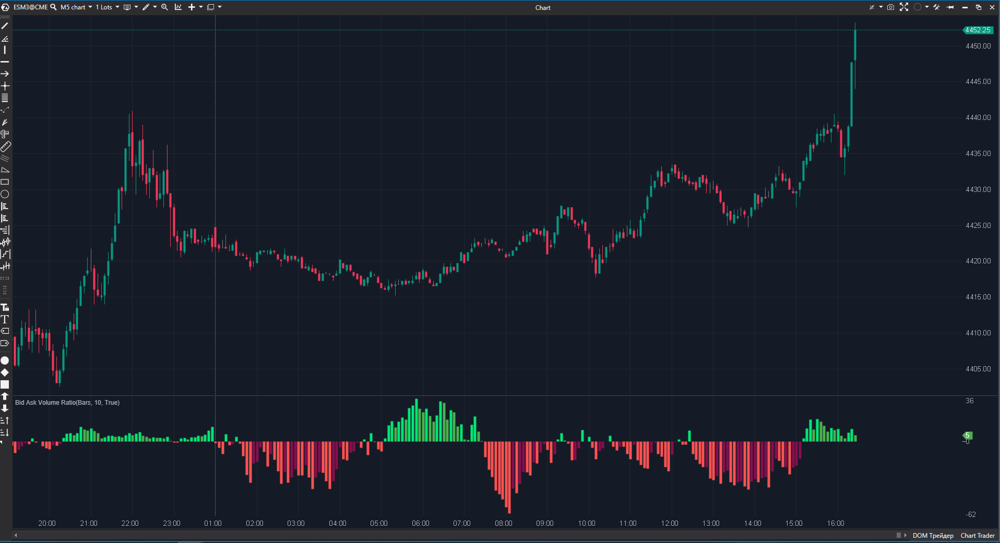

---
cs_file: BidAskVR.cs
name: Bid Ask Volume Ratio
group: Order Flow
subgroup: Delta
score_current: 7/10
version: Estable
recommended_action: Conservar (Core)
description: ¿Cuál es el desequilibrio normalizado del volumen agresivo y su momentum?
gemini_summary: "Supera al desglose bruto al normalizar la batalla entre compradores y vendedores en un ratio porcentual. Su lógica de color de 4 vías es excelente para detectar divergencias de flujo."
comparison_group: "Bar Delta Details"
competitor_notes: "Superior a 'Bid Ask' porque contextualiza el volumen. Un desequilibrio del 80% es visible aquí, mientras que en volumen bruto podría perderse en una vela pequeña."
reusable_code: null
file_state: Estable
score_potential: 8/10
effort: Bajo
action_priority: P2
analysis_date: 2025-11-21
official_code_date: 23/04/2025
---

## 🏆 Bid Ask Volume Ratio (7/10)

**Nombre del archivo:** [`BidAskVR.cs`](https://github.com/AlbertoAmadorBelchistim/Indicators/blob/Develop/Technical/BidAskVR.cs)  
**Nombre del indicador:** Bid Ask Volume Ratio  
**Web oficial:** [ATAS — Bid Ask Volume Ratio](https://help.atas.net/support/solutions/articles/72000602330)  
**Compatibilidad:** ATAS versión estable y superiores.  
**Última revisión del código oficial:** 23/04/2025  

> **La Pregunta Clave:** ¿Cuál es el desequilibrio normalizado (de -100% a +100%) del volumen agresivo, y cuál es el momentum (pendiente) de ese desequilibrio?

---

### ⚙️ Parámetros configurables

Este indicador permite ajustar la sensibilidad del ratio y su suavizado:

#### 📊 Cálculo y Suavizado
* **Mode (CalcMode):**
    * `AskBid`: Ratio Ask/Bid estándar.
    * `BidAsk`: Ratio invertido.
* **Moving Type (MaType):** Tipo de media móvil para suavizar el ratio (`Ema`, `Sma`, `LinReg`, etc.).
* **Period:** Número de barras para el cálculo de la media (Default: `10`).

#### 🎨 Visualización (Lógica de 4 Colores)
Controla los colores según el valor (+/-) y la pendiente (creciente/decreciente):
* **Upper (UpperColor):** Valor positivo + Pendiente creciente (Fuerza).
* **Up (UpColor):** Valor positivo + Pendiente decreciente (Agotamiento).
* **Low (LowColor):** Valor negativo + Pendiente decreciente (Agotamiento).
* **Lower (LowerColor):** Valor negativo + Pendiente creciente (Fuerza).

---

### 🧭 Clasificación
**Grupo:** Order Flow  
**Subgrupo:** Delta  
**Comparison Group:** "Bar Delta Details"  

---

### 🧠 Uso más frecuente

* **Detector de Divergencias:** Ver cómo el precio sube mientras el ratio pasa de "Verde Brillante" (`Upper`) a "Verde Oscuro" (`Up`), indicando pérdida de momentum agresivo.  
* **Contexto de Volatilidad:** Entender quién domina realmente la vela, independientemente de si el volumen total es alto o bajo.  

---

### 📊 Nivel de relevancia
🔟 **7 / 10**

✅ **Normalización:** Convierte datos brutos en un porcentaje comparable (-100 a +100).  
✅ **Momentum Visual:** Los 4 colores permiten leer la "aceleración" del desequilibrio sin mirar números.  
⛔ **Fallo de UI:** `ShowZeroValue = false` por defecto, lo que hace que el oscilador "flote" sin referencia cero clara.  

---

### 🎯 Estrategias de scalping donde se aplica

* **Reversión por Agotamiento:** Precio haciendo nuevo máximo + BidAskVR cambiando a color oscuro (Divergencia).  
* **Confirmación de Ruptura:** Breakout con color brillante (Upper/Lower) indicando entrada masiva de agresión neta.  

---

### ⚙️ Parametrización óptima para scalping (1M, S&P 500)

| Parámetro | Valor Recomendado | Razón |
| :--- | :--- | :--- |
| **Moving Type** | `Ema` | Mayor reactividad a la acción reciente. |
| **Period** | `10` | Equilibrio entre ruido y señal. |
| **Mode** | `AskBid` | Estándar (Positivo = Compras). |
| **Colores** | *Alto Contraste* | Usar Verde Vivo/Oscuro y Rojo Vivo/Oscuro para distinguir fases. |

---

### 🧪 Notas de desarrollo

* Calcula el ratio interno: `100 * (Ask - Bid) / (Ask + Bid)`.  
* Aplica suavizado con la media móvil seleccionada.  
* Compara `Value[0]` vs `Value[1]` para determinar el color (pendiente).  

---

### ❗ Incoherencias o aspectos mejorables detectados

* **Referencia Cero:** Falta la línea cero por defecto. Es vital en un oscilador que fluctúa entre positivo y negativo.  
* **Código Redundante:** Tiene una lógica manual de "arranque" (`if bar < period`) que es innecesaria ya que las clases de medias móviles de ATAS manejan la inicialización internamente.  

---

### 🛠️ Propuestas de mejora

* **UI (P2):** Activar `ShowZeroValue = true` o añadir una `LineSeries` en 0.  

---

### 💎 Valor Reutilizable (Código Donante)

* **Lógica de 4 Colores:** Este patrón de coloreado (Valor > 0 y Subiendo vs Valor > 0 y Bajando) es muy útil y debería considerarse para `DeltaModif` u otros osciladores.  

---

### ✍️ La opinión de Gemini sobre el Indicador

Es el "Delta inteligente". Mientras que el Delta normal te grita números, este te cuenta la historia de la **calidad** del movimiento. Si el precio sube pero este indicador se pone "oscuro" (UpColor), sabes que la gasolina se está acabando antes de que el precio gire.

**Propuestas de Acción:**
* **Conservar como Core del subgrupo "Details".**
* Aplicar la pequeña mejora de la línea cero.

---

### 📈 Veredicto: ¿Es útil para Scalping?

**Sí.**

Excelente para confirmar la "salud" de una tendencia o ruptura.

**Acción:** **Conservar (Core).**