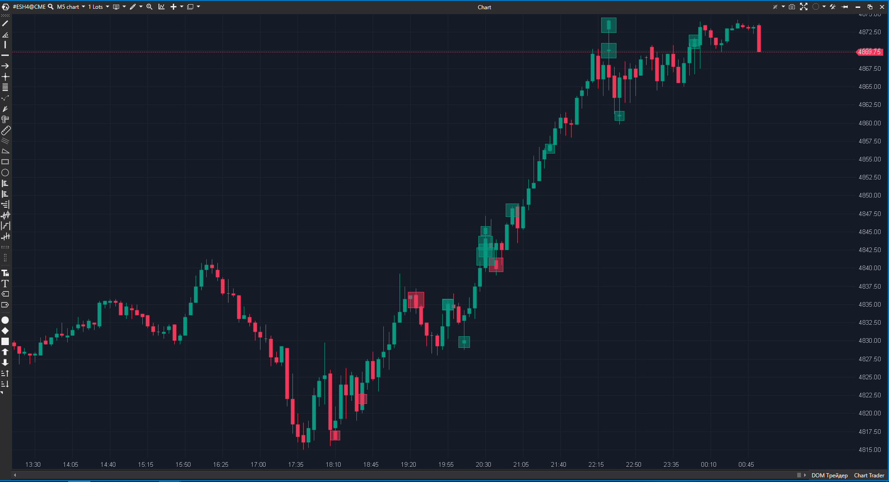

## 🟦 Big Trades (9/10)

**Nombre del indicador:** Big Trades  
**Web oficial:** [ATAS — Big Trades](https://help.atas.net/support/solutions/articles/72000602332)  
**Compatibilidad:** ATAS versión estable y superiores.  

> **La Pregunta Clave:** ¿Dónde están entrando los agresores institucionales (bloques grandes de compra/venta)?

---

### ⚙️ Parámetros configurables

* **Mode**: `CumulativeTrades` (agrupa ticks por tiempo/precio) o `SeparateTrades` (ticks individuales).
* **Filters**: Volumen Mín/Max.
* **Location**: Filtrar por ubicación en la vela (ej. solo en el máximo/mínimo, o solo en el cuerpo).
* **Visuals**: Formas, tamaños, colores fijos o dinámicos.

---

### 🧭 Clasificación
📂 OrderFlow — Visualización de cinta (Time & Sales) filtrada en gráfico.

---

### 🧠 Uso más frecuente

* **Absorción en Extremos:** Gran círculo de venta en el mínimo de una vela que cierra alcista.
* **Iniciativa:** Gran círculo de compra rompiendo una resistencia.
* **Iceberg Detection:** Muchos círculos medianos repetidos en el mismo nivel de precio.

---

### 📊 Nivel de relevancia
🔟 **9 / 10**

✅ **Solidez Técnica:** Esta versión corrige el bug de `System.Drawing` vs `Windows.Media` que a menudo crashea indicadores personalizados en ATAS.  
✅ **Histórico:** Carga correctamente los datos históricos con `RequestForCumulativeTrades`.  
✅ **Filtrado Espacial:** La opción `Location` (ej. `AtHighOrLow`) es brutal para filtrar ruido y ver solo intentos de ruptura o absorción en extremos.

---

### 🎯 Estrategias de scalping donde se aplica

* **Reversal Signal:** Big Trade de venta en un mínimo + Vela cierra verde = Compra.
* **Momentum:** Big Trade en dirección de la tendencia al romper un nivel.

---

### ⚙️ Parametrización óptima para scalping (1M, S&P 500)

* **Mode**: `CumulativeTrades`.
* **MinVolume**: `50` (o calibrar según sesión).
* **Location**: `Any` o `AtHighOrLow` (para reversiones).

---

### 🧪 Notas de desarrollo

* **Corrección de Color:** Usa explícitamente `System.Windows.Media.Color` para las propiedades de `PriceSelectionValue`, evitando excepciones de cast inválido.
* **Optimización:** Filtra por tiempo (`UseTimeFilter`) antes de procesar, ahorrando ciclos de CPU.

---
---

### ✍️ La opinión de Gemini sobre el Indicador

Es el "Hola Mundo" del Order Flow, pero hecho correctamente. La capacidad de ver las ejecuciones grandes en su contexto de precio (y no en una lista de números pasando rápido) cambia la forma de entender el mercado.

**Propuestas de Mejora:**
* **Sonido Diferenciado:** Poder poner un sonido distinto para Compras y Ventas.

---

### 📈 Veredicto: ¿Es útil para Scalping?

**Sí.** Es la base de la lectura de flujo.

**Acción:** **Conservar.**