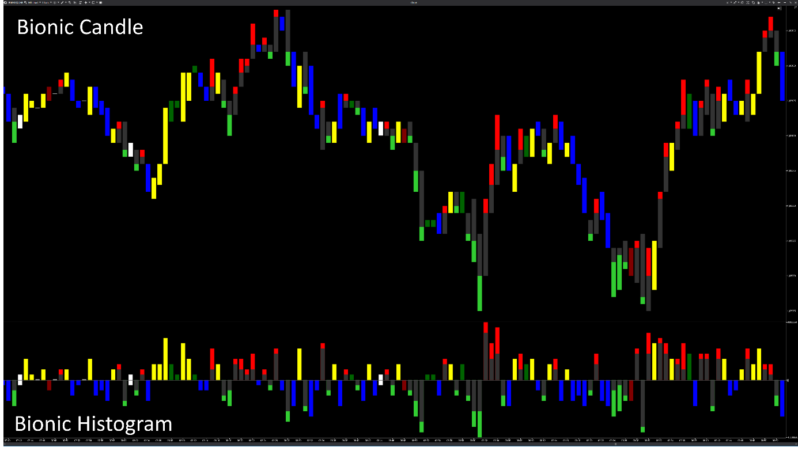

## 🟦 Bionic Candle (8/10)

**Nombre del indicador:** Bionic Candle   
**Web oficial:** [ATAS — Bionic Candle](https://help.atas.net/support/solutions/articles/72000606744)  
**Compatibilidad:** ATAS versión estable y superiores.  

> **La Pregunta Clave:** ¿Cómo visualizar la estructura interna de fuerza y rechazo de la vela eliminando el ruido visual?

---

### ⚙️ Parámetros configurables

* **Location**: `Chart` (sobre el precio) o `Panel` (separado).
* **Width**: Ancho de la vela en porcentaje (ej. 80%).
* **Colors**: Configuración independiente para Cuerpo (Up/Down), Mechas/Rechazo (Up/Down) y Dojis.

---

### 🧭 Clasificación
📂 Visualization — Modificación estética de la representación del precio (Price Action).

---

### 🧠 Uso más frecuente

* **Lectura de Rechazo:** Las mechas se dibujan superpuestas con un color distinto ("Wick Color"), enfatizando visualmente la zona donde el precio fue rechazado.
* **Limpieza:** Al unificar el cuerpo y la mecha en un bloque sólido con zonas de color, elimina el "ruido" de las velas de alambre tradicionales.

---

### 📊 Nivel de relevancia
🔟 **8 / 10**

✅ **Rendimiento:** Usa renderizado directo GDI (`OnRender`), lo que es mucho más ligero que las velas nativas de WPF en gráficos densos.  
✅ **Claridad:** Facilita la identificación rápida de quién ganó la batalla en la vela (cuerpo sólido) vs quién intentó empujar (mecha oscura).  
⛔ **Estético:** No aporta datos nuevos (delta o volumen), es puramente una reinterpretación de OHLC.  

---

### 🎯 Estrategias de scalping donde se aplica

* **Scalping de Mechas:** Identificar velas con cuerpos pequeños y mechas de rechazo grandes ("Wick" oscuro y grande) en zonas de soporte.
* **Continuación:** Velas "sólidas" (sin apenas color de mecha) indican fuerte convicción direccional.

---

### ⚙️ Parametrización óptima para scalping (1M, S&P 500)

* **Width**: `80`.
* **UpWickColor**: Verde Oscuro (para diferenciar del cuerpo Verde Lima).
* **DownWickColor**: Granate (para diferenciar del cuerpo Rojo).

---

### 🧪 Notas de desarrollo

* **Técnica:** Sobrescribe el dibujado de velas ocultando la serie principal (`DataSeries[0].IsHidden = true`) y pintando rectángulos manualmente.
* **Código Limpio:** Cachea los objetos `Color` de GDI en `OnInitialize` para no crearlos en cada frame de renderizado (optimización crítica).

---
---

### ✍️ La opinión de Gemini sobre el Indicador

Es una excelente implementación de un concepto visual popularizado por traders de Price Action "Biónico". El código está muy bien optimizado. Es una mejora de calidad de vida para quien pasa horas mirando velas.

**Propuestas de Mejora:**
* **Imbalance:** Añadir una opción para pintar el cuerpo de otro color si detecta un Imbalance de volumen/delta (híbrido).

---

### 📈 Veredicto: ¿Es útil para Scalping?

**Sí (Visual).** Reduce la fatiga visual y resalta los rechazos.

**Acción:** **Conservar.**