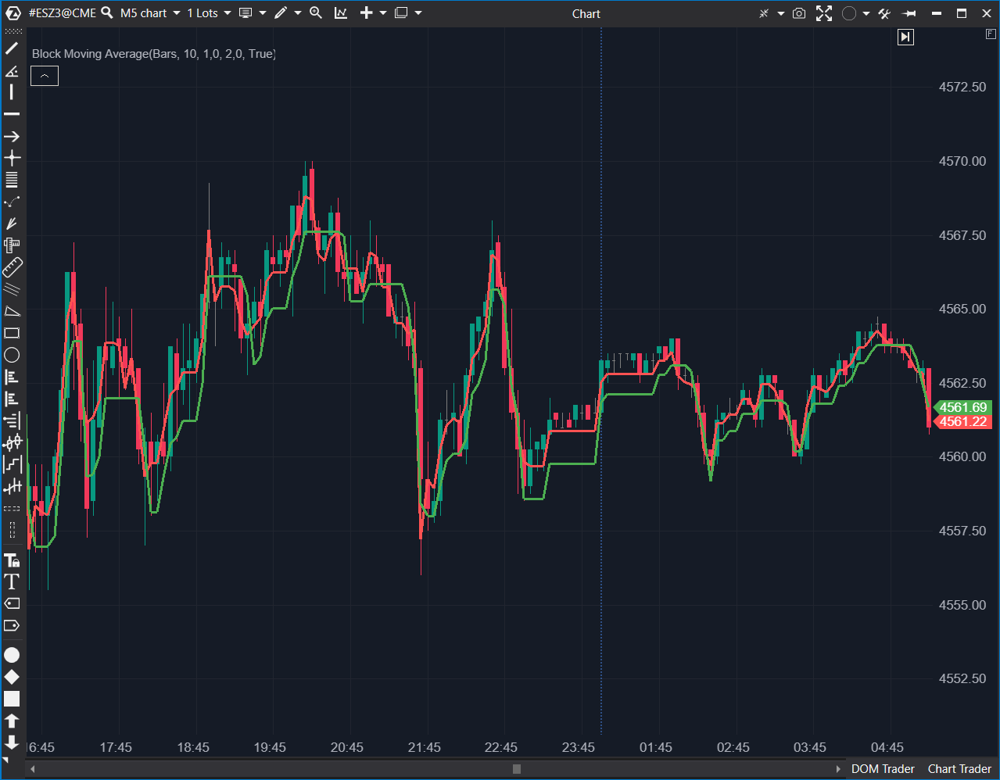

## 🟦 Block Moving Average (7/10 | Potencial: 8/10)

**Nombre del archivo:** [`BlockMA.cs`](https://github.com/AlbertoAmadorBelchistim/Indicators/blob/Develop/Technical/BlockMA.cs)  
**Nombre del indicador:** Block Moving Average  
**Web oficial:** [ATAS — Block Moving Average](https://help.atas.net/support/solutions/articles/72000602335)  
**Compatibilidad:** ATAS versión estable y superiores.  
**Última revisión del código oficial:** 23/04/2025

> **La Pregunta Clave:** ¿Cómo puedo crear un 'trailing stop' de volatilidad (basado en el ATR) que solo se mueva a favor de la tendencia (hacia arriba o hacia abajo), pero que nunca retroceda?

----------

### ⚙️ Parámetros configurables

-   **Period**: Periodo del ATR que define el ancho del canal (por defecto: `10`).
-   **Multiplier1**: Múltiplo de ATR para el primer canal (más estrecho) (por defecto: `1`).
-   **Multiplier2**: Múltiplo de ATR para el segundo canal (más amplio) (por defecto: `2`).

----------

### 🧭 Clasificación

📂 Trend / Volatility — Canal de volatilidad de seguimiento de tendencia (Tipo "Supertrend").

----------

### 🧠 Uso más frecuente

-   **Nombre Engañoso:** El indicador **no es una Media Móvil (Moving Average)**. Es un canal de volatilidad tipo "Supertrend" o "Chandelier Exit".
-   Definir **zonas de soporte/resistencia dinámicas** y adaptativas (basadas en ATR).
-   Usar como un **Trailing Stop** (Stop de seguimiento) de volatilidad: mientras el precio no rompa el canal, se asume que la tendencia continúa.
-   Filtrar ruido: El canal solo se mueve a favor de la tendencia (nunca retrocede), filtrando pullbacks menores.

----------

### 📊 Nivel de relevancia

🔟 **7 / 10**  
✅ Excelente para seguir tendencias: Es una de las mejores herramientas para mantenerse en una operación ganadora y no salir prematuramente.  
✅ Trailing Stop Lógico: Proporciona un nivel de stop dinámico basado en la volatilidad (ATR), no en un valor fijo.  
✅ Los dos multiplicadores (Multiplier1, Multiplier2) permiten tener un canal "de alerta" (interno) y uno "de salida" (externo).  
⛔ Falla en Rangos (Chop): Como todos los indicadores de seguimiento de tendencia, genera muchas señales falsas (saltos de canal) en mercados laterales.  

----------

### 🎯 Estrategias de scalping donde se aplica

-   **Filtro de Tendencia (Contexto):** Si el precio está por encima del canal (`_mid1`), solo se buscan largos. Si está por debajo, solo cortos.
-   **Trailing Stop (Gestión):** Entrar en una tendencia y colocar el stop _justo al otro lado_ del canal (`_mid1` o `_mid2`). Mover el stop manualmente cada vez que el canal "salte" (ratchet) a un nuevo nivel.
-   **Señal de Reversión (Salida):** Salir de un largo cuando el precio cierre _por debajo_ del canal inferior.

----------

### ⚙️ Parametrización óptima para scalping (1M, S&P 500)

-   **Period**: `10`
    
-   **Multiplier1**: `1.0` (Canal rápido/de alerta)
    
-   **Multiplier2**: `2.0` (Canal lento/de stop)
    

----------

### 🧪 Notas de desarrollo

-   El indicador usa un `ATR` para definir el ancho (`box1`, `box2`) de dos canales.
    
-   **Lógica "Ratcheting" (Trinquete):**
    
    1.  Si el precio (`candle.High`) rompe el canal superior (`_top1[bar - 1]`), todo el canal **"salta" hacia arriba** a un nuevo nivel basado en el `candle.High`.
        
    2.  Si el precio (`candle.Low`) rompe el canal inferior (`_bot1[bar - 1]`), todo el canal **"salta" hacia abajo** a un nuevo nivel basado en el `candle.Low`.
        
    3.  **Si el precio se mantiene dentro**, el canal permanece plano (`_top1[bar] = _top1[bar - 1]`).
        
-   El indicador **solo dibuja las líneas medias** (`_mid1`, `_mid2`) de cada canal, no las bandas exteriores.
    

----------

### ❗ Incoherencias o aspectos mejorables detectados

-   **Nombre Engañoso:** La principal incoherencia. Se llama `Block Moving Average` (Media Móvil) pero no calcula ninguna media móvil. Es un canal de ATR de seguimiento (un "Supertrend").
    
-   **Visualización Incompleta:** El código calcula `_top1`, `_bot1`, `_top2`, `_bot2`, pero _solo_ dibuja `_mid1` y `_mid2`. Esto oculta las bandas exteriores, que son los verdaderos niveles de "ruptura".
    

----------

### 🛠️ Propuestas de mejora

-   **¡Mejora Crítica!:** Cambiar el nombre del indicador a `Supertrend` o `ATR_Channel` para reflejar lo que realmente hace.
    
-   **¡Mejora de Usabilidad!:** Añadir `ValueDataSeries` para `_top1`, `_bot1`, `_top2`, `_bot2` y permitir al usuario dibujarlas (o sombrear el área entre ellas).
    

----------

----------

### ✍️ La opinión de Gemini sobre el Indicador

Tu análisis es perfecto. Has ignorado el **nombre completamente engañoso** (`Block Moving Average`) y has identificado su verdadera naturaleza: es un **Canal de Volatilidad (Supertrend)** con lógica "ratchet" (de trinquete). Es una herramienta fantástica para **seguimiento de tendencia** y para usarla como un **trailing stop dinámico**.

### 📈 Veredicto: ¿Es útil para Scalping?

**Sí, pero con reservas (7/10).**
* **Lo Bueno (El 7):** Es _excelente_ para confirmar una tendencia y, lo que es más importante, para _mantenerte en_ una operación ganadora. Te da un nivel claro de "soporte/resistencia" dinámico.
* **Lo Malo (El -3):** Es un desastre en mercados laterales o de "rango" (chop), donde genera muchas señales falsas.

**Acción:** **Mejorar (Prioridad P2).**

**¿Merece la pena mejorarlo?** **SÍ.** El indicador funciona, pero sus mejoras de usabilidad (`effort: Bajo`) son una prioridad P2.
1.  **Renombrar** el indicador a "ATR Trailing Stop" o "Supertrend".
2.  **Dibujar** las bandas exteriores (`_top1`, `_bot1`, etc.) que ya calcula, para que el usuario vea los niveles de ruptura reales.
<!--stackedit_data:
eyJoaXN0b3J5IjpbMTY4OTY2NDI1LC0xNzQxMDc1ODgxXX0=
-->