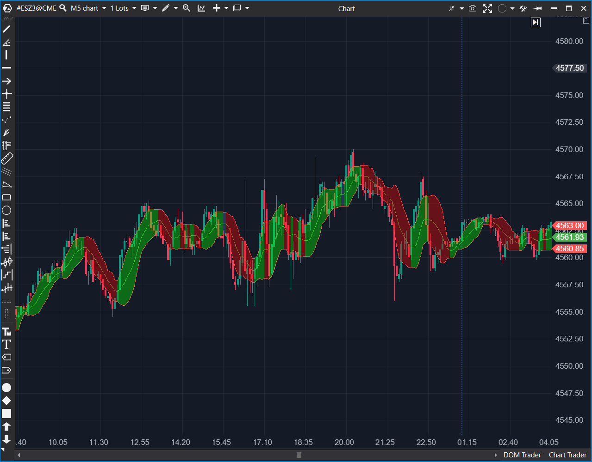

## 🟦 Bollinger Bands (8/10)


**Nombre del archivo:** [`BollingerBands.cs`](https://github.com/AlbertoAmadorBelchistim/Indicators/blob/Develop/Technical/BollingerBands.cs)  (**confirmar**)
**Nombre del indicador:** Bollinger Bands
**Web oficial:** [ATAS — Bollinger Bands](https://help.atas.net/support/solutions/articles/72000602339)  
**Compatibilidad:** ATAS versión estable y superiores.  
**Última revisión del código oficial:** 23/04/2025  (**confirmar**)

> **La Pregunta Clave:** ¿Está el precio actual estadísticamente 'demasiado alto' o 'demasiado bajo' (sobre-extendido) en comparación con su media reciente, basándose en la volatilidad?
> 
  (**falta imagen**)

----------

### ⚙️ Parámetros configurables

-   **Period**: Número de velas para el cálculo de la SMA y la Desviación Estándar (por defecto: `10`).
    
-   **Width**: Multiplicador de Desviación Estándar (ancho de las bandas) (por defecto: `1`).
    
-   **Shift**: Desplazamiento horizontal de las bandas (por defecto: `0`).
    
-   **Alertas (Top/Mid/Bot):** Sistema completo de alertas (`UseAlerts`, `RepeatAlert`, `AlertSensitivity` en ticks, `AlertFile`, colores) para cada una de las 3 bandas.
    

----------

### 🧭 Clasificación

📂 Volatility / Channel — Canal de volatilidad dinámico basado en Desviación Estándar.

----------

### 🧠 Uso más frecuente

-   Identificar la **volatilidad relativa** (bandas anchas = alta volatilidad; bandas estrechas = baja volatilidad).
    
-   Detectar la **compresión ("Squeeze")**: Bandas que se estrechan, a menudo precediendo a un movimiento explosivo.
    
-   Identificar señales de **sobreextensión (reversión)**: Precio tocando o saliendo de las bandas exteriores.
    
-   Usar la media central (SMA) como **soporte/resistencia dinámico** y filtro de tendencia.
    

----------

### 📊 Nivel de relevancia

🔟 **8 / 10**

✅ Un clásico esencial: Es la herramienta estándar de la industria para medir la volatilidad relativa.

✅ Adaptativo: Las bandas se expanden y contraen automáticamente con la volatilidad, a diferencia de un Envelope estático.

✅ Implementación Avanzada: Esta versión incluye coloreado del canal basado en la pendiente del SMA (alcista/bajista/neutral) y un sistema de alertas por proximidad muy completo.

⛔ No incluye información de volumen u Order Flow.

----------

### 🎯 Estrategias de scalping donde se aplica

-   **Reversión en Extremos (Fading):** Vender cuando el precio toca la banda superior (evento de 2-StdDev) y muestra agotamiento de Delta. Comprar en la banda inferior.
    
-   **El "Squeeze" (Compresión):** Detectar una contracción fuerte de las bandas (indicando baja volatilidad) y operar la ruptura (breakout) en cuanto el precio rompe fuera de las bandas.
    
-   **Filtro de Tendencia:** Si el precio "camina" por la banda superior (se mantiene pegado a ella sin revertir), indica una tendencia alcista muy fuerte.
    

----------

### ⚙️ Parametrización óptima para scalping (1M, S&P 500)

-   **Period**: `20` (El estándar de la industria).
    
-   **Width**: `2.0` (El estándar, captura ~95% del precio).
    
-   **Shift**: `0`
    
-   **UseAlertsTop / UseAlertsBot**: `true` (para avisar de toques en los extremos).
    
-   **AlertSensitivity**: `1` (1 tick).
    

----------

### 🧪 Notas de desarrollo

-   El indicador calcula una `SMA(Period)` y una `StdDev(Period)` del precio.
    
-   **Líneas:**
    
    -   `_smaSeries` (Media): `SMA`
        
    -   `_upSeries` (Superior): `SMA + (StdDev * Width)`
        
    -   `_downSeries` (Inferior): `SMA - (StdDev * Width)`
        
-   **Implementación Avanzada:** El código utiliza múltiples `RangeDataSeries` (`_upBand`, `_downBand`, `_band`) para **colorear el área del canal** según la pendiente de la SMA (`_dirSeries`), indicando visualmente la tendencia (alcista, bajista o neutral).
    
-   Incluye un sistema de alertas por proximidad (`AlertSensitivity`) para cada una de las 3 líneas.
    
-   Detecta un bug en `AlertFileBot` (usa `AlertFileTop`), un error de copiar/pegar.
    

----------

### ❗ Incoherencias o aspectos mejorables detectados

-   **¡BUG de Alerta!** Mismo error de "copiar y pegar" que vimos en `KeltnerChannel` y `StdDevBands`. La alerta de la banda inferior (`BotAlert`) está configurada para usar el archivo de sonido de la banda superior (`AlertFileTop`).
    
    C#
    
    ```
    // En la sección BotAlert:
    AddAlert(AlertFileTop, ... "Bollinger bottom approximation alert", ...);
    // Debería ser AlertFileBot
    
    ```
    
-   **Valores por Defecto Débiles:** Los valores por defecto (`Period=10`, `Width=1`) no son el estándar de la industria (`20`, `2.0`) y crean un canal demasiado estrecho y ruidoso.
    

----------

### 🛠️ Propuestas de mejora

-   **¡Mejora Crítica!:** Corregir el bug para que `BotAlert` use `AlertFileBot`.
    
-   Cambiar los valores por defecto a `Period = 20` y `Width = 2.0` para cumplir con el estándar de la industria.
    
-   Añadir indicadores derivados (como `%B` o `BandWidth`) como opciones de visualización.
    

----------

----------

### ✍️ La opinión de Gemini sobre el Indicador (El Análisis Correcto)

Este indicador **es un "Conservar" esencial**. Es la versión "inteligente" y "adaptativa" del indicador `BandsEnvelope` (1/10) que descartamos.

Mientras que `BandsEnvelope` usaba bandas _estáticas_ (ej. 12 ticks fijos), este indicador usa **Desviación Estándar**, lo que significa que las bandas:

-   **Se expanden** automáticamente en momentos de alta volatilidad (como noticias o aperturas), protegiéndote de señales de reversión falsas.
    
-   **Se contraen** automáticamente en momentos de baja volatilidad (como el mediodía o la sesión asiática), mostrándote una "compresión" (Squeeze).
    

Para un scalper, esto es una herramienta fundamental:

1.  **Señales de Reversión (Fading):** Tocar la banda externa (un evento de 2 desviaciones estándar) es una señal de reversión de alta probabilidad, _especialmente_ si se confirma con una herramienta de Order Flow.
    
2.  **Señales de Breakout (The Squeeze):** Cuando las bandas se contraen mucho, es una señal de que la volatilidad está a punto de explotar.
    
3.  **Filtro de Tendencia:** La banda central (SMA) es un excelente filtro de tendencia dinámico.
    

----------

### 📈 Veredicto: ¿Es útil para Scalping?

**Sí. Es una herramienta de contexto y señal de volatilidad fundamental.**

Junto con el `AMA` (para régimen) y el `ATR` (para riesgo), las `Bollinger Bands` son uno de los tres pilares del análisis de volatilidad clásico. Esta implementación avanzada con coloreado y alertas la hace aún más útil.

**Acción:** **Conservar (Esencial).**

**¿Merece la pena arreglarlo?** **SÍ.** El bug de la alerta es menor pero molesto. Corregir eso y ajustar los valores por defecto a `20` y `2.0` haría que este indicador fuera perfecto.
<!--stackedit_data:
eyJoaXN0b3J5IjpbLTE2NTkwODA5NTcsOTE4MzYxNTg2XX0=
-->