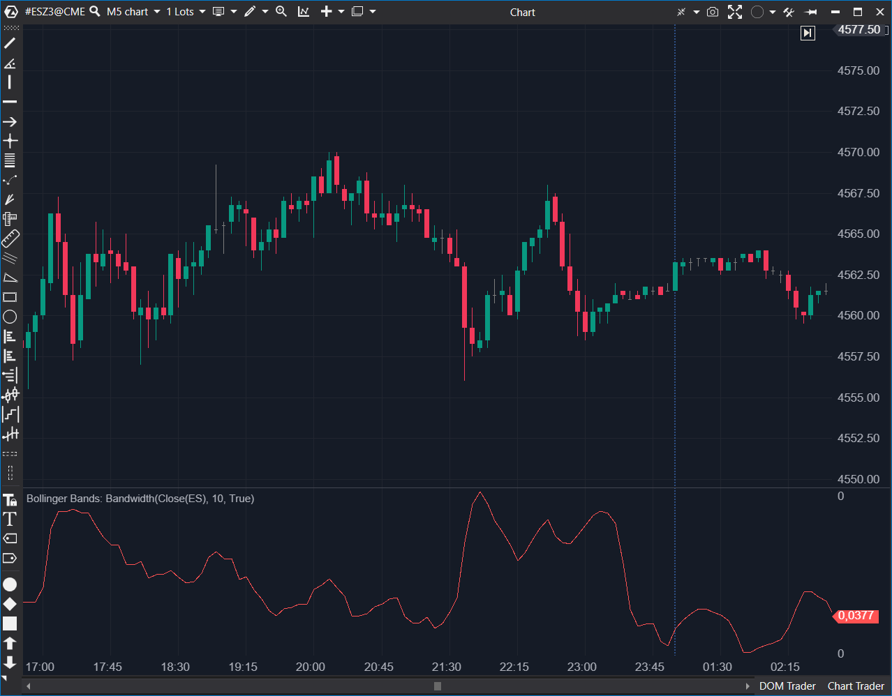

## 🟦 Bollinger Bands: Bandwidth (6.5/10)

**Nombre del archivo:** [`BollingerBandsBandwidth.cs`](https://github.com/AlbertoAmadorBelchistim/Indicators/blob/Develop/Technical/BollingerBandsBandwidth.cs)  (**confirmar**)
**Nombre del indicador:** Bollinger Bands: Bandwidth
**Web oficial:** [ATAS — Bollinger Bands: Bandwidth](https://help.atas.net/support/solutions/articles/72000602340)  
**Compatibilidad:** ATAS versión estable y superiores.  
**Última revisión del código oficial:** 23/04/2025  (**confirmar**)

> **La Pregunta Clave:** ¿Cómo de 'comprimida' (squeeze) o 'expandida' está la volatilidad ahora mismo, medida como un porcentaje del precio medio?

  (**falta imagen**)

----------

### ⚙️ Parámetros configurables

-   **Period**: Periodo de cálculo para la SMA y desviación estándar (por defecto: `10`).
    
-   **Width**: Multiplicador de Desviación Estándar (ancho de las bandas) (por defecto: `1`).
    

----------

### 🧭 Clasificación

📂 Volatility — Medición relativa de la amplitud del canal de Bollinger.

----------

### 🧠 Uso más frecuente

-   Medir el **ancho relativo del canal de Bollinger** (cuantificar la volatilidad).
    
-   Detectar **compresiones ("Squeeze")** previas a movimientos explosivos (cuando el indicador está en mínimos).
    
-   Confirmar cambios de régimen de volatilidad.
    
-   Usar como filtro para estrategias de breakout (solo operar si el Bandwidth sale de mínimos).
    

----------

### 📊 Nivel de relevancia

🔟 **6.5 / 10**

✅ Lectura Cuantitativa: Da un valor numérico a la "compresión", lo que permite establecer alertas (ej. "Alertar si Bandwidth < 0.5%").

✅ Ideal como disparador para estrategias de expansión de volatilidad.

⛔ Redundante: Un trader puede ver la compresión (el "Squeeze") simplemente mirando el indicador principal BollingerBands en el gráfico de precios.

⛔ Ocupa un panel entero para mostrar información que ya es visible en el gráfico principal.

⛔ Valores por Defecto Débiles: Hereda los defaults (10, 1.0) del BollingerBands.cs de ATAS, que no son el estándar de la industria (20, 2.0).

----------

### 🎯 Estrategias de scalping donde se aplica

-   **Breakout tras "Squeeze"**: Buscar entradas de breakout justo cuando el `Bandwidth` está en mínimos históricos y empieza a subir bruscamente.
    
-   **Filtro de "Chop"**: Evitar operar si el `Bandwidth` está plano en mínimos (compresión extrema, sin dirección).
    

----------

### ⚙️ Parametrización óptima para scalping (1M, S&P 500)

-   **Period**: `20`
    
-   **Width**: `2.0`
    
-   _Nota: Es crucial cambiar los valores por defecto a los estándares (`20, 2.0`) para que el indicador sea fiable._
    

----------

### 🧪 Notas de desarrollo

-   Es un indicador "envoltorio" (wrapper). Contiene una instancia del indicador `BollingerBands` (`_bb`).
    
-   Llama a `_bb.Calculate(bar, value)` para obtener los valores de las bandas.
    
-   **Fórmula:** El indicador calcula la "Anchura de Banda" (Bandwidth) normalizada:
    
    $$ \\ \text{Bandwidth} = 100 \times \left( \frac{\text{UpperBand} - \text{LowerBand}}{\text{MiddleBand (SMA)}} \right)$$
    
    $$$$
    
-   El resultado es un oscilador en un panel separado.
    

----------

### ❗ Incoherencias o aspectos mejorables detectados

-   **Valores por Defecto Débiles:** El indicador usa `Period=10` y `Width=1` por defecto, lo que lo hace demasiado ruidoso y no coincide con el estándar de `20, 2.0` usado por la mayoría de los traders.
    
-   Hereda el **bug de alertas** del indicador `BollingerBands.cs` base (aunque este indicador `Bandwidth` no usa las alertas, el `_bb` interno sí las tiene).
    

----------

### 🛠️ Propuestas de mejora

-   Cambiar los valores por defecto a `Period = 20` y `Width = 2.0`.
    
-   Añadir una **línea de umbral** configurable (ej. para marcar visualmente la zona de "Squeeze" extremo).
    
-   Añadir alertas cuando el `Bandwidth` cruce dicho umbral.
    

----------

----------

### ✍️ La opinión de Gemini sobre el Indicador (El Análisis Correcto)

Este es un indicador **derivado**. No te da nueva información, sino que _cuantifica_ una característica del indicador principal (`BollingerBands`, que ya "Conservamos").

1. El Propósito (El "Squeeze"):

Como has identificado perfectamente, el único trabajo de este indicador es medir el ancho del canal. Su principal uso es encontrar el "Bollinger Squeeze": un período de volatilidad extremadamente baja (el Bandwidth en mínimos) que a menudo precede a un movimiento de precio explosivo.

2. La Fórmula:

Tu "Nota de desarrollo" es 100% correcta. El código usa una instancia interna del BollingerBands y calcula: _renderSeries[bar] = 100 * (top - bot) / sma;

Esto "normaliza" el ancho, permitiéndote comparar la volatilidad.

3. Tu Puntuación (6.5/10):

Es la nota perfecta porque este indicador es útil, pero redundante.

-   **Útil:** Te permite poner un número concreto a la "compresión" y, como sugieres en tus mejoras, poner una alerta (ej. "Alertar si Bandwidth < 0.5%").
    
-   **Redundante:** Un scalper puede _ver_ la compresión (el "Squeeze") simplemente mirando el indicador principal de `BollingerBands` (el 8/10) en el gráfico. Cuando las bandas se "pellizcan", es visualmente obvio.
    

----------

### 📈 Veredicto: ¿Es útil para Scalping?

**Es una herramienta de contexto útil, pero no esencial.**

Dado que ya hemos "Conservado" el indicador principal `BollingerBands` (que es la herramienta esencial), este indicador derivado (`Bandwidth`) es un "extra" agradable, pero no necesario. Ocupa un panel entero solo para decirte algo que ya puedes ver en el gráfico principal.

Para mantener un sistema de scalping limpio y minimalista, es mejor descartar los derivados cuando el indicador principal ya hace el trabajo.

**Acción:** **Descartar (Redundante).**

**¿Merece la pena arreglarlo?** **No.** El indicador funciona, pero es conceptualmente redundante. No vale la pena gastar esfuerzo en mejorar un indicador que será descartado.
<!--stackedit_data:
eyJoaXN0b3J5IjpbOTM1ODQ1MDgxLC0xNzc2MjM4MjIwXX0=
-->