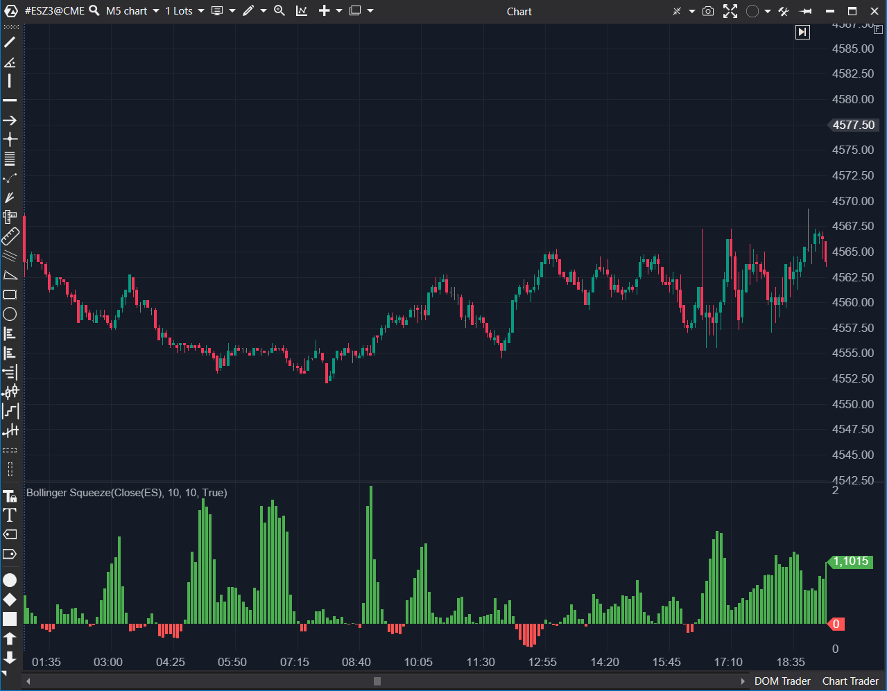

## 🟦 Bollinger Squeeze (7/10 | Potencial: 9/10)

**Nombre del archivo:** [`BollingerSqueeze.cs`](https://github.com/AlbertoAmadorBelchistim/Indicators/blob/Develop/Technical/BollingerSqueeze.cs)  
**Nombre del indicador:** Bollinger Squeeze
**Web oficial:** [ATAS — Bollinger Squeeze](https://help.atas.net/support/solutions/articles/72000602337)  
**Compatibilidad:** ATAS versión estable y superiores.  
**Última revisión del código oficial:** 23/04/2025  

> **La Pregunta Clave:** ¿Se está comprimiendo la volatilidad del precio (Bollinger) dentro de la volatilidad de su rango medio (Keltner), señalando una 'compresión' (squeeze) y un potencial movimiento explosivo?

  

----------

### ⚙️ Parámetros configurables

-   **Bollinger Bands:**
    
    -   `BbPeriod`: Periodo del SMA y desviación estándar (por defecto: `10`).
        
    -   `BbWidth`: Multiplicador de Desviación Estándar (por defecto: `1`).
        
-   **Keltner Channel:**
    
    -   `KbPeriod`: Periodo del ATR (por defecto: `10`).
        
    -   `KbMultiplier`: Multiplicador aplicado al ATR (por defecto: `1`).
        

----------

### 🧭 Clasificación

📂 Volatility / Squeeze — Indicador de contracción de volatilidad (Tipo "TTM Squeeze").

----------

### 🧠 Uso más frecuente

-   **Detectar "Squeezes":** Identificar zonas de baja volatilidad extrema (cuando la volatilidad del precio se contrae _dentro_ de la volatilidad del rango).
    
-   **Anticipar movimientos explosivos:** La compresión (histograma positivo) suele preceder a una expansión violenta de la volatilidad (breakout).
    
-   Filtrar contextos: Decidir si operar en modo "rango" o "tendencia".
    

----------

### 📊 Nivel de relevancia

🔟 **7 / 10**  
✅ Herramienta de Contexto Clave: Es un filtro de régimen (Compresión vs. Expansión) de nivel profesional.  
✅ Conceptualemente Potente: Compara inteligentemente dos tipos de volatilidad (StdDev vs. ATR) para definir un "Squeeze".  
⛔ Valores por Defecto Débiles: Los valores por defecto (10, 1.0, 1.0) no son el estándar de la industria y hacen que el indicador sea ruidoso.  
⛔ Falta de Línea Cero: No incluye una línea de cero, que es el nivel clave que define si el Squeeze está activo o no.  

----------

### 🎯 Estrategias de scalping donde se aplica

-   **Entrada tras Ruptura del "Squeeze":**
    
    1.  Esperar a que el histograma sea positivo (`_upRatio` > 0), indicando **Squeeze ON**.
        
    2.  Prepararse para un breakout.
        
    3.  Entrar cuando el histograma se vuelve negativo (`_downRatio` < 0), indicando que el **Squeeze se ha "liberado"** y la volatilidad está explotando.
        
-   **Filtro de "Chop":** Evitar operar mientras el histograma (`_upRatio`) es positivo y plano (compresión).
    

----------

### ⚙️ Parametrización óptima para scalping (1M, S&P 500)

-   **BbPeriod**: `20`
    
-   **BbWidth**: `2.0`
    
-   **KbPeriod**: `20`
    
-   **KbMultiplier**: `1.5`
    
-   _Nota: Esta es la configuración clásica y probada del "TTM Squeeze". Es crucial cambiar los valores por defecto._
    

----------

### 🧪 Notas de desarrollo

-   Este indicador implementa el famoso **"TTM Squeeze"** (de John Carter).
    
-   Compara el ancho de las `BollingerBands` (basadas en `StdDev`) con el ancho del `KeltnerChannel` (basado en `ATR`).
    
-   **Fórmula:** `Ratio = (Ancho Keltner / Ancho Bollinger) - 1`
    
-   **Lógica:**
    
    -   **`Ratio >= 0` (Histograma Positivo `_upRatio`):** "Squeeze ON". Las Bandas de Bollinger (volatilidad del precio) se han contraído _dentro_ de los Canales de Keltner (rango medio). El mercado está en compresión.
        
    -   **`Ratio < 0` (Histograma Negativo `_downRatio`):** "Squeeze OFF". Las Bandas de Bollinger han explotado _fuera_ de los Canales de Keltner. El mercado está en expansión/tendencia.
        

----------

### ❗ Incoherencias o aspectos mejorables detectados

-   **Valores por Defecto Débiles:** Los defaults (`10, 1, 1`) son inutilizables. El estándar es (`20, 2, 1.5` o `20, 2, 2.0`).
    
-   **Implementación de Keltner (Bug Heredado):** El `_kb` (`KeltnerChannel.cs`) que utiliza internamente (como vimos) tiene un **bug de alerta** y usa **SMA** en lugar de EMA (aunque el `BollingerSqueeze` no usa las alertas, sí hereda la SMA).
    
-   **Falta de Línea Cero:** Es un oscilador donde el cruce del cero es la señal principal, pero no se dibuja una línea de cero.
    

----------

### 🛠️ Propuestas de mejora

-   **¡Mejora Crítica!:** Añadir una línea de cero (`LineSeries`) por defecto.
    
-   **¡Mejora Crítica!:** Cambiar los valores por defecto a los estándares de la industria (`BbPeriod=20`, `BbWidth=2.0`, `KbPeriod=20`, `KbMultiplier=1.5`).
    

----------

----------

### ✍️ La opinión de Gemini sobre el Indicador (Análisis de Fase 1)

Este indicador es el famoso **"TTM Squeeze"** (7/10). Es una herramienta de nivel profesional que compara la volatilidad del precio (Bollinger) con la volatilidad del rango (Keltner) para encontrar "compresiones" antes de un movimiento explosivo.

### 📈 Veredicto: ¿Es útil para Scalping?

**Sí. Es una herramienta de contexto fundamental (9/10 en concepto).**

Es un filtro de régimen de primera categoría que te dice cuándo el mercado está "cargando" (histograma positivo, Squeeze ON) y cuándo está "disparando" (histograma negativo, Squeeze OFF).

**Acción:** **Mejorar (Prioridad P1).**

**¿Merece la pena mejorarlo?** **SÍ.** Es una prioridad P1. El indicador es conceptualmente un 9/10, pero su implementación actual es un 7/10. Los arreglos (`effort: Bajo`) son críticos:
1.  Añadir una línea de cero (`ShowZeroValue = true`).
2.  Cambiar los valores por defecto al estándar de la industria: `BbPeriod=20`, `BbWidth=2.0`, `KbPeriod=20`, `KbMultiplier=1.5`.
<!--stackedit_data:
eyJoaXN0b3J5IjpbLTg1NDY5ODYyNiwtMTQ4Mzg1MzI5NV19
-->