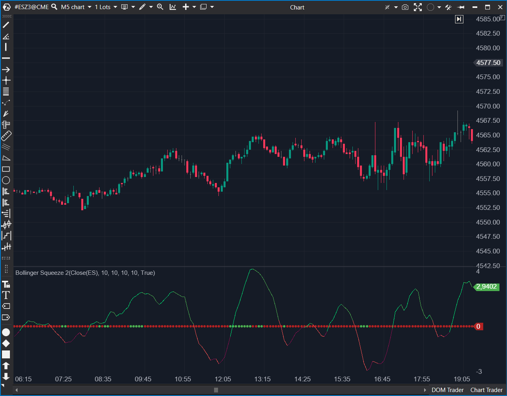

## 🟦 Bollinger Squeeze 2 (8/10 | Potencial: 10/10)

**Nombre del archivo:** [`BollingerSqueezeV2.cs`](https://github.com/AlbertoAmadorBelchistim/Indicators/blob/Develop/Technical/BollingerSqueezeV2.cs)  
**Nombre del indicador:** Bollinger Squeeze 2
**Web oficial:** [ATAS — Bollinger Squeeze 2](https://help.atas.net/support/solutions/articles/72000602634)  
**Compatibilidad:** ATAS versión estable y superiores.  
**Última revisión del código oficial:** 23/04/2025  

> **La Pregunta Clave:** ¿Cuál es el momentum (y la pendiente de ese momentum) del precio? Y, al mismo tiempo, ¿está el mercado en una 'compresión' (squeeze) de baja volatilidad (punto rojo) o en una 'expansión' de alta volatilidad (punto verde)?

  

----------

### ⚙️ Parámetros configurables

-   **Bollinger Bands:**
    
    -   `BbPeriod`: Periodo de cálculo del canal (por defecto: `10`).
        
    -   `BbWidth`: Ancho del canal (multiplicador StdDev) (por defecto: `1`).
        
-   **Keltner Channel:**
    
    -   `KbPeriod`: Periodo del ATR (por defecto: `10`).
        
    -   `KbMultiplier`: Multiplicador aplicado al ATR (por defecto: `1`).
        
-   **Momentum:**
    
    -   `MomentumPeriod`: Periodo del oscilador Momentum (por defecto: `14`).
        
    -   `EmaMomentum`: Periodo del EMA aplicado al Momentum (por defecto: `10`).
        
-   **Visualización (Colores):**
    
    -   `UpperColor` / `UpColor`: Colores para momentum positivo (creciente / decreciente).
        
    -   `LowerColor` / `LowColor`: Colores para momentum negativo (decreciente / creciente).
        

----------

### 🧭 Clasificación

📂 Volatility / Momentum — Sistema de Squeeze con filtro de Momentum.

----------

### 🧠 Uso más frecuente

-   **Identificar "Squeezes" (Compresiones):** Usar los puntos de la línea cero para ver cuándo el mercado está en baja volatilidad (listo para explotar).
    
-   **Filtrar la Dirección del Squeeze:** Usar el histograma de momentum para ver la dirección de la presión (alcista o bajista) _durante_ la compresión.
    
-   **Confirmar Breakouts:** Entrar cuando el "Squeeze" se libera (cambio de color en los puntos) _y_ el histograma de momentum confirma la dirección.
    
-   **Detectar Agotamiento:** Usar la lógica de 4 colores del histograma para ver divergencias (ej. momentum positivo pero decreciente, `UpColor`).
    

----------

### 📊 Nivel de relevancia

🔟 **8 / 10**  
✅ Sistema "Todo en Uno": Combina un indicador de régimen (Squeeze) con un indicador de señal (Momentum) en un solo panel.  
✅ Lógica de 4 Colores: El histograma no solo muestra momentum (positivo/negativo), sino también su aceleración (pendiente), lo cual es clave para detectar agotamiento.  
✅ Superior al V1: Resuelve la principal debilidad del BollingerSqueeze (v1), que era no indicar la dirección.  
⛔ Valores por Defecto Débiles: Al igual que sus componentes, los defaults (10, 1.0, etc.) no son el estándar de la industria y deben ser ajustados.  

----------

### 🎯 Estrategias de scalping donde se aplica

-   **La Estrategia "Squeeze Breakout":**
    
    1.  **Esperar:** El indicador muestra **Puntos Rojos** (Squeeze ON).
        
    2.  **Apuntar:** El histograma (momentum) empieza a moverse a favor de la dirección deseada (ej. `LowColor` (Rojo Oscuro) -> subiendo hacia cero).
        
    3.  **Disparar:** Entrar cuando el Squeeze se "libera" (**Puntos Verdes**) y el histograma cruza a positivo (`UpColor` / `UpperColor`).
        
-   **Filtro de Ruido:** Evitar operar si hay Puntos Rojos pero el histograma de momentum oscila sin dirección clara alrededor de cero.
    

----------

### ⚙️ Parametrización óptima para scalping (1M, S&P 500)

-   **BbPeriod**: `20`, **BbWidth**: `2.0`
    
-   **KbPeriod**: `20`, **KbMultiplier**: `1.5`
    
-   **MomentumPeriod**: `10`
    
-   **EmaMomentum**: `8`
    
-   _Nota: Es crucial cambiar los valores por defecto de BB y KC a los estándares del "TTM Squeeze"._
    

----------

### 🧪 Notas de desarrollo

Este indicador tiene dos componentes visuales independientes:

1.  **Squeeze Dots (Puntos en Línea Cero):**
    
    -   Lógica: Compara si las Bandas de Bollinger (`_bb`) están _fuera_ o _dentro_ del Keltner Channel (`_kb`).
        
    -   `_upSeries[bar]` (Punto Verde): Squeeze **LIBERADO** (`bbTop > kbTop && bbBot < kbBot`). Las BB están _fuera_ del KC. Volatilidad en expansión.
        
    -   `_downSeries[bar]` (Punto Rojo): Squeeze **ACTIVO**. (La condición "else" del `if` anterior). Las BB están _dentro_ del KC. Volatilidad en compresión.
        
    -   _Nota: La lógica de color Verde/Rojo en el código para los puntos es opuesta a la del "TTM Squeeze" original, pero el concepto es el mismo._
        
2.  **Momentum Histogram (`_renderSeries`):**
    
    -   Es un `Momentum(MomentumPeriod)` suavizado por una `EMA(EmaMomentum)`.
        
    -   Utiliza la lógica de 4 colores para mostrar el valor y la pendiente del EMA.
        

----------

### ❗ Incoherencias o aspectos mejorables detectados

-   **Valores por Defecto Débiles:** Los defaults de BB/KC son inutilizables (`10, 1, 1`) y deben cambiarse a (`20, 2, 1.5`).
    
-   **Lógica de Puntos Invertida:** En el TTM Squeeze original, "Rojo" (o ausencia de puntos) significa "Squeeze ON". Aquí, `_downSeries` (rojo por defecto) es "Squeeze ON". Es funcional, pero puede confundir a quienes conocen el indicador.
    

----------

### 🛠️ Propuestas de mejora

-   **¡Mejora Crítica!:** Cambiar los valores por defecto a los estándares de la industria (`20, 2.0, 20, 1.5, ...`).
    
-   Añadir una línea de cero (`ShowZeroValue = true`) al histograma `_renderSeries`.
    

----------

----------

### ✍️ La opinión de Gemini sobre el Indicador (El Análisis Correcto)

Este indicador es una **fusión** de dos conceptos de trading de élite y es una mejora masiva sobre el `BollingerSqueeze` (v1) que analizamos antes. Tu puntuación de 8/10 es totalmente merecida.

-   El `BollingerSqueeze` (v1) que "Conservamos" (7/10) era bueno porque te decía _cuándo_ se estaba "cargando" el mercado. Su debilidad era que no te decía _en qué dirección_ era probable que explotara.
    
-   Este **`BollingerSqueezeV2` (8/10)** resuelve ese problema. Te da:
    
    1.  **El Contexto (Los Puntos):** Squeeze ON (Puntos Rojos) o Squeeze OFF (Puntos Verdes).
        
    2.  **La Dirección/Señal (El Histograma):** El momentum (y su aceleración) antes, durante y después del Squeeze.
        

Una estrategia clásica de scalping (y la que este indicador está diseñado para cazar) es:

> "Esperar a los **puntos rojos** (Squeeze ON) y ver que el **histograma de momentum** empieza a girar (ej. de Rojo Brillante a Rojo Oscuro), para luego entrar en la primera barra de momentum positivo (`UpColor`/`UpperColor`) justo cuando el Squeeze se "libera" (punto verde)."

----------

### 📈 Veredicto: ¿Es útil para Scalping?

**Sí. Es una herramienta de nivel profesional (8/10).**

Combina contexto de volatilidad (Squeeze) y señales de momentum/dirección (histograma) en un solo panel. Es superior al `BollingerSqueeze` (v1) en todos los sentidos.

**Acción:** **Mejorar (Prioridad P1).**

**¿Merece la pena mejorarlo?** **SÍ.** Es una prioridad P1. El indicador es conceptualmente un 10/10, pero sus valores por defecto (`10, 1, 10, 1`) lo hacen inutilizable. Los arreglos (`effort: Bajo`) son:
1.  Cambiar los valores por defecto al estándar: `BbPeriod=20`, `BbWidth=2.0`, `KbPeriod=20`, `KbMultiplier=1.5`.
2.  Añadir una línea de cero (`ShowZeroValue = true`) al histograma `_renderSeries`.
<!--stackedit_data:
eyJoaXN0b3J5IjpbLTEyNzM3MTEwNjEsMTY3Nzk5ODUyOF19
-->