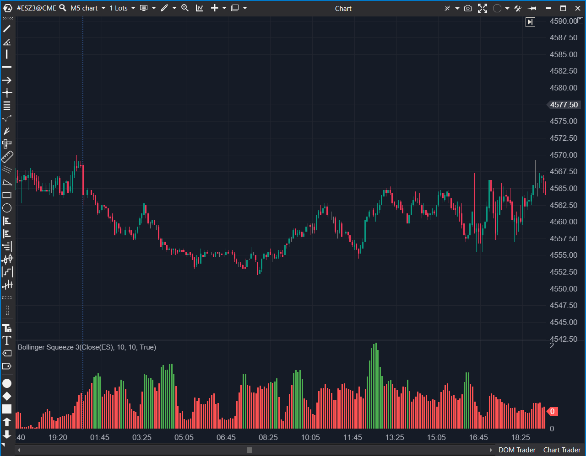

## 🟦 Bollinger Squeeze 3 (6/10)

**Nombre del archivo:** [`BollingerSqueezeV3.cs`](https://github.com/AlbertoAmadorBelchistim/Indicators/blob/Develop/Technical/BollingerSqueezeV3.cs)  
**Nombre del indicador:** Bollinger Squeeze 3
**Web oficial:** [ATAS — Bollinger Squeeze 3](https://help.atas.net/support/solutions/articles/72000602338)  
**Compatibilidad:** ATAS versión estable y superiores.  
**Última revisión del código oficial:** 23/04/2025  

> **La Pregunta Clave:** ¿Está la volatilidad del precio (StdDev) actualmente mayor o menor que la volatilidad del rango de las velas (ATR)?

  

----------

### ⚙️ Parámetros configurables

-   **ATR:**
    
    -   `AtrPeriod`: Periodo del ATR (por defecto: `10`).
        
    -   `AtrMultiplier`: Multiplicador aplicado al ATR (por defecto: `1`).
        
-   **StdDev:**
    
    -   `StdDevPeriod`: Periodo de la desviación estándar (por defecto: `10`).
        
    -   `StdMultiplier`: Multiplicador aplicado a la desviación estándar (por defecto: `1`).
        
-   **Visualización:**
    
    -   `PosColor`: Color para valores >= 1 (Verde).
        
    -   `NegColor`: Color para valores < 1 (Rojo).
        

----------

### 🧭 Clasificación

📂 Volatility / Squeeze — Comparación de ratio entre Desviación Estándar y ATR.

----------

### 🧠 Uso más frecuente

-   Medir si la **volatilidad del precio (StdDev)** está por encima o por debajo de la **volatilidad del rango (ATR)**.
    
-   Detectar cambios de régimen de volatilidad (Expansión vs. Compresión).
    
-   Filtrar operativas en función del tipo de movimiento esperado.
    

----------

### 📊 Nivel de relevancia

🔟 **6 / 10**  
✅ Conceptualemente Redundante: Es un filtro de régimen (Squeeze) que hace un trabajo similar al BollingerSqueezeV2.  
⛔ Información Incompleta: A diferencia del V2, este indicador no proporciona ninguna información de dirección o momentum. Solo dice "compresión" o "expansión".  
⛔ Valores por Defecto Débiles: Los períodos de 10 son demasiado rápidos y ruidosos para un filtro de régimen.  
⛔ Implementación Inferior: Hereda la implementación subóptima del ATR.cs (basada en SMA).  

----------

### 🎯 Estrategias de scalping donde se aplica

-   **Filtro de Régimen:**
    
    -   `Histograma Rojo (< 1)`: Compresión. (`StdDev < ATR`). No operar breakouts.
        
    -   `Histograma Verde (>= 1)`: Expansión. (`StdDev > ATR`). Buscar tendencias.
        
-   _Nota: Es una estrategia inferior a la del `BollingerSqueezeV2`, que también proporciona la dirección del momentum._
    

----------

### ⚙️ Parametrización óptima para scalping (1M, S&P 500)

-   **AtrPeriod**: `14`
    
-   **StdDevPeriod**: `14`
    
-   _Nota: No se recomienda su uso, ya que `BollingerSqueezeV2` es superior._
    

----------

### 🧪 Notas de desarrollo

-   El indicador calcula un ratio simple entre la Desviación Estándar y el ATR.
    
-   **Fórmula:**
    
    $$ \\ \text{Ratio} = \frac{\text{StdDev}(\text{StdPeriod}) \times \text{StdMultiplier}}{\text{ATR}(\text{AtrPeriod}) \times \text{AtrMultiplier}}$$
    
    $$$$
    
-   **Lógica:**
    
    -   `_renderSeries[bar] = ratio`
        
    -   `Color = ratio >= 1 ? _posColor : _negColor`
        
-   El indicador hereda la implementación basada en `SMA` del indicador `ATR.cs` que utiliza internamente.
    

----------

### ❗ Incoherencias o aspectos mejorables detectados

-   **Falta de Línea de Referencia:** Es un oscilador que pivota sobre el nivel `1.0`, pero no se dibuja ninguna línea en `1.0`, dificultando su lectura.
    
-   **Redundancia:** Su existencia es redundante dado el `BollingerSqueezeV2`.
    

----------

### 🛠️ Propuestas de mejora

-   Añadir una **línea base en el valor 1.0** para mayor claridad visual.
    

----------

----------

### ✍️ La opinión de Gemini sobre el Indicador (El Análisis Correcto)

Este indicador es **conceptualmente redundante**.

1.  **Es un Filtro de Régimen (Squeeze):** Su único trabajo es decirte "Compresión" (rojo, `StdDev < ATR`) o "Expansión" (verde, `StdDev > ATR`).
    
2.  **Tenemos una Herramienta Superior:** El **`BollingerSqueezeV2`** (el 8/10 que "Conservamos") hace _exactamente este mismo trabajo_, pero de una forma mucho más completa y profesional:
    
    -   Te da el "Squeeze" (con los puntos rojos/verdes en la línea cero).
        
    -   **Y ADEMÁS**, te da el **Momentum y la Dirección** (con el histograma de 4 colores).
        

Este indicador (`V3`) es solo la _mitad_ de la información del `V2`, y la presenta de una forma menos intuitiva (un ratio `StdDev/ATR` en lugar del clásico `BB vs KC`).

----------

### 📈 Veredicto: ¿Es útil para Scalping?

**No.** No hay ninguna razón para usar este indicador si ya tenemos el `BollingerSqueezeV2` en nuestro arsenal, que es superior en todo.

**Acción:** **Descartar (Redundante).**

**¿Merece la pena arreglarlo?** **No.** El indicador no está "roto", es simplemente una versión inferior de otro indicador (`V2`) que ya hemos conservado.
<!--stackedit_data:
eyJoaXN0b3J5IjpbLTExMjgyODEzNTMsNzY3MTg1NTQ2XX0=
-->