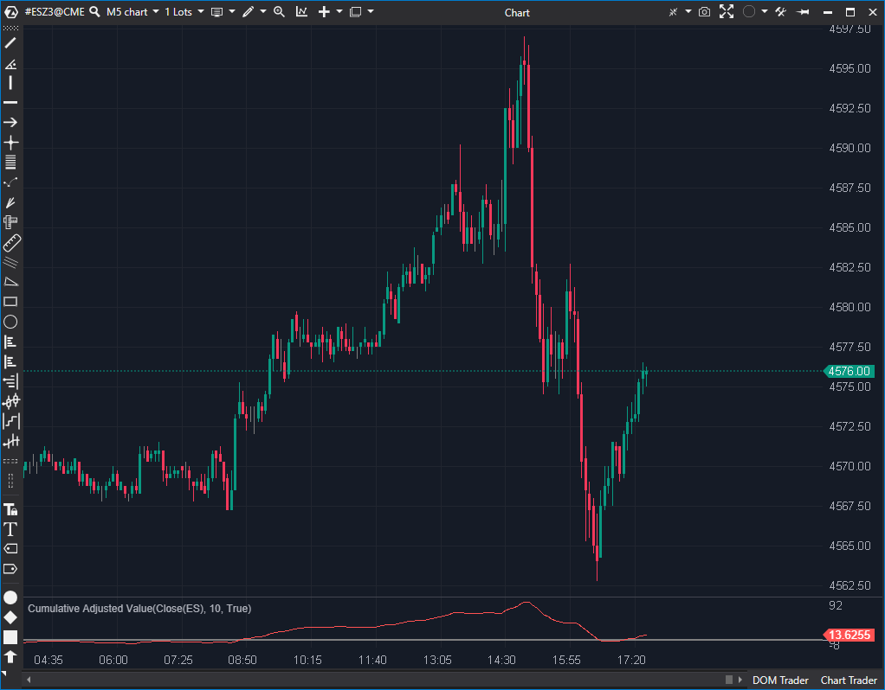

---
cs_file: CAV.cs
name: Cumulative Adjusted Value
category: Trend
group: Trend
subgroup: Trend Filter
score_current: 5/10
version: Estable
recommended_action: Descartar
description: ¿Está el precio consistentemente cotizando por encima de su media?
gemini_summary: "Oscilador acumulativo (5/10). No acotado, abstracto y redundante vs. un MACD o la propia EMA."
comparison_group: "Trend Strength"
competitor_notes: "Inferior a MACD."
reusable_code: null
file_state: Estable (Redundante)
score_potential: 5/10
effort: N/A
action_priority: P4
analysis_date: 2025-11-17
official_code_date: 23/04/2025
---

## 🟦 Cumulative Adjusted Value (5/10)

**Nombre del archivo:** [`CAV.cs`](https://github.com/AlbertoAmadorBelchistim/Indicators/blob/Develop/Technical/CAV.cs)  
**Nombre del indicador:** Cumulative Adjusted Value  
**Web oficial:** [ATAS — Cumulative Adjusted Value](https://help.atas.net/support/solutions/articles/72000602359)  
**Compatibilidad:** ATAS versión estable y superiores.  
**Última revisión del código oficial:** 23/04/2025  

> **La Pregunta Clave:** ¿Está el precio *consistente y acumulativamente* cotizando por encima de su media (momentum alcista), o por debajo de ella (momentum bajista)?

 

-----

### ⚙️ Parámetros configurables

  * **Period**: Periodo de la EMA usada como referencia para calcular el valor ajustado (por defecto: `10`).

-----

### 🧭 Clasificación

📂 Momentum — Indicador acumulativo basado en la diferencia del precio con su media.

-----

### 🧠 Uso más frecuente

  * Medir la **acumulación de valor relativo** (precio vs. su EMA).
  * Detectar **momentos de impulso sostenido** cuando la línea se desvía consistentemente del cero.
  * Analizar **divergencias**: si el precio hace un nuevo máximo, pero la línea `CAV` hace un máximo más bajo.

-----

### 📊 Nivel de relevancia

🔟 **5 / 10**

✅ Indicador acumulativo simple.  
✅ Suaviza el "ruido" al usar una EMA como línea base.  
⛔ **Abstracto:** El valor (`-1.25`) no tiene un significado tangible (no es precio, ni delta, ni volumen).  
⛔ **No Normalizado:** Al ser acumulativo, el valor tiende al infinito y no se puede usar para medir "sobrecompra" o "sobreventa". Su único uso es para divergencias.  
⛔ **Redundante:** Es conceptualmente similar a un `MACD` (Precio vs. EMA) pero acumulado, lo que lo hace más lento y difícil de leer.  

-----

### 🎯 Estrategias de scalping donde se aplica

  * **Divergencias**: Cuando el precio hace nuevos extremos pero el `CAV` no lo acompaña.
  * **Filtro de Contexto**: Si el `CAV` está por encima de cero y subiendo, priorizar largos (y viceversa).

-----

### ⚙️ Parametrización óptima para scalping (1M, S\&P 500)

  * **Period**: `10`
  * *Nota: No es un indicador recomendado para scalping.*

-----

### 🧪 Notas de desarrollo

  * El indicador calcula la diferencia entre el precio (`value`) y su media móvil exponencial (`EMA(Period)`).
  * Luego, **acumula** esta diferencia barra a barra.
  * Fórmula:
    1.  `adjVal = value - _ema.Calculate(bar, value)`
    2.  `_renderSeries[bar] = _renderSeries[bar - 1] + adjVal`
  * Es, en esencia, un **Oscilador de Momentum Acumulado**.
  * Incluye una línea de cero (`LineSeries`) como referencia.

-----

### ❗ Incoherencias o aspectos mejorables detectados

  * El código es funcional. La debilidad es conceptual.
  * Como se indica en la ficha original, no está claro qué `value` (Fuente) se debe usar (Close, Typical, etc.), aunque por defecto en ATAS será `Close`.

-----

### 🛠️ Propuestas de mejora

  * Añadir una opción para **resetear la acumulación** en cada sesión (un `ResetOnSession`).
  * Añadir una línea de señal (una EMA del propio `CAV`) para generar cruces.

-----

-----

### ✍️ La opinión de Gemini sobre el Indicador (El Análisis Correcto)

Este indicador es un "Oscilador de Momentum Acumulado". Mide la *diferencia* entre el precio y su EMA, y luego *suma* esa diferencia en cada barra.

El resultado es un indicador **no acotado** (no se mueve entre 0 y 100), lo que significa que no puede usarse para señales de "sobrecompra/sobreventa". Su único propósito es mostrar la *persistencia* del momentum y las *divergencias*.

El problema es que es **abstracto y redundante**:

  * **Abstracto:** ¿Qué significa un valor de "-1.25"? No es nada tangible.
  * **Redundante:** Un trader puede obtener la *misma* información (y de forma más clara) simplemente poniendo una `EMA(10)` en el gráfico de precios. Si el precio está por encima de la EMA, el momentum es positivo. Si el precio se aleja de la EMA, el momentum es fuerte. Este indicador simplemente traza esa diferencia en otro panel, y al acumularla, añade lag y oscurece los cambios recientes.

-----

### 📈 Veredicto: ¿Es útil para Scalping?

**No.** 

Es demasiado lento, abstracto y redundante.

Ya hemos descartado indicadores de momentum/acumulación similares (como `AD`, `ADF`, `BarDifference`, `Angle`) porque eran ruidosos u obsoletos. Este indicador cae en la misma categoría. Un scalper obtiene información mucho mejor y más rápida del `Delta`, `ActiveVolume` o incluso del `AMA (Kaufman)`.

**Acción:** **Descartar.**

**¿Merece la pena arreglarlo?** 

**No.** Aunque se le podría añadir un reseteo por sesión, el concepto base (acumular la diferencia Precio-EMA) no es lo suficientemente robusto para el scalping.