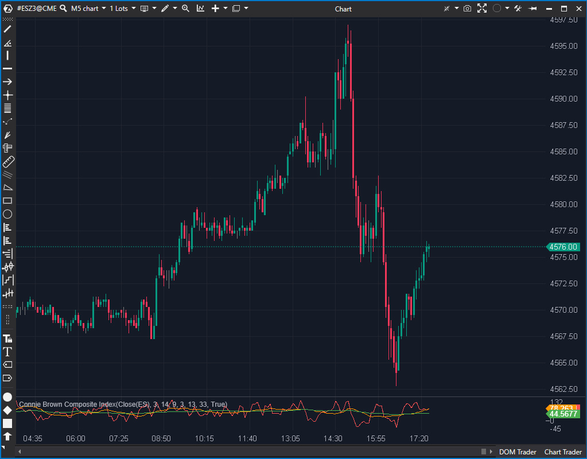

## 🟦 Connie Brown Composite Index (5/10)

**Nombre del archivo:** [`CBI.cs`](https://github.com/AlbertoAmadorBelchistim/Indicators/blob/Develop/Technical/CBI.cs)  
**Nombre del indicador:** Connie Brown Composite Index  
**Web oficial:** [ATAS — Connie Brown Composite Index](https://help.atas.net/support/solutions/articles/72000602601)  
**Compatibilidad:** ATAS versión estable y superiores.  
**Última revisión del código oficial:** 23/04/2025  

> **La Pregunta Clave:** ¿Cuál es el momentum "compuesto" (RSI + Momentum) del precio, y cómo se compara con sus propias medias móviles (lenta y rápida)?

  

-----

### ⚙️ Parámetros configurables

  * **Rsi1Period**: Periodo del primer RSI (por defecto: `14`)
  * **Rsi2Period**: Periodo del segundo RSI (por defecto: `3`)
  * **MomentumPeriod**: Periodo del Momentum (aplicado al RSI1) (por defecto: `9`)
  * **Sma1Period**: Periodo de la SMA (aplicada al RSI2) (por defecto: `3`)
  * **Sma2Period**: Periodo de la SMA media sobre el CBI (por defecto: `13`)
  * **Sma3Period**: Periodo de la SMA larga sobre el CBI (por defecto: `33`)

-----

### 🧭 Clasificación

📂 Momentum — Indicador compuesto derivado de RSI y Momentum.

-----

### 🧠 Uso más frecuente

  * Medir el **momentum compuesto** mediante la combinación de RSI, Momentum y medias.
  * Identificar **divergencias avanzadas** que un RSI tradicional no muestra.
  * Detectar cambios de tendencia usando el cruce de la línea principal (`CBI1`) con sus medias (`CBI2`, `CBI3`).

-----

### 📊 Nivel de relevancia

🔟 **5 / 10**

✅ Indicador técnico avanzado para análisis de momentum compuesto.  
✅ Buena capacidad para detectar divergencias compuestas.  
⛔ **LAG Múltiple:** Es un indicador de "lag sobre lag" (una media de un momentum de un RSI). Es muy lento.  
⛔ **Complejo y Abstracto:** Es un "oscilador de un oscilador". Su valor no tiene una interpretación directa, solo relativa (divergencias, cruces).  

-----

### 🎯 Estrategias de scalping donde se aplica

  * **Detección de Divergencias**: Entre el precio y la línea `_cbi1Series`.
  * **Cruce de Medias (Señal Lenta):** Comprar cuando la línea `_cbi1Series` (rápida) cruza por encima de `_cbi2Series` (media) y `_cbi3Series` (lenta).
  * *Nota: Es demasiado lento para ser una señal primaria de scalping.*

-----

### ⚙️ Parametrización óptima para scalping (1M, S\&P 500)

  * **Rsi1Period**: `14`
  * **Rsi2Period**: `3`
  * **MomentumPeriod**: `9`
  * **Sma1Period**: `3`
  * **Sma2Period**: `13`
  * **Sma3Period**: `33`
  * *Nota: Se deben usar los valores por defecto (clásicos). No se recomienda para scalping debido a su lag.*

-----

### 🧪 Notas de desarrollo

  * El indicador calcula una **línea principal (CBI1)** como la suma de dos osciladores:
    1.  `Momentum(RSI(Rsi1Period), MomentumPeriod)`
    2.  `SMA(RSI(Rsi2Period), Sma1Period)`
  * Luego, calcula **dos medias móviles de esa línea principal**:
      * **CBI2**: `SMA(CBI1, Sma2Period)` (Media señal)
      * **CBI3**: `SMA(CBI1, Sma3Period)` (Media lenta)
  * El indicador traza las 3 líneas (CBI1, CBI2, CBI3).

-----

### ❗ Incoherencias o aspectos mejorables detectados

  * **Naming Inconsistente en Parámetros:** El código usa `[Display(Name = nameof(Strings.SMAPeriod1))]` para el parámetro `Rsi1Period`. Es un error de "copiar y pegar" que hace que la etiqueta en la UI sea confusa (dice "SMA Period" pero controla "RSI Period").
  * **Falta de Protección (Warm-up):** El indicador empieza a calcular en `bar == 0`, usando valores de RSI y Momentum que aún no están "maduros". Esto introduce valores incorrectos al inicio del gráfico hasta que todos los períodos (`33` por defecto) se hayan cargado.

-----

### 🛠️ Propuestas de mejora

  * **Corregir las etiquetas `[Display]`** en los parámetros `Rsi1Period` y `Rsi2Period` para que muestren "RSI Period".
  * **Añadir un "warm-up"**: El indicador no debería calcular hasta que `bar > Max(Sma3Period, Rsi1Period, ...)` para evitar valores iniciales incorrectos.
  * Añadir una línea de cero (`LineSeries`) como referencia.

-----

-----

### ✍️ La opinión de Gemini sobre el Indicador (El Análisis Correcto)

Este es un "oscilador de osciladores". Es un indicador compuesto que intenta medir el "momentum del momentum".

1.  Calcula un `RSI(14)`.
2.  Calcula el `Momentum(9)` *de ese RSI*.
3.  Calcula un `RSI(3)`.
4.  Calcula una `SMA(3)` *de ese RSI*.
5.  Suma (2) y (4) para obtener la línea `CBI1`.
6.  Calcula una `SMA(13)` y una `SMA(33)` *de esa línea CBI1*.

El resultado es un sistema de cruce de medias (`CBI1`, `CBI2`, `CBI3`) que tiene **cuatro capas de suavizado y lag**. Es conceptualmente *extremadamente* lento.

-----

### 📈 Veredicto: ¿Es útil para Scalping?

**No.** 

Es un indicador de swing trading (gráficos diarios/semanales) con un lag masivo. Para un scalper, las señales llegarán horas tarde.

**Acción:** **Descartar.**

**¿Merece la pena arreglarlo?** 

**No.** El indicador tiene bugs (etiquetas de parámetros incorrectas y falta de "warm-up"), pero arreglarlos no soluciona el fallo conceptual (es demasiado lento para scalping).