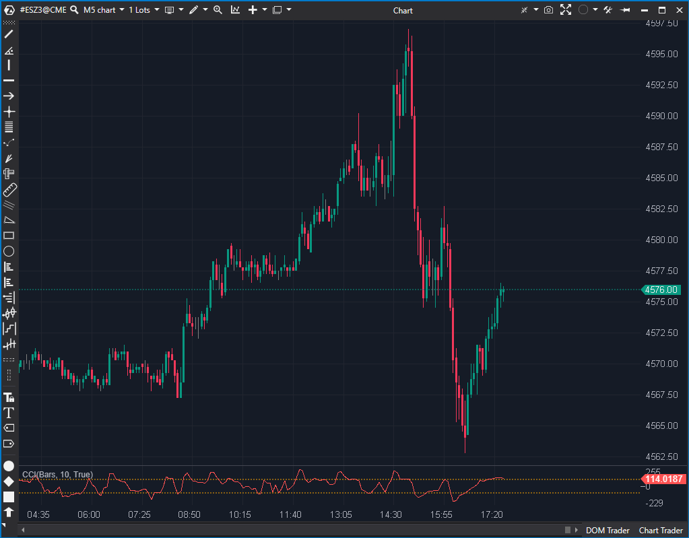

## 🟦 Commodity Channel Index (CCI) (7/10)

**Nombre del archivo:** [`CCI.cs`](https://github.com/AlbertoAmadorBelchistim/Indicators/blob/Develop/Technical/CCI.cs)  
**Nombre del indicador:** CCI  
**Web oficial:** [ATAS — CCI](https://help.atas.net/support/solutions/articles/72000602539)  
**Compatibilidad:** ATAS versión estable y superiores.  
**Última revisión del código oficial:** 23/04/2025  

> **La Pregunta Clave:** ¿Qué tan lejos se ha desviado el precio "típico" de hoy de su precio "promedio", medido en unidades de desviación estadística?

  

-----

### ⚙️ Parámetros configurables

  * **Period**: Número de barras usado para el cálculo de la media (SMA) y la desviación media (por defecto: `10`).
  * **DrawLines**: Mostrar o no las líneas guía (por defecto: `true`).
  * **Line100 / LineM100**: Configuración (valor, color, visibilidad) de las líneas horizontales de sobrecompra/sobreventa (por defecto: `+100` y `-100`).

-----

### 🧭 Clasificación

📂 Oscillators — Oscilador de momentum que mide la desviación del precio de su media.

-----

### 🧠 Uso más frecuente

  * Identificar **zonas de sobrecompra** (CCI \> +100) y **sobreventa** (CCI \< -100).
  * Medir la **fuerza y velocidad** de un movimiento de tendencia (momentum).
  * Detectar **divergencias** (precio hace un nuevo máximo, pero el CCI hace un máximo más bajo).
  * Usar el **cruce de la línea cero** como una señal de cambio de tendencia a corto plazo.

-----

### 📊 Nivel de relevancia

🔟 **7 / 10**

✅ **Indicador Clásico y Versátil:** Muy popular y bien implementado.  
✅ **Eficaz para Divergencias:** Es una de sus principales fortalezas.  
✅ **Niveles Clave (+100/-100):** Proporciona niveles de acción claros para estrategias de reversión.  
⛔ **Genera Señales Falsas en Tendencia:** En una tendencia fuerte, el CCI puede permanecer "sobrecomprado" (\>+100) durante mucho tiempo, dando señales de venta falsas.  
⛔ **No es un indicador "ciego"** (usa solo precio), no tiene en cuenta el volumen ni el Order Flow.  

-----

### 🎯 Estrategias de scalping donde se aplica

  * **Contratendencia (Fading) en Extremos**: Vender si CCI \> +100 (o +200) y muestra una divergencia bajista. Comprar si CCI \< -100 (o -200) y muestra divergencia alcista.
  * **Confirmación de Momentum (Cruce de Cero)**: Comprar cuando el CCI cruza de negativo a positivo (cruce de la línea cero) en un pullback.
  * **Divergencias**: Buscar divergencias clásicas entre el precio y el oscilador en los extremos para anticipar un giro.

-----

### ⚙️ Parametrización óptima para scalping (1M, S\&P 500)

  * **Period**: `14` (un valor más estándar y ligeramente más suave que el `10` por defecto).
  * **DrawLines**: `true`
  * **Line100 / LineM100**: Mantener en `±100`.

✅ Buen equilibrio entre sensibilidad y ruido.  
✅ Las zonas ±100 se respetan con frecuencia en reversiones intradía.

-----

### 🧪 Notas de desarrollo

  * El indicador implementa fielmente la fórmula clásica de Donald Lambert:
  * **Paso 1:** Calcula el "Precio Típico": `typical = (candle.High + candle.Low + candle.Close) / 3m`
  * **Paso 2:** Calcula una `SMA` de ese Precio Típico: `sma0 = _sma.Calculate(bar, typical)`
  * **Paso 3:** Calcula la "Desviación Media Absoluta" (Mean Deviation) de las últimas `Period` barras: `mean += Math.Abs(_typicalSeries[i] - sma0)`
  * **Paso 4:** Calcula el CCI:
    `CCI = (Typical Price - SMA) / (0.015 * Mean Deviation)`
  * **Protección contra división por cero:** El código comprueba si el divisor (`res`) es casi cero y lo reemplaza por `1` para evitar errores.

-----

### ❗ Incoherencias o aspectos mejorables detectados

  * **Falta de Protección (Warm-up):** El indicador calcula la Desviación Media usando `Math.Min(Period, bar + 1)`. Esto significa que en las primeras `Period` barras, el cálculo se realiza con un período incompleto (1, 2, 3... barras), generando valores iniciales ruidosos e incorrectos.
  * **Lógica de `DrawLines` Redundante:** Las líneas `Line100` y `LineM100` se añaden en el constructor. El `setter` de la propiedad `DrawLines` luego intenta añadirlas o quitarlas, lo cual es una lógica confusa (aunque funcional).

-----

### 🛠️ Propuestas de mejora

  * **Añadir "Warm-up":** El indicador no debería calcular (devolver `return`) hasta que `bar > Period` para asegurar que la SMA y la Desviación Media tengan un conjunto de datos completo.
  * Añadir una opción para seleccionar la **fuente de precio** (Close, HL2, HLC3, etc.) en lugar de usar siempre HLC3 (Precio Típico).
  * Añadir alertas (`AddAlert`) cuando el CCI cruce los niveles ±100 o la línea cero.

-----

-----

### ✍️ La opinión de Gemini sobre el Indicador (El Análisis Correcto)

El CCI es un oscilador de momentum clásico y una herramienta sólida. A diferencia de un RSI (que está "acotado" entre 0 y 100), el CCI es **no acotado**, lo que le permite mostrar mejor los movimientos de tendencia extremos (puede llegar a +300 o -300).

Su uso principal para un scalper no es la señal de "sobrecompra" (vender a +100) en una tendencia, ya que fallará. Su verdadero poder reside en dos estrategias:

1.  **Divergencias en Extremos:** Cuando el precio hace un nuevo máximo, pero el CCI (ej. en +250) hace un máximo más bajo (ej. +210), es una señal de agotamiento de tendencia muy fiable.
2.  **Cruce de Cero (Filtro de Tendencia):** Usarlo como un filtro de régimen simple. Si CCI \> 0, solo se buscan largos. Si CCI \< 0, solo se buscan cortos.

-----

### 📈 Veredicto: ¿Es útil para Scalping?

**Sí, como indicador de confirmación (7/10).**

Es una buena herramienta para identificar divergencias y filtrar la dirección del momentum a corto plazo. No debe usarse como una señal de entrada principal (especialmente no para "fading" en tendencias fuertes), pero es un excelente complemento para confirmar un setup de reversión.

**Acción:** **Conservar.**

**¿Merece la pena arreglarlo?** **Sí.** El arreglo es trivial (añadir un `if (bar < Period) return;` al inicio de `OnCalculate`) y mejoraría la calidad de la señal al eliminar el ruido inicial.
