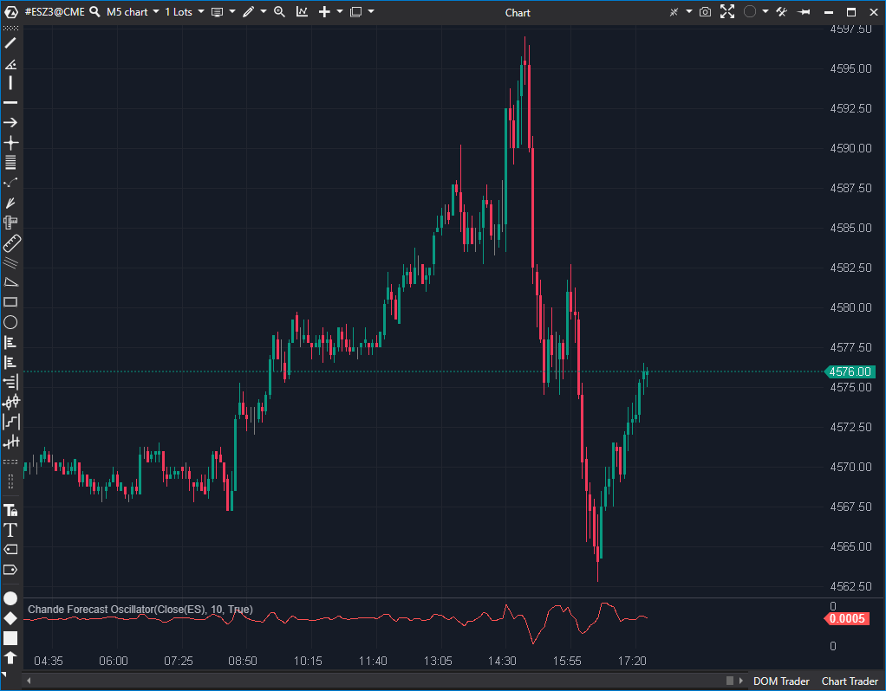

## 🟦 Chande Forecast Oscillator (CFO) (4/10)

**Nombre del archivo:** [`CFO.cs`](https://github.com/AlbertoAmadorBelchistim/Indicators/blob/Develop/Technical/CFO.cs)  
**Nombre del indicador:** Chande Forecast Oscillator  
**Web oficial:** [ATAS — Chande Forecast Oscillator](https://help.atas.net/support/solutions/articles/72000602274)  
**Compatibilidad:** ATAS versión estable y superiores.  
**Última revisión del código oficial:** 23/04/2025  

> **La Pregunta Clave:** ¿Cuán lejos, en porcentaje, se ha desviado el precio de su propia línea de tendencia (Regresión Lineal)?

  

-----

### ⚙️ Parámetros configurables

  * **Period**: Número de barras usado para calcular la regresión lineal (por defecto: `10`)

-----

### 🧭 Clasificación

📂 Momentum — Oscilador basado en la desviación del precio de su tendencia.

-----

### 🧠 Uso más frecuente

  * Medir la **desviación relativa (en %)** del precio respecto a su regresión lineal.
  * Detectar momentos en que el precio se "sobreextiende" de su valor de tendencia esperado.
  * Identificar divergencias (precio hace un nuevo máximo, pero el CFO no).

-----

### 📊 Nivel de relevancia

🔟 **4 / 10**

✅ Bueno para detectar sobrecompra/sobreventa *relativa a la tendencia*, no a niveles fijos.  
⛔ **Abstracto:** El valor (ej. "0.5%") no es tan tangible como el precio o el delta.  
⛔ **Lagging:** Se basa en una `LinearReg(10)`, que tiene lag.  
⛔ **Redundante:** Un trader obtiene la misma (o mejor) información simplemente trazando una `LinearReg` o `AMA` sobre el precio y observando visualmente la distancia.  

-----

### 🎯 Estrategias de scalping donde se aplica

  * **Reversión a la Media (Fading):** Vender cuando el CFO alcanza un extremo positivo (ej. +0.5%) y muestra divergencia; comprar en un extremo negativo.
  * **Confirmación de Retrocesos**: Si el precio está en un pullback alcista pero el CFO se mantiene negativo, indica debilidad.

-----

### ⚙️ Parametrización óptima para scalping (1M, S\&P 500)

  * **Period**: `9` a `12`
  * *Nota: No es un indicador recomendado para scalping.*

-----

### 🧪 Notas de desarrollo

  * El CFO mide el **porcentaje de diferencia** entre el precio actual y su regresión lineal.
  * Utiliza el componente `LinearReg` para estimar la tendencia local (`_linReg.Calculate(bar, value)`).
  * Fórmula: `cfoValue = 100m * (value - _linReg.Calculate(bar, value)) / value`
  * Se protege contra una división por cero si `value == 0`.

-----

### ❗ Incoherencias o aspectos mejorables detectados

  * **Falta de Protección (Warm-up):** El indicador no tiene una guarda `if (bar < Period) return;`. Esto significa que en las primeras `Period` barras, `_linReg.Calculate` devuelve valores incompletos, generando un "ruido" inicial en el oscilador.

-----

### 🛠️ Propuestas de mejora

  * **Añadir "Warm-up":** Incluir un `if (bar < Period) return;` al inicio de `OnCalculate` para evitar el ruido inicial.
  * **Añadir Líneas Guía:** Añadir `LineSeries` horizontales y configurables (ej. en +0.5, -0.5, +1.0, -1.0) para que el usuario pueda definir sus propios niveles de "sobreextensión".

-----

-----

### ✍️ La opinión de Gemini sobre el Indicador (El Análisis Correcto)

Este indicador es un "Oscilador de Desviación Normalizado". Su único propósito es medir qué tan lejos (en porcentaje) está el precio de su propia línea de tendencia (la `LinearReg`).

El concepto es **Reversión a la Media**. Asume que la `LinearReg` es el "valor justo" y que cualquier desviación grande es una anomalía que tenderá a corregirse.

El problema es que:

1.  **La `LinearReg` tiene Lag:** La línea de tendencia *siempre* va por detrás del precio.
2.  **Es Abstracto y Redundante:** Un scalper no necesita este indicador. Es mucho más simple y efectivo trazar un `AMA (Kaufman)` (7/10) directamente en el gráfico de precios. Cuando el precio se aleja *visualmente* del AMA, es una señal de sobreextensión. Este indicador solo toma esa información visual y la traza en un panel separado, añadiendo ruido y desorden.

-----

### 📈 Veredicto: ¿Es útil para Scalping?

**No.** 

Es un indicador lento, abstracto y redundante (4/10). El `AMA (Kaufman)` hace un trabajo superior de identificar la "tendencia vs. sobreextensión" de una forma visualmente más limpia.

**Acción:** **Descartar.**

**¿Merece la pena arreglarlo?** 

**No.** Tiene un bug de "warm-up", pero arreglarlo no soluciona el fallo conceptual (es redundante).