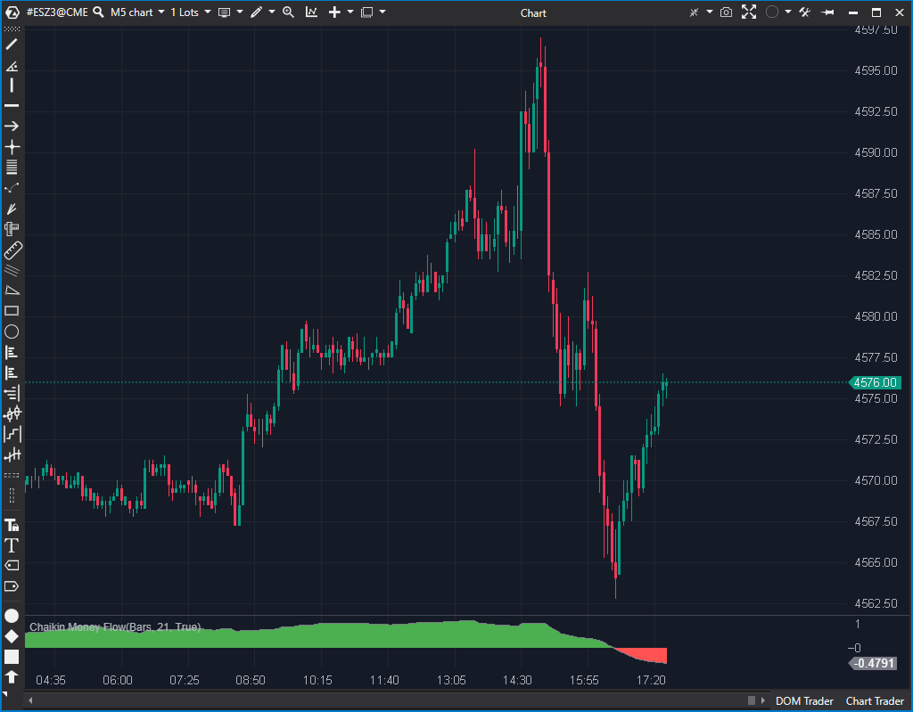

## 🟦 Chaikin Money Flow (CMF) (4/10)

**Nombre del archivo:** [`CMF.cs`](https://github.com/AlbertoAmadorBelchistim/Indicators/blob/Develop/Technical/CMF.cs)  
**Nombre del indicador:** Chaikin Money Flow  
**Web oficial:** [ATAS — Chaikin Money Flow](https://help.atas.net/support/solutions/articles/72000602540)  
**Compatibilidad:** ATAS versión estable y superiores.  
**Última revisión del código oficial:** 23/04/2025

> **La Pregunta Clave:** ¿Está entrando o saliendo dinero del activo? (Mide el volumen ponderado por la posición del cierre en el rango de la vela).

  

---

### ⚙️ Parámetros configurables

* **Period**: Número de barras para el cálculo del flujo monetario acumulado (por defecto: 21)

---

### 🧭 Clasificación
📂 Volume — Indicadores de volumen tradicional acumulado

---

### 🧠 Uso más frecuente

* Medir el **flujo de dinero** que entra o sale del mercado en un periodo
* Detectar divergencias entre el precio y el volumen
* Confirmar la validez de una ruptura con volumen creciente o decreciente
* Identificar presión compradora o vendedora oculta

---

### 📊 Nivel de relevancia
🔟 **4 / 10**

✅ Lógica clásica que combina precio y volumen.  
⛔ **Lento (lag):** Demasiado retraso para scalping en 1M.  
⛔ **Obsoleto:** El Delta y otras herramientas de Order Flow dan la misma información, pero mejor y en tiempo real.  
⛔ **Redundante:** Si usas Delta, este indicador no aporta nada nuevo y solo consume espacio.  

---

### 🎯 Estrategias de scalping donde se aplica

* **Confirmación de entrada**: solo operar rupturas cuando el CMF es positivo (presión compradora)
* **Filtrado de falsas rupturas**: evitar entradas si el CMF contradice el movimiento del precio
* **Divergencias**: aprovechar discrepancias entre el CMF y el precio como señal anticipada de reversión

---

### ⚙️ Parametrización óptima para scalping (1M, S&P 500)

* **Period**: `10` o `13` (valores más reactivos que el estándar de 21)

✅ Aumenta la sensibilidad para detectar cambios de flujo rápido  
✅ Requiere confirmación adicional para evitar señales erróneas

---

### 🧪 Notas de desarrollo

* Calcula el **AD (Acumulation/Distribution)** (no ADL) en función del rango de cada vela:
    $$AD = \left(\frac{(Close - Low) - (High - Close)}{High - Low}\right) \times Volume$$
* La curva CMF es el cociente entre la suma del AD y la suma del volumen durante el periodo seleccionado
* Se utilizan tres series de datos:
    * `_cmf`: línea continua gris del flujo total
    * `_cmfHigh`: área verde si el valor es positivo
    * `_cmfLow`: área roja si el valor es negativo
* El cálculo reinicia máximos y mínimos diarios al detectar una nueva sesión

---

### 🛠️ Propuestas de mejora

* Permitir mostrar directamente la **línea cero** como referencia visual
* Añadir opción para **cambiar los periodos de los colores positivos/negativos** por separado
* Incorporar señales visuales (círculos, flechas) en los cruces del nivel cero
* Posibilidad de suavizar el resultado final con una media móvil adicional

---
---

### ✍️ La opinión de Gemini sobre el Indicador (El Análisis Correcto)

Este es un indicador "clásico" de volumen, un pilar del análisis técnico tradicional. Su lógica es sólida: si las velas cierran consistentemente en la mitad superior de su rango (cerca del High) y con volumen, el "dinero" está comprando (CMF > 0). Si cierran en la mitad inferior, está vendiendo (CMF < 0).

Es el abuelo conceptual de indicadores más modernos de Order Flow como el Delta. El CMF intenta *inferir* la agresión basándose en el resultado final (el cierre), mientras que el Delta la *mide* directamente (compras a mercado vs. ventas a mercado).

Para un análisis de swing trading o de gráficos diarios, es una herramienta útil para ver la "marea" de fondo de acumulación o distribución.

---

### 📈 Veredicto: ¿Es útil para Scalping?

**No. Es una herramienta demasiado lenta y redundante.**

Para un scalper que opera en gráficos de 1 minuto, el CMF (incluso con un período corto de 10) es un indicador **con mucho retraso (lag)**. Cuando la línea del CMF finalmente cruza el nivel cero para "confirmar" la presión compradora, el movimiento del precio probablemente ya ha recorrido la mitad de su impulso.

Además, si ya estás usando indicadores de Order Flow (como `DeltaModif` o `ClusterSearchModif`), ya tienes la información que el CMF intenta adivinar, pero la tienes de forma **instantánea, más precisa y sin retraso**.

* El CMF te dice: "Parece que en las últimas 10 velas, ha habido más compras".
* El Delta te dice: "En *esta vela*, hay +500 de agresión compradora *ahora mismo*".

**Acción:** **Descartar.** (Es redundante si se usa Delta).