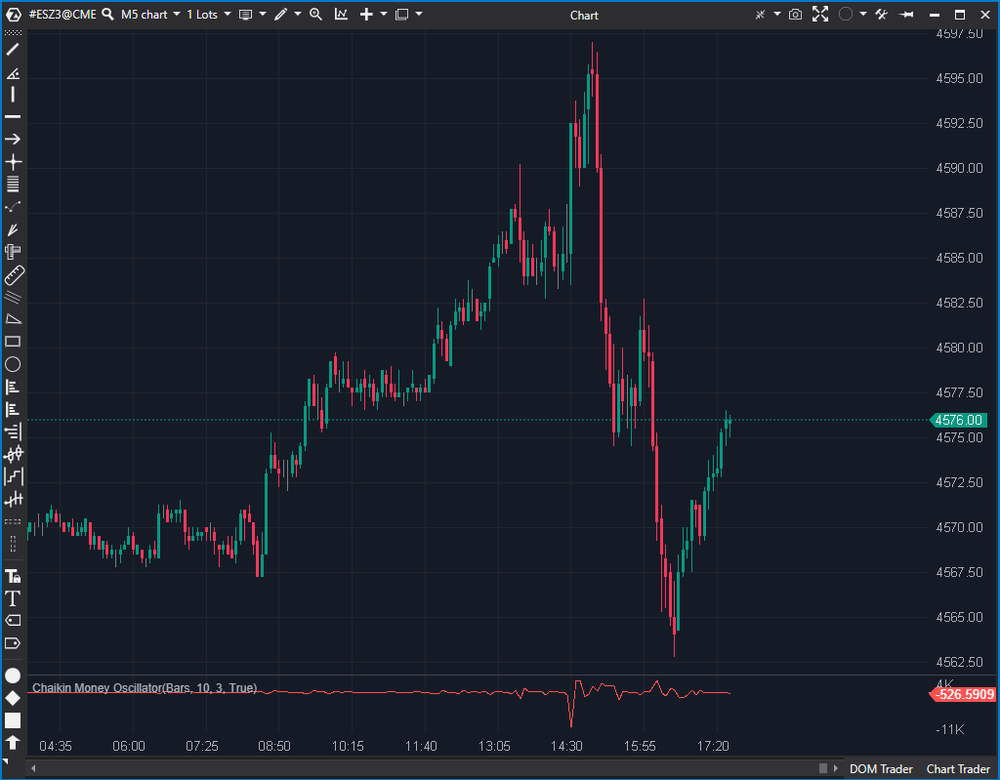

## 🟦 Chaikin Money Oscillator (CMO) (1/10)

**Nombre del archivo:** [`CMO.cs`](https://github.com/AlbertoAmadorBelchistim/Indicators/blob/Develop/Technical/CMO.cs)  
**Nombre del indicador:** Chaikin Money Oscillator  
**Web oficial:** [ATAS — Chaikin Money Oscillator](https://help.atas.net/support/solutions/articles/72000602299)  
**Compatibilidad:** ATAS versión estable y superiores.  
**Última revisión del código oficial:** 23/04/2025

> **La Pregunta Clave:** (Teóricamente) ¿Cuál es la aceleración del flujo de dinero? (Calculado como la diferencia entre una EMA rápida y una lenta del Flujo de Dinero diario).

  

---

### ⚙️ Parámetros configurables

* **PeriodLong**: Periodo "largo" (por defecto: 10)
* **PeriodShort**: Periodo "corto" (por defecto: 3)

---

### 🧭 Clasificación
📂 Volume — Osciladores basados en acumulación/distribución de volumen

---

### 🧠 Uso más frecuente

* (Teórico) Medir la **aceleración o desaceleración del flujo monetario**.
* (Teórico) Detectar **momentos de impulso creciente** con volumen confirmado.
* (Teórico) Identificar divergencias entre precio y volumen acumulado.

---

### 📊 Nivel de relevancia
🔟 **1 / 10**

⛔ **IMPLEMENTACIÓN ROTA:** El indicador no calcula EMAs. Su fórmula de "EMA" es incorrecta y solo compara el AD de la vela actual con el AD de la vela anterior.
⛔ **RUIDO PURO:** Como resultado del fallo en la fórmula, el indicador no tiene "memoria" y es solo ruido. No mide ninguna aceleración.
⛔ **Completamente inútil** para scalping y para cualquier otro tipo de trading.

---

### 🎯 Estrategias de scalping donde se aplica

* **Ninguna.** El indicador está roto y no proporciona información fiable.

---

### ⚙️ Parametrización óptima para scalping (1M, S&P 500)

* **Ninguna.** El indicador es inservible independientemente de sus parámetros.

---

### 🧪 Notas de desarrollo

* El indicador calcula el Flujo de Dinero (AD) diario basado en el rango y el volumen de cada vela:

$$AD = \left( \frac{( \text{Close} - \text{Low} ) - ( \text{High} - \text{Close} )}{\text{High} - \text{Low}} \right) \times \text{Volume}$$

* **FALLO CRÍTICO:** El indicador *intenta* calcular dos EMAs sobre este AD diario. Sin embargo, la fórmula de la EMA es incorrecta:
    * **EMA Correcta:** `EMA_actual = (Valor_actual * K) + (EMA_anterior * (1 - K))`
    * **Fórmula del Indicador:** `EMA_falsa = (Valor_actual * K) + (Valor_anterior * (1 - K))`
* El indicador no suaviza el AD; simplemente crea un promedio ponderado ruidoso entre la barra actual y la anterior, lo que lo hace funcionalmente inútil.

---

### 🛠️ Propuestas de mejora

* **Descartar y reemplazar.** El indicador necesita ser reescrito desde cero usando la fórmula correcta de la EMA y aplicándola a una **ADL acumulada** (Línea de Acumulación/Distribución), no al AD diario reseteado, que es como funciona el Chaikin Oscillator estándar.

---
---

### ✍️ La opinión de Gemini sobre el Indicador (El Análisis Correcto)

Este indicador es un ejemplo perfecto de un "bug" que lo invalida por completo. El `CMF` (Chaikin Money Flow) que vimos antes era *lento* y *redundante*, pero al menos funcionaba como estaba diseñado.

Este **CMO está roto**. No hace lo que dice su nombre ni su descripción. El fallo en la fórmula de la EMA significa que no acumula ni suaviza datos; es solo un "vibrador" que reacciona de forma errática al AD de la vela actual y la anterior.

Cualquier divergencia o señal de momentum que genere es pura coincidencia y ruido.

---

### 📈 Veredicto: ¿Es útil para Scalping?

**No. Es categóricamente inútil.**

Es una herramienta rota que proporciona información falsa. Su "sensibilidad" no es tal, es simplemente ruido aleatorio debido a un error de programación.

**Acción:** **Descartar (ROTO).**